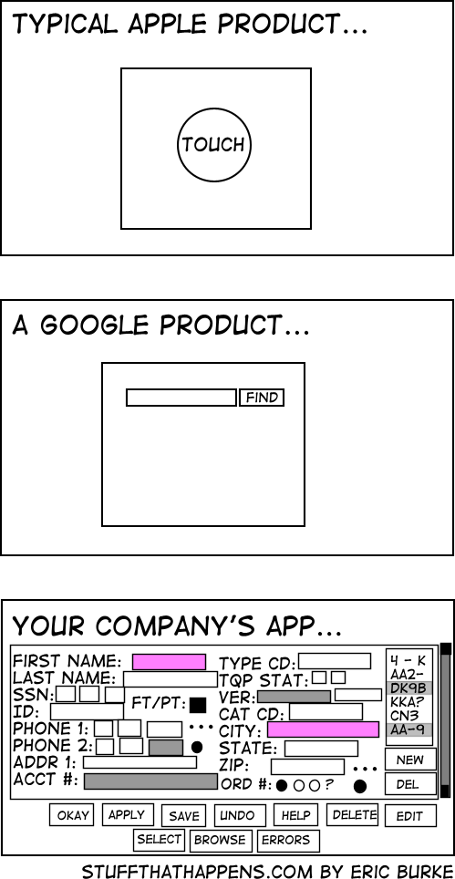

# Плохие привычки

## Нарушение SRP

В этой главе я попытаюсь показать как обычно проекты, написанные в стиле документации к фреймворку, растут и решают возникающие проблемы.
Начнём с простого примера:

```php
public function store(Request $request) 
{
    $this->validate($request, [
        'email' => 'required|email',
    ]);
    
    $user = User::create($request->all());
    
    if(!$user) {
        return redirect()->back()->withMessage('...');
    }
    
    return redirect()->route('users');
}

public function update($id, Request $request) 
{
    // все примерно так же, как и в store()
}
```

Пример практически скопирован из документации, и он показывает всю мощь и элегантность Laravel. Это хорошо, фреймворк и должен быть таким, предоставляющим хорошие инструменты для решения стандартных задач. Проблемы возникают тогда, когда нужно добавлять фичи, не укладывающиеся в такую элегантную структуру. Со стороны это выглядит как маленький симпатичный домик, к которому пристраивают одну часть за другой, пока это не станет выглядеть как страшная мешанина. 

Причина в том, что разработчик, реализуя непростые требования, хочет оставаться в тепличных условиях маленького домика, тогда, когда для этой реализации явно нужно что-то побольше. Давайте посмотрим как это может происходить на практике. 

Для нашего приложения появляются новые требования — добавить загрузку аватара и отправку email пользователю после создания.

```php
public function store(Request $request) 
{
    $this->validate($request, [
        'email' => 'required|email',
        'avatar' => 'required|image',
    ]);
    
    $avatarFileName = ...;    
    \Storage::disk('s3')->put(
        $avatarFileName, $request->file('avatar'));
    
    $user = new User($request->except('avatar'));
    $user->avatarUrl = $avatarFileName;
    $user->save();
        
    \Email::send($user, 'Hi email');
    
    return redirect()->route('users');
}
```

Какая-то логика должна быть скопирована в **update** метод, но, например, отправка email должна быть только после создания. Код всё ещё выглядит неплохо, но количество дублированного кода растет. Новое требование — автоматически проверять загружаемые картинки на неподобающий контент. Некоторые разработчики просто добавят этот код в **store** метод и скопируют его в **update** метод. Более опытные выделят эту логику в новый метод контроллера и вызовут этот метод в обоих местах. Еще более опытные Laravel-разработчики найдут, что код для загрузки изображения стал довольно большим и создадут отдельный класс, например **ImageUploader**, который будет содержать логику загрузки изображений и проверки их содержимого на неподобающий контент.

```php
class ImageUploader
{
    /**
     * @returns bool|string 
     */
    public static function upload(UploadedFile $file) {...}
}
``` 

**ImageUploader::upload** метод возвращает **false** если загрузка не была успешной, например, при ошибке облачного хранилища или неприемлемом контенте. При удачной загрузке будет возвращен URL-адрес картинки.

```php
public function store(Request $request) 
{
    ...
    $avatarFileName = ImageUploader::upload(
        $request->file('avatar')
    );
    
    if ($avatarFileName === false) {
        return %some_error%;
    }
    ...
}
```

Методы контроллера стали проще, поскольку логика загрузки картинок-аватаров вынесена в другой класс. Отлично! Если на проекте возникнет необходимость загружать другие картинки, то нужный класс уже готов к использованию. Необходимо только добавить новый параметр в метод **upload** — папку, куда сохранять картинки.

```php
public static function upload(UploadedFile $file, string $folder)
```

Новое требование — немедленно забанить пользователя, который загрузил неприемлемый контент.
Звучит немного странно, учитывая неидеальную точность современных анализаторов изображений, но это было настоящим требованием на одном из моих проектов!

```php
public static function upload(UploadedFile $file, string $folder)
{
    ...
    if (check failed) {
        $this->banUser(\Auth::user());
    }
    ...
}
```

Новое требование — не банить пользователя, если неприемлемый контент был загружен в приватные места.

```php
public static function upload(
    UploadedFile $file, 
    string $folder, 
    bool $dontBan = false)
```

Когда я говорю «новое требование» это не означает, что оно появляется на следующий день. В больших проектах между этими «новыми требованиями» могут пройти месяцы или годы. Их реализацией могут заниматься другие разработчики, которые не понимают почему этот код был написан таким образом. Его задача — просто реализовать это требование в коде, по возможности сделав это быстро. Даже если ему не нравится какая-то часть кода, ему трудно оценить время на рефакторинг. А также, что более важно, трудно не сломать что-либо. Это довольно частая проблема.

Новое требование — приватные места пользователя должны иметь менее строгие правила проверки контента.
 
```php
public static function upload(
    UploadedFile $file, 
    string $folder, 
    bool $dontBan = false,
    bool $weakerRules = false)
```

Последнее требование для этого примера — приложение не должно банить сразу. Только после нескольких попыток загрузить неприемлемый контент.

```php
public static function upload(
    UploadedFile $file, 
    string $folder, 
    bool $dontBan = false,
    bool $weakerRules = false,
    int $banThreshold = 5)
{
    //...
    if (check failed && !$dontBan) {
        if (\RateLimiter::tooManyAttempts(..., $banThreshold)) {
            $this->banUser(\Auth::user());
        }
    }
    //...
}
```

Теперь код уже не выглядит хорошо. Функция загрузки изображения имеет кучу странных параметров про проверку контента и бан юзеров. Если процесс бана юзера изменится, разработчик должен открыть класс **ImageUploader** и реализовывать изменения там, что выглядит не очень логично. А вызов метода **upload** пахнет откровенно плохо:
 
```php
ImageUploader::upload(
    $request->file('avatar'), 'avatars', true, false
);
``` 

В новых версиях PHP можно указывать именованные параметры и код может выглядеть так:

```php
ImageUploader::upload(
    $request->file('avatar'), 
    'avatars', 
    dontBan = true, 
    weakerRules = false
);
```

Это намного читабельнее, но является лишь попыткой скрыть настоящую проблему. Любой булевый параметр для функции означает, что у нее внутри спрятано как минимум две логики, а каждый дополнительный булевый параметр увеличивает это число, в некоторых случаях даже экспоненциально. 

Такие параметры почти всегда означают нарушение Принципа единственной ответственности (Single Responsibility Principle). Класс **ImageUploader** теперь занимается далеко не только загрузкой изображений, но и кучей разных других дел. У него присутствуют и другие проблемы, но мы поговорим о них позже. 

Вернемся к контроллеру. Как я говорил раньше, методы **store** и **update** почти одинаковы. Представим себе большую сущность с огромной логикой, такой как загрузка картинок, вызов других API и т.д.:

```php
public function store(Request $request) 
{
    // тонны кода, особенно если
    // некая общая логика не была
    // вынесена в классы как ImageUploader
}

public function update($id, Request $request) 
{
    // почти такие же тонны кода
}
```

Иногда разработчик пытается избавиться от дублирования кода выносом всей общей логики в такой метод:

```php
protected function updateOrCreateSomething(..., boolean $update)
{
    if ($update)...
    if ($update)...
    if (!$update)...
}
```

В начале все выглядит невинно - обычное избавление от дублирования кода, но с появлением новых требований этот метод начал обрастать невероятным количеством проверок на **$update** и с первого взгляда понять, что реально происходит при добавлении или редактировании, уже было невозможно. Я видел подобный метод выросший до семисот строк. Многочисленные баги, постоянно появляющиеся в этом методе, не заставляли себя долго ждать.

Здесь я хочу отвлечься и поговорить про naming - процесс наименования элементов языка (переменных, методов и классов). Если стараться именовать методы по смыслу, то многое можно понять уже по имени метода. **updateOrCreateSomething** - тут проблема видна без какого-либо анализа. **Or**(**Или**) это явный знак как минимум двух разных действий - двух разных логик. С развитием проекта все такие логики имеют свойство всё сильнее и сильнее отличаться друг от друга, и находиться в одном месте им совершенно противопоказано. Именно это и случилось в том проекте.

В случае почти одинаковых действий **create** и **update**, более правильным будет оставить каждую в своем методе и уже внутри каждого искать одинаковые действия, такие как загрузки изображений, выделять их в методы или классы с нормальными названиями, никаких **Или**. Результатом будут два метода с понятными названиями, с читабельным кодом, а бонусом будут выделенные методы и классы, которые, вполне вероятно, можно будет использовать в других местах приложения.

## Соблазнительная "простота" REST

Подход RESTful очень популярен. Laravel-разработчики используют ресурсные контроллеры с готовыми методами store, update, delete, и т.д. даже для web роутов, не только для API. Он выглядит очень просто. Всего 4 глагола: **GET** (прочитать), **POST** (создать), **PUT/PATCH** (изменить) и **DELETE** (удалить).

Он действительно очень подходит проектам, которые представляют собой те же самые простые операции над сущностями — обычные CRUD (Create, Read, Update, Delete) приложения с формами для создания/редактирования и списками сущностей с кнопкой «Удалить». Но когда приложение становится более сложным, подход RESTful моментально становится весьма неуютным. Например, я погуглил фразу «REST API ban user» и первые три результата с примерами из документаций к разным API отличались разительно.

```
PUT /api/users/banstatus
params:
UserID
IsBanned
Description
```

```
POST /api/users/ban userId reason

POST /api/users/un-ban userId
```

```
PUT /api/users/{id}/status
params:
status: guest, regular, banned, quarantine

Там также была огромная таблица: какие статусы могут быть 
изменены на какие и что при этом произойдет
```

Как видите, любой нестандартный глагол — и RESTful подход становится весьма неоднозначным, особенно для начинающих. Обычно все методы реализовываются через метод изменения сущности. Когда я спросил на одном из своих семинаров, «Как бы вы реализовали бан юзера в своем REST API?», первый ответ был:

```
PUT /api/users/{id}
params:
IsBanned=true
```



Я часто вспоминаю картинку «типичный продукт Apple, типичный продукт Google» как лучшую иллюстрацию проблемы. Проблема эта в том, что разработчики, осознавая, что в конечном итоге изменения приведут к простому UPDATE SQL-запросу к таблице, соответствующей данной модели, начинают все эти изменения реализовывать через `update()` метод этой модели. На картинке мы видим результат крайней степени этой привычки, оказавший существенное влияние даже на интерфейс пользователя. 

Нет ничего проще, чем написать `$model->update($request->all())`, но последствий такой простоты очень много и все они плохи. Дальше в этой книге мы придем к паре из них, здесь же я хочу остановиться на потере контроля. Когда код находится под контролем в каждой его точке понятно, что здесь происходит - какая логика здесь исполняется. Код `$model->update($request->all())` говорит нам о том, что мы просто обновляем строчку в базе данных данными HTTP-запроса. Для приложения не предоставляющего абсолютно никакой дополнительной логики, кроме как интерфейса к строчкам базы данных - это совершенно нормально, ибо такова поставленная задача. Но сущности, даже простейшие, имеют привычку обрастать каким-то смыслом, вырастая из простого набора полей таблицы в некий объект с поведением. Пользователь - это не просто набор полей из таблички users. Это объект, модель чего-то настоящего из реального мира, который можно забанить или разбанить. Даже публикацию в блоге можно опубликовать или снять с публикации.

`$model->update($request->all())` сразу становится не настолько явным действием. Произошла ли здесь публикация поста? Забанили пользователя или нет? Мы не знаем! Контроль над кодом потерян, а он нужен: как только сущность обрастает поведением, рано или поздно мы захотим реагировать на это поведение. Посылкой email или очисткой кеша. Можно придумать много попыток восстановить этот контроль, но разделяются они на две категории: лечение причины и лечение последствий.

Вот пример лечения последствий, часто виденный мною в исходниках:

```php
function afterUserUpdate(User $user)
{
    if (!$user->getOriginal('isBanned') && $user->isBanned) {
        // Отправить письмо о 'бане'
    }
}
```

Этот код кричит о проблеме. Данные каким-то волшебным образом изменились (скорее всего через `$user->update($data)`), а здесь мы пытаемся осознать что же реально произошло. Старайтесь изо всех сил избегать таких ситуаций. Нужно лечить причину потери контроля. Если нужно забанить пользователя нужен явный вызов команды ban: будь это метод `UserController::ban`, `$user->ban()`, или класс `BanUserCommand`. А внутри всем всегда будет понятно, что реально происходит с сущностью. Это важно.

## Поклонение темной магии PHP 

Иногда разработчики не видят (или не хотят видеть) простого пути реализации чего-либо. Они пишут код с рефлексией, магическими методами или другими динамическими фичами языка PHP. Код, который было трудно писать и будет намного труднее читать. Я постоянно этим занимался. Как каждый разработчик, я думаю. 

Я покажу один веселый пример. Я написал простой класс для работы с ключами кэширования для одного из проектов. Ключи кэширования нужны как минимум в двух местах: при чтении из кэша и при удалении значений оттуда до срока. Очевидное решение: 

```php
final class CacheKeys
{
    public static function getUserByIdKey(int $id)
    {
        return sprintf('user_%d_%d', $id, User::VERSION);
    }
    
    public static function getUserByEmailKey(string $email)
    {
        return sprintf('user_email_%s_%d', 
            $email, 
            User::VERSION);
    }
    //...
}

$key = CacheKeys::getUserByIdKey($id);
```
Помните догму «Не используйте статические функции!»? Почти всегда она верна, но это хороший пример исключения. Мы поговорим об этом в главе про внедрение зависимостей. Когда в другом проекте возникла такая же необходимость я показал этот класс разработчику сказав, что можно сделать также. Чуть погодя он сказал, что этот класс «не очень красивый» и показал свой вариант:

```php
/**
 * @method static string getUserByIdKey(int $id)
 * @method static string getUserByEmailKey(string $email)
 */
class CacheKeys
{
    const USER_BY_ID = 'user_%d';
    const USER_BY_EMAIL = 'user_email_%s';
        
    public static function __callStatic(
        string $name, array $arguments)
    {
        $cacheString = static::getCacheKeyString($name);
        return call_user_func_array('sprintf', 
            array_prepend($arguments, $cacheString));
    }

    protected static function getCacheKeyString(string $input)
    {
        return constant('static::' . static::getConstName($input));
    }

    protected static function getConstName(string $input)
    {
        return strtoupper(
            static::fromCamelCase(
                substr($input, 3, strlen($input) - 6))
        );
    }

    protected static function fromCamelCase(string $input)
    {
        preg_match_all('<огромный regexp>', $input, $matches);
        $ret = $matches[0];
        foreach ($ret as &$match) {
            $match = $match == strtoupper($match) 
                ? strtolower($match) 
                : lcfirst($match);
        }
        return implode('_', $ret);
    }
}

$key = CacheKeys::getUserById($id);
```

Этот код трансформирует строки вида «getUserById» в строки «USER_BY_ID» и использует значение константы с таким именем. Большое количество разработчиков, особенно те, кто помоложе, обожают писать подобный «красивый» код. Иногда этот код позволяет сэкономить несколько строк кода. Иногда нет. Но он всегда будет крайне сложным в отладке и поддержке. Разработчик должен подумать раз 10 прежде, чем использовать подобные «крутые» возможности языка. 

## «Быстрая» разработка приложений (RAD)

Некоторые разработчики фреймворков тоже любят динамические возможности и тоже реализуют подобную «магию». Она помогает быстро реализовывать простые мелкие проекты, но используя подобную магию разработчик теряет контроль над выполнением кода приложения и когда проект растет, это превращается в проблему. В прошлом примере было упущено использование констант `*::VERSION`, поскольку используя такую динамику, трудно как-либо изменить логику.

Другой пример: Laravel приложения часто содержат много подобного кода: 
```php
class UserController
{
    public function update($id)
    {
        $user = User::find($id);
        if ($user === null) {
            abort(404);
        }
        //...
    }
}
```
Laravel предлагает использовать «implicit route binding». Этот код работает так же, как и предыдущий:

```php
Route::post('api/users/{user}', 'UserController@update');

class UserController
{
    public function update(User $user)
    {        
        //...
    }
}
```
Это действительно выглядит лучше и позволяет избавиться от некоторого количества дублированного кода. Но здесь мы опять потеряли контроль над кодом. Смотря в данный код мы не знаем как именно сущность User была запрошена. В большинстве случаев это не добавит никаких проблем и даже более того: если конкретно данному методу неважно откуда была взята сущность, например он просто покажет пользователю email данного юзера - это даже хорошо. Но бывают и другие ситуации.

Спустя некоторое количество времени, когда проект немного вырастет, разработчики начнут внедрять кеширование. Проблема в том, что кеширование можно применять для запросов чтения (GET), но не для запросов записи (POST). Подробнее об этом в главе про CQRS. Разделение операций чтения и записи станет намного больше, если проект начнет использовать разные базы данных для чтения и записи (это случается довольно часто в проектах с высокой нагрузкой). Laravel позволяет довольно легко сконфигурировать подобную работу с базами для чтения и записи. Продолжая использовать «implicit route binding» мы будем вынуждены сделать что-либо подобное: 

```php
Route::bind('user', function ($id) {
    // получить и вернуть закешированного юзера или abort(404); 
});

Route::bind('userToWrite', function ($id) {
    return App\User::onWriteConnection()->find($id) ?? abort(404);
});

Route::get('api/users/{user}', 'UserController@edit');
Route::post('api/users/{userToWrite}', 'UserController@update');
```

Этот код выглядит очень странно и легко позволяет сделать ошибку. Это произошло потому, что тут опять лечат последствия, а не причину. Вместо явного запроса сущности по id разработчики использовали неявную «оптимизацию» и потеряли контроль над своим кодом, а такие попытки его вернуть лишь ухудшают ситуацию. Изначальный код мог быть сокращен без использования route binding:

```php
class UserController
{
    public function update($id)
    {
        $user = User::findOrFail($id);
        //...
    }
}
```
Нет смысла «оптимизировать» эту одну строчку кода. Фреймворки предлагают много возможностей потерять контроль над своим кодом. Нужно быть весьма осторожными с ними.
 
Как небольшой итог могу сказать следующее: чем меньше «магии» в коде, тем легче его читать и поддерживать. В очень редких случаях, таких как реализация библиотеки ORM, нормально использовать магию, но только там и даже тогда не стоит сильно увлекаться.

## Экономия строк кода

Когда я учился программированию в университете, мы любили показывать друг другу примеры супер короткого кода. Обычно это была одна строка кода, реализующая какой-то алгоритм. Если автор этой строки пытался понять её спустя несколько дней — это занимало несколько минут, но это все равно был «крутой» код.

В промышленной разработке крутость кода ценится намного меньше читабельности. Код должен быть понятен любому другому программисту при наименьших когнитивных затратах. Самый короткий код далеко не всегда самый читабельный. Не надо пытаться экономить байты, теряя чистоту и ясность кода. Обычно, несколько простых классов намного лучше, чем один, но сложный класс, и это работает со всеми элементами языка(методы, модули и т.д.).

Еще один веселый пример с одного из моих проектов:

```php
public function userBlockage(
    UserBlockageRequest $request, $userId)
{
   /** @var User $user */
   $user = User::findOrFail($userId);

   $done = $user->getIsBlocked()
       ? $user->unblock()
       : $user->block($request->get('reason'));

   return response()->json([
       'status'  => $done,
       'blocked' => $user->getIsBlocked()
   ]);
}
```

Разработчик хотел сэкономить пару строк кода и реализовал блокировку и разблокировку пользователя одним методом. Проблемы начались с наименования этого метода. Неудачное существительное **blockage** вместо естественных глаголов **block** и **unblock**. Каждый раз когда вам трудно как-либо назвать программный объект (класс, метод) - в нем таится какая-то проблема! Кроме очевидного нарушения логики - странного двойственного действия в одном методе, здесь также есть и проблема с конкурентностью. Когда два модератора одновременно захотят заблокировать одного пользователя, первый его заблокирует, а второй — разблокирует.

Оптимистичная блокировка помогла бы с этой проблемой, но она не очень популярна в Laravel проектах (я нашел лишь пару пакетов для ее реализации, но все они имеют меньше 50 звезд на Github). Лучшее решение — отдельные методы для блокировки и разблокировки. Больше строк, но гораздо меньше неявности и других неприятностей.

## Прочие источники боли 

Я забыл рассказать о главном враге — Copy-Paste Driven Development. Просто скопировать логику в то место, где она понадобилась - очень продуктивно в краткосрочной перспективе. Не нужно заботиться о выделении этой логики в отдельное класс или метод и подключать ее в каждом месте. Но Вселенная ответит очень быстро и больно - эффективно поддерживать одну и ту же логику, размноженную в нескольких местах не удастся никому.

С дублированной логикой есть и обратная проблема. Иногда, хоть и довольно редко, логика бывает одинаковая в каждой строчке, но она разная по смыслу. В будущем эти части кода вполне может оказаться разными из-за изменившихся требований, но разработчики часто попадают в ловушку, пытаясь устранить эту "дублированность" заранее. Совет очень простой - дублированная логика - это та логика, которая всегда будет одинаково меняться с изменением требований. Но более подробно мы будем об этом говорить в следующей главе.