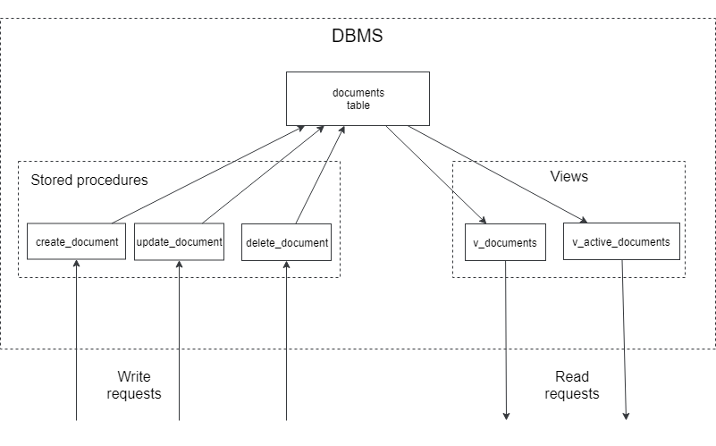
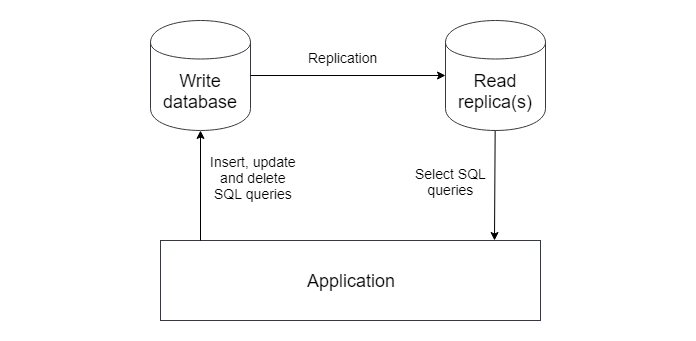
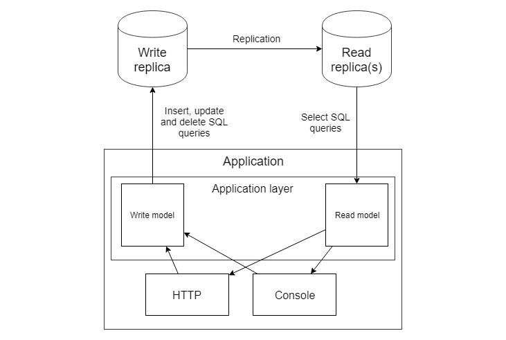

# CQRS

## Чтение и запись - это разные ответственности?

Как мы выяснили в прошлой главе, геттеры совсем не нужны для реализации корректной доменной модели. Сущности и методы, изменяющие их состояния - вполне достаточный набор. Однако, данные необходимо где-то показывать. Неужели нет иного способа, кроме создания методов-геттеров? Давайте попробуем "изобрести" что-нибудь, а для этого мне нужно вспомнить прошлое.

### Хранимые процедуры и представления

Первым проектом в моей профессиональной карьере было огромное приложение с логикой, хранимой в базе данных: в тысячах хранимых процедурах и представлениях. Я писал клиент для всего этого на С++. Представление в базе данных, это сохраненный SQL select-запрос, который выглядит как таблица. Использоваться эта "таблица" должна только для чтения, хотя некоторые движки баз данных позволяют туда писать, но это выглядит не очень логично - писать в результат SQL-запроса.

```sql
CREATE TABLE t (qty INT, price INT);
INSERT INTO t VALUES(3, 50);
CREATE VIEW v AS SELECT qty, price, qty*price AS value FROM t;
SELECT * FROM v;
+------+-------+-------+
| qty  | price | value |
+------+-------+-------+
|    3 |    50 |   150 |
+------+-------+-------+
```

Пример представления из документации MySQL. Оно содержит поле `value`, которое не содержится в таблице.

Хранимая процедура это просто набор инструкций, написанных в процедурном расширении языка SQL (**PL/SQL** в Oracle, **Transact-SQL** в MSSQL, и другие). Это как PHP-функция, которая выполняется внутри базы данных.

```sql
PROCEDURE raise_salary (
    emp_id NUMBER,
    amount NUMBER
  ) IS
BEGIN
  UPDATE employees
    SET salary = salary + amount
    WHERE employee_id = emp_id;
END;
```

Пример простейшей процедуры в **PL/SQL**. Как я уже говорил, система была огромной, с невероятным количеством логики. Без каких-либо ограничений, такие системы мгновенно превращаются в монструозный неподдерживаемый кусок... кода. Для каждой сущности там была определённая структура процедур и представлений:





Таблицы там были, как приватные поля класса: трогать их извне было нельзя. Можно было лишь вызывать хранимые процедуры и делать select из представлений. Когда я писал эту книгу, я осознал, что все эти хранимки и представления составляют Слой Приложения. Точно также как слой приложения, описанный мною в предыдущих главах, прячет базу данных от своих клиентов (HTTP, Console и т.д.), эти хранимки и представления прятали реальную таблицу с данными от своих клиентов.

Я вспомнил это всё, потому что здесь очень наглядно показано насколько разными являются операции записи, которые изменяют данные (хранимые процедуры), и операции чтения, нужные для показа данных пользователям (представления). Они используют совершенно разные типы объектов базы данных.

### Master-slave репликация

Когда приложение вдруг становится популярным и нагрузка возрастает, первое, что обычно разработчики делают для снижения нагрузки на базу данных, это использование одной базы данных для операций записи и одной (или несколько других) для операций чтения. Это называется master-slave replication.





Все изменения идут на главную базу данных и реплицируются на slave базы данных, которые называются репликами. То же самое: write-запросы идут в одно место, read-запросы в другое.

Иногда процесс репликации немного подтормаживает, в силу разных причин, и read-реплики содержат немного старые данные. Пользователи могут изменить какие-то данные в приложении, но продолжать видеть старые данные в нём. Кстати, то же самое происходит тогда, когда в приложении не очень аккуратно реализовано кеширование. Вообще, архитектура системы с одной базой данных и кешем очень похожа на архитектуру приложений с мастер-слейв репликацией. Кеш здесь является подобием read-реплики, которую обновляют вручную из приложения, а не автоматически.
 
Но любые проблемы с репликацией остаются позади, и реплики всегда догонят мастер, а кеш протухнет и старые данные заменятся обновлёнными. Т.е. если пользователь изменил какие-либо данные, то он увидит результат, если не сразу, то чуть позже. Этот тип консистентности называется eventual (eventual consistency, по-русски "Согласованность в конечном счёте"). Она - типичный атрибут любых систем с разными хранилищами для записи и чтения.

Разработчики должны всегда держать этот факт в голове. Если выполняется операция записи, все запросы, включая select-запросы, должны идти в хранилище записи. Никаких значений из реплик или кеша. Иначе можно обновить базу данных, используя устаревшие значения. Это условие заставляет разделять слой приложения на две части: код для операций чтения и код для операций записи. 





Но это не единственная причина для такого разделения.

## Типичный сервисный класс

```php
final class PostService
{
    // Методы чтения
    public function getById($id): Post{}
    public function getLatestPosts(): array{}
    public function getAuthorPosts($authorId): array{}
    
    // Методы записи
    public function create(PostCreateDto $dto){}
    public function publish($postId){}
    public function delete($postId){}
}
```

Обычный сервисный класс для простой сущности. Он состоит из методов для операций чтения и методов для операций записи. Манипуляции и рефакторинги этого класса немного усложнены.

Попробуем реализовать кеширование. Если его реализовать прямо в этом классе, то у него будут как минимум две ответственности: работа с базой данных и кеширование. Самое простое решение - шаблон Декоратор, который я уже применял в главе про внедрение зависимостей. Проблема в том, что для методов записи всё это не нужно: кеширование имеет смысл только для операций чтения. Этот простой факт тоже позволяет осознать, что чтение и запись надо отделять друг от друга. 

Попробуем в **PostService** оставить только операции записи:

```php
final class PostService
{
    public function create(PostCreateDto $dto){}
    public function publish($postId){}
    public function delete($postId){}
}

interface PostQueries
{
    public function getById($id): Post;
    public function getLatestPosts(): array;
    public function getAuthorPosts($authorId): array;
}

final class DatabasePostQueries implements PostQueries{}

final class CachedPostQueries implements PostQueries
{
    public function __construct(
        private PostQueries $baseQueries,
        private Cache $cache,
    ) {}
    
    public function getById($id): Post
    {
        return $this->cache->remember('post_' . $id, 
            function() use($id) {
                return $this->baseQueries->getById($id);
            });
    }
    //...
}
```

Выглядит неплохо! Разделение операций записи и чтения делают рефакторинг и другие манипуляции намного проще, а это говорит о том, что это действие угодно богам.

### Отчёты

SQL-запросы для отчётов очень легко показывают разницу в природе запросов чтения и записи. Сложнейшие конструкции из группировок, агрегаций и вычисляемых полей. Когда разработчик пытаются запросить эти данные, используя сущности Eloquent, это выглядит кошмарно. Сущности Eloquent не предназначены содержать агрегированные значения и строить подобные запросы.

Простая идея использовать **язык структурированных запросов** (**Structured Query Language**, **SQL**) быстро приходит в голову. SQL запросы намного более удобны для этой цели. Данные, полученные из этих запросов, можно хранить в простейших классах, как DTO, или просто в массивах. Это еще один пример, когда для одних и тех же данных используются абсолютно разные модели.

## Command Query Responsibility Segregation

Шаблон **Command Query Responsibility Segregation**(CQRS) предлагает полностью разделять код на модели чтения и модели записи. Модель здесь - это множество классов, работающих с базой данных: сервисные классы, сущности, объекты-значения и т.д.

Модели для чтения и записи, будучи полностью разделёнными, могут быть реализованы на абсолютно разных технологиях. Write-модель с Доктриной или другим data-mapper и Read-модель с какой-нибудь Active Record библиотекой, а то и просто на чистых SQL-запросах и простейших классах в стиле DTO. Технологии и архитектура для каждой модели выбираются исходя из нужд проекта, без оглядки на другую модель.

Для приложения из прошлой главы с write-моделью, реализованной с помощью Доктрины, read-модель может быть реализована просто с помощью Eloquent:

```php

namespace App\ReadModels;

use Illuminate\Database\Eloquent\Builder;
use Illuminate\Database\Eloquent\Model;

abstract class ReadModel extends Model
{
    public $incrementing = false;
        
    protected function performInsert(Builder $query)
    {
        throw new WriteOperationIsNotAllowedForReadModel();
    }

    protected function performUpdate(Builder $query)
    {
        throw new WriteOperationIsNotAllowedForReadModel();
    }

    protected function performDeleteOnModel()
    {
        throw new WriteOperationIsNotAllowedForReadModel();
    }

    public function truncate()
    {
        throw new WriteOperationIsNotAllowedForReadModel();
    }
}

final class WriteOperationIsNotAllowedForReadModel 
    extends \RuntimeException
{
    public function __construct()
    {
        parent::__construct(
            "Операция записи недоступна в модели для чтения");
    }
}
```

Базовый класс для Eloquent моделей для чтения. Все операции, которые пишут в базу данных, переопределены с генерацией исключения, чтобы исключить даже теоретическую возможность записать данные с помощью этих классов.

```php
final class Client extends ReadModel{}

final class Freelancer extends ReadModel{}

final class Proposal extends ReadModel{}

final class Job extends ReadModel
{
    public function proposals()
    {
        return $this->hasMany(Proposal::class, 'job_id', 'id');
    }
}

final class ClientsController extends Controller
{
    public function get(UuidInterface $id)
    {
        return Client::findOrFail($id);
    }
}

final class FreelancersController extends Controller
{
    public function get(UuidInterface $id)
    {
        return Freelancer::findOrFail($id);
    }
}

final class JobsController extends Controller
{
    public function get(UuidInterface $id)
    {
        return Job::findOrFail($id);
    }

    public function getWithProposals(UuidInterface $id)
    {
        return Job::with('proposals')->findOrFail($id);
    }
}
```

Простейшая реализация. Просто сущности, запрашиваемые напрямую из контроллеров. Как видите, даже со сложной write-моделью некоторые модели для чтения могут быть элементарными, и иногда нет смысла выстраивать какие-либо сложные архитектуры для них. Если нужно, можно реализовать некоторые ***Query**- или ***Repository**-классы, с кеширующими декораторами и другими шаблонами. Огромным бонусом идёт то, что write-модель не будет даже затронута!

Случаи с простой моделью для записи, но сложной моделью для чтения тоже возможны. Один раз я участвовал в высоконагруженном контент-проекте. Write-модель не была особенно сложной, и она была реализована просто слоем приложения с Eloquent-сущностями. А read-модель содержала много сложных запросов, иногда несколько разных сущностей для одной таблицы, сложное кеширование и т.д. Там были использованы простые SQL-запросы и обычные классы с публичными полями, как read-сущности.

## Пара слов в конце главы

Как и любой шаблон, CQRS имеет и преимущества и недостатки. Он позволяет независимо друг от друга разрабатывать модели для записи и чтения. Это позволяет уменьшить сложность модели для записи (удалить геттеры и другую логику, используемую только для чтения) и модели для чтения (использовать простейшие сущности и чистые SQL-запросы). С другой стороны, для большинства приложений это будет дублирование сущностей, некоторой части слоя приложения и т.д. Очевидно, что создание двух моделей одного и того же почти всегда дороже, чем создание одной.

Read- и write-модели часто требуют синхронизации и задача, например "добавить поле в сущность" разбивается на две под-задачи: сделать это для модели чтения и записи. Всё имеет свою цену. И это опять превращается в виртуальные весы в голове архитектора. Здесь я лишь немного описал гирьки на чашах этих весов.