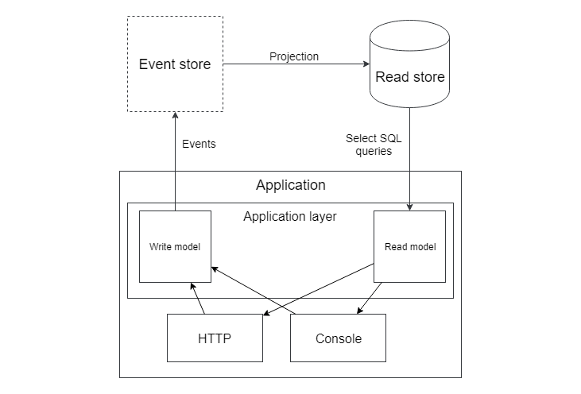

# Event sourcing

A> 1. e4 - e5
A>
A> 2. Кf3 - Кc6
A>
A> 3. Сb5 - a6

Вы играли в шахматы? Даже если нет, вы знаете эту игру. Два игрока просто двигают фигуры. И это лучший пример для шаблона, про который я хочу поговорить.

## Игра королей

Когда любители шахмат хотят узнать про какую-то игру гроссмейстеров, конечная позиция на доске их мало интересует. Они хотят знать про каждый ход!

1. d4 - Кf6
2. Сg5

«Вот это шутка от чемпиона мира!!!»

Смысл текущей позиции на доске полностью зависит от ходов, сделанных ранее:

1. Самое важное: кто ходит следующим? Позиция может одновременно быть выигранной или проигранной в зависимости от этого.
2. Рокировка возможна только если король и ладья не двигались до этого.
3. Взятие на проходе возможно только сразу после того, как пешка сделала ход через клетку.

Давайте создадим приложение для игры в шахматы. Как оно будет хранить игры? Я вижу два варианта:

1. Хранить текущую позицию на доске(т.е. где какие фигуры стоят) с некоторой дополнительной информацией: кто ходит следующим, какие рокировки возможны и некоторая информация о последнем ходе для расчета возможности «взятия на проходе». Все сделанные ходы будут храниться в отдельной таблице, просто для истории.
2. Хранить только сделанные ходы и каждый раз «проигрывать» их для того, чтобы получить текущую позицию.

Как зеркальное отображение этих идей, в шахматном мире существуют две основные нотации:
 
**FEN** - хранит текущую позицию на доске со всей необходимой дополнительной информацией. Пример:

```
rnbqkbnr/pp1ppppp/8/2p5/4P3/8/PPPP1PPP/RNBQKBNR w KQkq c6 0 2
```

**PGN** - просто хранит все ходы. Пример:

```
[Event "F/S Return Match"]
[Site "Belgrade, Serbia JUG"]
[Date "1992.11.04"]
[Round "29"]
[White "Fischer, Robert J."]
[Black "Spassky, Boris V."]
[Result "1/2-1/2"]

1. e4 e5 2. Nf3 Nc6 3. Bb5 a6
...(все остальные ходы)...
42. g4 Bd3 43. Re6 1/2-1/2
```

Как видите обе идеи представлены в шахматном мире достаточно широко. Первый путь традиционен для веб-приложений: мы почти всегда просто храним текущее состояние в базе данных. Иногда, имеются также таблицы, где хранится история изменений записей, но эти данные всегда вторичны - это просто некоторые аудит-логи.

Идея хранить только изменения, без текущего состояния выглядит на первый взгляд странной. Каждый раз проматывать все изменения какой-либо сущности, чтобы получить её текущее состояние - это очень медленно, но иметь полную историю игры может быть весьма полезно.

Давайте представим два приложения для игры в шахматы и проанализируем оба пути. Первое приложение будет хранить шахматные игры в такой таблице:
id, текущее положение на доске, кто ходит, возможности рокировки, поле для взятия на проходе, если такое есть.

Второе приложение будет просто хранить все ходы с начала партий.

Требования к приложениям постоянно меняются и здесь я нарочно забыл пару шахматных правил про ничью. «Правило 50 ходов» говорит, что должна быть объявлена ничья если произошло 50 ходов с обеих сторон без взятия или хода пешкой. Такое правило добавлено, чтобы избежать бесконечных партий и в компьютерных шахматах ничья объявляется автоматически. Как наши два приложения будут реализовывать данное правило?

Первое приложение должно будет добавить новое поле в таблицу: сколько ходов сделано без взятий и движений пешкой и оно будет вычисляться после каждого хода. Остаётся только проблема с теми партиями, которые идут прямо сейчас, там это поле ещё не посчитано и придётся оставить их без этого правила. Проблема в том, что если вместо шахмат мы возьмём какие-нибудь важные сущности из финансовых или страховых областей, то никто нам не позволит просто оставить старые сущности без новых «правил», потому что эти правила могут быть законами или важными финансовыми показателями.

Второе приложение просто добавит эту логику в свои алгоритмы и это правило мгновенно станет работать для всех партий, в том числе и для текущих. 

Кажется, вторая система готова к изменениям гораздо лучше, но если вы ещё сомневаетесь, то вот вам ещё одно правило про ничьи: тройное повторение. Если позиция на доске повторилась три раза за время партии, то объявляется ничья. Я не знаю каким образом разработчики первого приложения будут реализовывать это требование: им придётся где-то хранить все предыдущие положения на доске. Я часто наблюдаю такую картину: выбран неверный вариант хранения данных, алгоритм или другое архитектурное решение и каждое изменение требований вызывает боль. Код сильно «сопротивляется» изменениям. В ход идут костыли и заплатки. Когда такое происходит, стоит немного отвлечься и попробовать взглянуть на систему по-другому, подвергая сомнению каждое архитектурное решение, сделанное ранее. Вероятно, ещё не поздно его поменять.

Второе приложение опять просто добавит в свою логику это правило и ничего менять в системе хранения партий не придётся. Как видите, в некоторых предметных областях знание о том, что было ранее, очень важно для бизнес-логики и идея хранения всей истории сущности как активного участника логики, а не как пассивных логов, может быть весьма здравой.

Однако такое приложение все ещё трудно представить: история важна для логики, но пользователям обычно интересно только текущее состояние сущностей. Рассчитывать финальное состояние для каждого запроса на чтение в популярном приложении может сильно ударить по производительности. Для решения этой проблемы можно использовать идеи из прошлой главы. Там мы говорили о полностью отделенном коде для работы с операциями записи и чтения. Здесь разными будут и хранилища данных.

Для операций записи будут использоваться хранилище с таблицами, которые хранят всю историю сущностей (есть и специальные хранилища оптимизированные для хранения событий - можно погуглить Event store). Для операций чтения будет использоваться традиционное хранилище с таблицами, хранящими текущее состояние. После каждого сделанного хода можно рассчитывать текущее состояние и записывать его в таблицу, которая будет использоваться для операций чтения.

Я выбрал шахматы, поскольку это лучший пример настоящей Event sourcing предметной области. Шаблон Event sourcing предлагает хранить все изменения в системе как последовательность событий. Т.е. вместо традиционной таблицы **posts**:

```
PostId, Title, Text, Published, CreatedBy
```

Всё будет храниться в таблице **post_events**, в которую можно только вставлять новые записи или считывать их, т.е. никаких update или delete запросов - историю нельзя изменять. Выглядеть она будет так:

```
PostId, EventName, EventDate, EventData
```

Вероятные события:

* **PostCreated**(Title, Text, CreatedBy)
* **PostPublished**(PublishedBy)
* **PostDeleted**

Разумеется, блог это явно не та предметная область, для которой стоит реализовывать шаблон Event Sourcing. Очень сложно придумать такую логику с постами в блог, которая зависела бы от их истории. Хранение данных как последовательность событий имеет такие преимущества:

* разработчики могут «продебажить» любую сущность и понять как именно она пришла к своему текущему состоянию.
* состояние всего приложения можно рассчитать на любой момент времени и увидеть как всё было тогда.
* любое состояние, базирующееся на исторических событиях может быть просчитано для любой сущности, в том числе и для старых. Например, если были забыты поля ´created_at´ и ´updated_at´ - их всегда можно рассчитать для всех сущностей позже.
* любая логика, которая зависит от истории сущности, может быть реализована и она заработает немедленно для всех сущностей. Даже созданных до того, как эта логика зародилась в чьей то голове. Пример, некий трекер задач: требование о том, что если задание было назначено на одного и того же пользователя 3 раза - подписать менеджера на эту задачу.

Существует довольно много индустрий, в которых текущее состояние сущностей не является единственными важными данными:

* Баланс вашего банковского счёта всегда рассчитывается как результат всех транзакций с этим счётом, которые банк хранит как основной источник данных.
* Расчеты страховых компаний полностью основаны на истории.
* Медицинские данные всегда лишь некие записи из истории.
* Бухгалтерские программы работают исключительно с произошедшими событиями.

Реальными примерами технологий, использующих подход Event sourcing, являются современные системы хранения кода (git) и блокчейн.

Git хранит данные как последовательности изменений. Изменение, которое чаще называется коммитом, содержит события, такие как: файл А создан с таким вот содержимым, такие-то строки вставлены в содержимое файла Б в такую-то позицию, файл В удалён.

Блокчейном называется последовательность информационных блоков, в которую можно только добавлять и каждый блок содержит криптографический хеш, вычисляемый из предыдущего блока.

Базы данных хранят все операции, которые изменяют данные (insert, update и delete запросы), в специальном логе транзакций и в некоторых ситуациях он используется как главный источник данных. Процесс репликации обычно основан на передаче этого лога транзакций с мастер базы данных в реплики.

## Unit-тестирование сущностей

Давайте взглянем снова на unit-тесты для модели, написанные в главе про Доменный слой.

```php
class JobApplyTest extends UnitTestCase
{
    public function testApplySameFreelancer()
    {
        $job = $this->createJob();
        $freelancer = $this->createFreelancer();

        $freelancer->apply($job, 'cover letter');

        $this->expectException(SameFreelancerProposalException::class);

        $freelancer->apply($job, 'another cover letter');
    }
}
```

Вместо того, чтобы создавать сущность в нужном нам состоянии и тестировать её поведение в этом состоянии, тесты вынуждены создать сущность в ее изначальном состоянии и, выполняя некоторые команды, довести её до нужной кондиции. Этот тест повторяет идеи Event sourcing.

События - это единственная информация, которую эти модели отдают наружу и unit-тесты могут проверять только их. Что, если некая сущность вернёт событие об успешном действии, но забудет обновить своё состояние? Тест на данное действие будет успешным. Если сущность хорошо покрыта тестами, то, скорее всего, какие-нибудь другие тесты упадут. Если сущность **Job** не добавит заявку, то тест **testApplySameFreelancer** "упадёт". Однако для сложных сущностей (помните Монополию и шахматы?), таких тестов может не найтись и сущность с некорректной логикой пройдёт все unit-тесты. Простой пример с публикацией статей:

```php
class Post
{
    public function publish()
    {        
        if (empty($this->body)) {
            throw new CantPublishException();
        }

        //$this->published = true;
        
        $this->record(new PostPublished($this->id));
    }
}

class PublishPostTest extends \PHPUnit\Framework\TestCase
{
    public function testSuccessfulPublish()
    {
        // initialize
        $post = new Post('title', 'body');

        // run
        $post->publish();

        // check
        $this->assertEventsHas(
            PostPublished::class, $post->releaseEvents());
    }
}
```

Тесты будут корректными, но поле в базе не обновится. Пост опубликован не будет и функциональные тесты, если они написаны, должны "упасть", но надеяться на другие тесты - не самая лучшая стратегия. В Event sourcing (ES) системах события являются главным источником данных, поэтому само событие PostPublished является фактически аналогом записи `$this->published = true;` и unit-тестирование ES-сущностей выглядит намного более естественным. Тесты проверяют реальное поведение.

## Мир без магии

Как сущности из главы про Доменный слой сохраняются в базе данных? Классы сущностей там скрывают почти всю информацию о себе, с приватными полями и публичные методы там только для действий, изменяющих состояние. Доктрина анализирует файлы с сущностями, получая мета-информацию о том, как поля должны быть сохранены и в каких таблицах. После команд **persist** и **flush** она использует всю мощь тёмной магии PHP reflection, получая нужные значения и сохраняя их в базе. Что, если магия покинет наш грешный мир? В таком мире будут невозможны Doctrine-сущности.

Можно попробовать забыть про **Сокрытие информации** и сделать всю внутренность сущностей публичной, либо просто реализовать шаблон Event Sourcing! События публичны и полностью открыты. Их можно легко сохранять в базу. Как следствие, системы, обеспечивающие сохранение ES-сущностей в хранилищах, на несколько порядков проще, чем Doctrine и ей подобные.





Архитектура ES-систем повторяет схему CQRS-приложений, но различия моделей для чтения и записи коснулись и хранилищ. Модель для записи, вместо данных, которые могли бы использоваться в модели для чтения, просто хранит события, а данные для чтения - лишь проекция этих событий: 

* Традиционное текущее состояние сущностей в таблицах
* Полнотекстовые индексы для поиска (SphinxSearch или Elasticsearch)
* Специальные статистические таблицы для отчётов (они частенько хранятся в отдельных таблицах или базах данных и в традиционных системах)
* Могут быть и другие данные для чтения

События - это достоверный источник всех данных во всех приложениях. Хранение их как первостепенный источник данных - весьма неплохая мысль, однако всё имеет свою цену.

## Реализация ES

На момент написания книги, лучшей PHP библиотекой для реализации ES-подхода была **prooph/event-sourcing**, однако недавно я обнаружил обращение одного из разработчиков (полный вариант - https://www.sasaprolic.com/2018/08/the-future-of-prooph-components.html), в котором он объясняет почему они решили отказаться от дальнейшей разработки этой библиотеки. Если помните, я уже говорил, что в данном подходе практически не нужна сложная магия с рефлексией, и разработчик прямо пишет, что для реализации ES-подхода неправильно использовать какую-либо библиотеку, потому что написать те несколько строк кода для реализации подхода будет полезно как с точки зрения понимания ES разработчиками проекта, так и с точки зрения уменьшения зависимостей проекта от других библиотек. Однако это не помешает мне рассмотреть пример использование данной библиотеки, написанный самими разработчиками: **prooph/proophessor-do**.

Каждая сущность имеет Value object для своего id. Это имеет смысл как для сокрытия реального типа, используемого для ключа, так и для того, чтобы случайно в коде не попытаться получить сущность, используя id для другой сущности. Этот подход популярен и в Doctrine-подобных сущностях. 

```php
interface ValueObject
{
    public function sameValueAs(ValueObject $object): bool;
}

final class TodoId implements ValueObject
{
    private function __construct(private UuidInterface $uuid) {}

    public static function generate(): TodoId
    {
        return new self(Uuid::uuid4());
    }

    public static function fromString(string $todoId): TodoId
    {
        return new self(Uuid::fromString($todoId));
    }

    public function toString(): string
    {
        return $this->uuid->toString();
    }

    public function sameValueAs(ValueObject $other): bool
    {
        return \get_class($this) === \get_class($other) 
            && $this->uuid->equals($other->uuid);
    }
}
```
Здесь **TodoId** просто представляет собой UUID значение.

```php
final class TodoWasPosted extends AggregateChanged
{
    /** @var UserId */
    private $assigneeId;

    /** @var TodoId */
    private $todoId;

    /** @var TodoText */
    private $text;

    /** @var TodoStatus */
    private $todoStatus;

    public static function byUser(UserId $assigneeId, TodoText $text, 
        TodoId $todoId, TodoStatus $todoStatus): TodoWasPosted
    {
        /** @var self $event */
        $event = self::occur(...);

        $event->todoId = $todoId;
        $event->text = $text;
        $event->assigneeId = $assigneeId;
        $event->todoStatus = $todoStatus;

        return $event;
    }

    public function todoId(): TodoId {...}

    public function assigneeId(): UserId {...}

    public function text(): TodoText {...}

    public function todoStatus(): TodoStatus {...}
}
```

Событие, возникающее при создании объекта Todo. **AggregateChanged** - это базовый класс для всех ES-событий в **Prooph**. Именованный конструктор используется для того, чтобы код выглядел как естественное предложение на английском: **TodoWasPosted::byUser(...)**. Всё, даже текст и статус, обёрнуты в Value Object классы. Пользу от такого сокрытия информации я приводил в главе про Доменный слой.

Каждая сущность должна наследоваться от класса **AggregateRoot**. Главные его части:

```php
abstract class AggregateRoot
{
    /**
     * List of events that are not committed to the EventStore
     *
     * @var AggregateChanged[]
     */
    protected $recordedEvents = [];

    /**
     * Get pending events and reset stack
     *
     * @return AggregateChanged[]
     */
    protected function popRecordedEvents(): array
    {
        $pendingEvents = $this->recordedEvents;

        $this->recordedEvents = [];

        return $pendingEvents;
    }

    /**
     * Record an aggregate changed event
     */
    protected function recordThat(AggregateChanged $event): void
    {
        $this->version += 1;

        $this->recordedEvents[] = 
                        $event->withVersion($this->version);

        $this->apply($event);
    }

    abstract protected function aggregateId(): string;

    /**
     * Apply given event
     */
    abstract protected function apply(AggregateChanged $event);
}
```

Тот же самый шаблон хранения событий в сущности, использованный нами ранее. Различия лишь в методе **apply**. ES-сущности могут изменять своё состояние только применяя события. Каждый раз сущность восстанавливает своё состояние, "проигрывая" все события, произошедшие с ней с самого начала.

```php
final class Todo extends AggregateRoot
{
    /** @var TodoId */
    private $todoId;

    /** @var UserId */
    private $assigneeId;

    /** @var TodoText */
    private $text;

    /** @var TodoStatus */
    private $status;

    public static function post(
        TodoText $text, 
        UserId $assigneeId, 
        TodoId $todoId): Todo
    {
        $self = new self();
        $self->recordThat(TodoWasPosted::byUser(
            $assigneeId, $text, $todoId, TodoStatus::OPEN()));

        return $self;
    }

    /**
     * @throws Exception\TodoNotOpen
     */
    public function markAsDone(): void
    {
        $status = TodoStatus::DONE();

        if (! $this->status->is(TodoStatus::OPEN())) {
            throw Exception\TodoNotOpen::triedStatus($status, $this);
        }

        $this->recordThat(TodoWasMarkedAsDone::fromStatus(
          $this->todoId, $this->status, $status, $this->assigneeId));
    }

    protected function aggregateId(): string
    {
        return $this->todoId->toString();
    }

    /**
     * Apply given event
     */
    protected function apply(AggregateChanged $event): void
    {
        switch (get_class($event)) {
            case TodoWasPosted::class:
                $this->todoId = $event->todoId();
                $this->assigneeId = $event->assigneeId();
                $this->text = $event->text();
                $this->status = $event->todoStatus();
                break;
            case TodoWasMarkedAsDone::class:
                $this->status = $event->newStatus();
                break;
        }
    }
}
```

Небольшая часть сущности **Todo**. Главное различие - состояние сущности полностью зависит от событий. Метод **markAsDone** не меняет состояние напрямую. Только через событие **TodoWasMarkedAsDone**.

Для сохранения сущности используется id и все события, которые с ним произошли с последнего сохранения, получаемые с помощью метода **popRecordedEvents**. Они сохраняются в хранилище событий (это может быть просто таблица в базе данных, или что-то другое).
Для выстраивания сущности по id из хранилища получают все события, создают новый объект нужного класса и "проигрывают" все события через него.

```php
final class Todo extends AggregateRoot
{
    /** @var null|TodoDeadline */
    private $deadline;
    
    /**
     * @throws Exception\InvalidDeadline
     * @throws Exception\TodoNotOpen
     */
    public function addDeadline(
        UserId $userId, TodoDeadline $deadline)
    {
        if (! $this->assigneeId()->sameValueAs($userId)) {
            throw Exception\InvalidDeadline::userIsNotAssignee(
                $userId, $this->assigneeId());
        }
        
        if ($deadline->isInThePast()) {
            throw Exception\InvalidDeadline::deadlineInThePast(
                $deadline);
        }
        
        if ($this->status->is(TodoStatus::DONE())) {
            throw Exception\TodoNotOpen::triedToAddDeadline(
                $deadline, $this->status);
        }
        
        $this->recordThat(DeadlineWasAddedToTodo::byUserToDate(
            $this->todoId, $this->assigneeId, $deadline));
            
        if ($this->isMarkedAsExpired()) {
            $this->unmarkAsExpired();
        }
    }
}
```

Другая часть сущности **Todo**: добавление дедлайна. Просто почитайте код. Он выглядит как простой английский текст, благодаря использованию правильно именованных конструкторов и объектов-значений. Дедлайн - это не просто **DateTime**, а специальный объект **TodoDeadline** со всеми нужными вспомогательными методами, такими как **isInThePast**. Всё это делает клиентский код очень чистым, легким для чтения, что очень важно для больших проектов, разрабатываемых командой программистов.

Не хочу углубляться дальше в этот пример, я рекомендую ознакомиться самим, если интересно - **https://github.com/prooph/proophessor-do**

Проекции - это объекты, которые трансформируют ES-события в данные, удобные для чтения. Практически каждая ES-система имеет проекции, которые выстраивают традиционные таблицы, содержащие текущее состояние сущностей.

```php
final class Table
{
    const TODO = 'read_todo';
    //...
}


final class TodoReadModel extends AbstractReadModel
{
    /**
     * @var Connection
     */
    private $connection;

    public function __construct(Connection $connection)
    {
        $this->connection = $connection;
    }

    public function init(): void
    {
        $tableName = Table::TODO;

        $sql = <<<EOT
CREATE TABLE `$tableName` (
`id` varchar(36) COLLATE utf8_unicode_ci NOT NULL,
`assignee_id` varchar(36) COLLATE utf8_unicode_ci NOT NULL,
`text` longtext COLLATE utf8_unicode_ci NOT NULL,
`status` varchar(7) COLLATE utf8_unicode_ci NOT NULL,
`deadline` varchar(30) COLLATE utf8_unicode_ci DEFAULT NULL,
`reminder` varchar(30) COLLATE utf8_unicode_ci DEFAULT NULL,
PRIMARY KEY (`id`),
KEY `idx_a_status` (`assignee_id`,`status`),
KEY `idx_status` (`status`)
) ENGINE=InnoDB DEFAULT CHARSET=utf8 COLLATE=utf8_unicode_ci;
EOT;

        $statement = $this->connection->prepare($sql);
        $statement->execute();
    }

    public function isInitialized(): bool
    {
        $tableName = Table::TODO;

        $sql = "SHOW TABLES LIKE '$tableName';";

        $statement = $this->connection->prepare($sql);
        $statement->execute();

        $result = $statement->fetch();

        if (false === $result) {
            return false;
        }

        return true;
    }

    public function reset(): void
    {
        $tableName = Table::TODO;

        $sql = "TRUNCATE TABLE `$tableName`;";

        $statement = $this->connection->prepare($sql);
        $statement->execute();
    }

    public function delete(): void
    {
        $tableName = Table::TODO;

        $sql = "DROP TABLE `$tableName`;";

        $statement = $this->connection->prepare($sql);
        $statement->execute();
    }

    protected function insert(array $data): void
    {
        $this->connection->insert(Table::TODO, $data);
    }

    protected function update(
        array $data, array $identifier): void
    {
        $this->connection->update(
            Table::TODO,
            $data,
            $identifier
        );
    }
}
```

Этот класс представляет таблицу для содержания текущего состояния todo-задач. Методы **init**, **reset** и **delete** используются когда система хочет создать или пересоздать проекцию. Методы **insert** и **update** очевидно для добавления/изменения записей в таблице. Такой же класс может быть создан для построения полнотекстовых индексов, статистических данных или просто для логирования всех событий в файле (это не самый лучший вариант использования проекций - все события и так хранятся в хранилище событий).

```php
$readModel = new TodoReadModel(
    $container->get('doctrine.connection.default'));

$projection = $projectionManager
    ->createReadModelProjection('todo', $readModel);

$projection
->fromStream('todo_stream')
->when([
    TodoWasPosted::class 
        => function ($state, TodoWasPosted $event) {
        $this->readModel()->stack('insert', [
            'id' => $event->todoId()->toString(),
            'assignee_id' => $event->assigneeId()->toString(),
            'text' => $event->text()->toString(),
            'status' => $event->todoStatus()->toString(),
        ]);
    },
    TodoWasMarkedAsDone::class 
        => function ($state, TodoWasMarkedAsDone $event) {
        $this->readModel()->stack(
            'update',
            [
                'status' => $event->newStatus()->toString(),
            ],
            [
                'id' => $event->todoId()->toString(),
            ]
        );
    },
    // ...
])
->run();
```

Это конфигурация проекции. Она использует класс **TodoReadModel** и трансформирует события в команды для этого класса. Событие **TodoWasPosted** приводит к созданию новой записи в таблице. Событие **TodoWasMarkedAsDone** изменяет поле статуса для определённого **id**. После трансформа всех событий таблица **read_todo** будет содержать текущее состояние всех todo-задач. Типичный процесс работы с данными в ES-системе такой: получение сущности из хранилища событий, вызов команды (**markAsDone** или **addDeadline**), получение всех новых событий из сущности (их может быть больше одного), сохранение их в хранилище событий, вызов всех проекций. Некоторые проекции хочется вызвать сразу, особенно те, которые изменяют таблицы с текущим состояние. Некоторые можно выполнить отложено в очереди.

## Уникальные данные в ES-системах

Одним из недостатков подхода ES является то, что данные в них невозможно проверять условиями, такими как уникальные индексы. В традиционных базах данных, обычный уникальный индекс на колонку `users.email` позволяет нам быть спокойными - в системе не будет двух юзеров с одинаковыми email. Сущности же в ES-системах абсолютно независимы друг от друга. Разные пользователи с одинаковыми email вполне могут жить рядом друг с другом, но требования к системе такого не допускают.

Некоторые приложения используют уникальные индексы из таблиц для чтения, но на 100% такие проверки не защищают. Некоторые системы просто создают специальную таблицу с одним полем для email под уникальным индексом и вставляют значение туда перед попыткой сохранить событие о создании пользователя.

## Пара слов в конце главы

Шаблон Event Sourcing - очень мощная вещь. Он позволяет легко реализовывать логику, основанную на исторических данных. Он может помочь приложениям для регулируемых областей иметь правильные аудит-логи. Он также помогает приложениям быть лучше готовыми к изменениям, особенно если эти изменения основаны на том, что происходило с сущностями в прошлом.

Недостатков тоже хватает. ES очень "дорогой" подход. Дорогой по времени кодирования, по железу и времени системных администраторов для обслуживания проекта, по требуемому уровню разработчиков. В команду будет сложнее вливаться новым членам. "Мышление событиями" сильно отличается от "мышления строчками в базе данных". Анализируя проекты, подобные **proophessor-do**, или создавая свои, особенно для нестандартных предметных областей, можно достичь более глубокого понимания преимуществ и недостатков этого подхода для каждого приложения и более обоснованно выбирать или не выбирать его для новых проектов.
