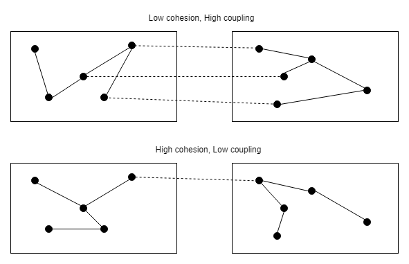
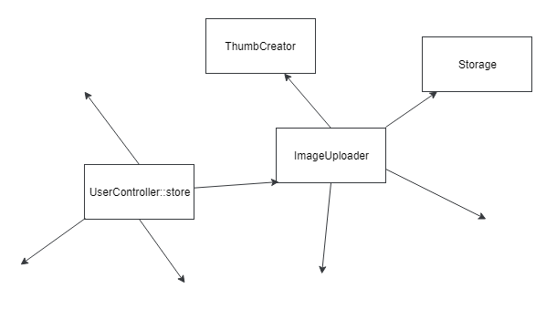
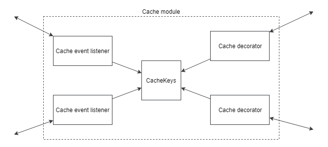

# Внедрение зависимостей

A> "Дайте мне точку опоры и я переверну землю"

## Принцип Единственной Ответственности

Вы, возможно, слышали о Принципе Единственной Ответственности (Single Responsibility Principle, SRP).
Одно из его определений: «Каждый модуль, класс или функция должны иметь ответственность над единой частью функционала».
Много разработчиков упрощают его до «класс должен делать что-то одно», но это определение не самое удачное. "Что-то одно" может быть одной строкой кода, или целой большой огромной задачей. Выделить границы здесь весьма непросто.

Роберт Мартин предложил другое определение, где заменил слово «ответственность» на «причину для изменения»: «Класс должен иметь лишь одну причину для изменения».
«Причина для изменения» более удобный термин и мы можем начать рассуждать об архитектуре используя его.
Почти все шаблоны и практики имеют своей целью лучше подготовить приложение к изменениям, но приложения бывают разные, с разными требованиями и разными возможными изменениями.

Я часто встречаю заявления: «Если вы располагаете весь ваш код в контроллерах, вы нарушаете SRP!».
Представим простое приложение, представляющее собой списки сущностей с возможностью создавать их, изменять и удалять. Так называемое CRUD-приложение.
Все, что оно делает — лишь предоставляет интерфейс к строчкам в базе данных, без какой-либо дополнительной логики.

```php
public function store(Request $request) 
{
    $this->validate($request, [
        'email' => 'required|email',
        'name' => 'required',
    ]);
    
    $user = User::create($request->all());
    
    if (!$user) {
        return redirect()->back()->withMessage('...');
    }
    
    return redirect()->route('users');
}
```

Какие изменения возможны в таком приложении?
Добавление/удаление полей или сущностей, косметические изменения интерфейса... сложно представить что-то большее.
Я не думаю, что такой код нарушает SRP. Почти.
Теоретически, может поменяться алгоритм редиректов, но это мелочи, я не вижу смысла рефакторить данный код.

Рассмотрим новое требование к этому приложению из прошлой главы — загрузка аватара пользователя и посылка email после регистрации:

```php
public function store(Request $request) 
{
    $this->validate($request, [
        'email' => 'required|email',
        'name' => 'required',
        'avatar' => 'required|image',
    ]);
    
    $avatarFileName = ...;    
    \Storage::disk('s3')->put(
        $avatarFileName, $request->file('avatar'));
        
    $user = new User($request->except('avatar'));
    $user->avatarUrl = $avatarFileName;
    
    if (!$user->save()) {
        return redirect()->back()->withMessage('...');
    }
    
    \Email::send($user->email, 'Hi email');
        
    return redirect()->route('users');
}
```

Метод **store** содержит уже несколько ответственностей. Напомню, что кроме него есть ещё и метод **update**, меняющий сущность, и код, загружающий аватары, должен быть скопирован туда.
Любое изменение в алгоритме загрузки аватар уже затронет как минимум два места в коде приложения.
Часто бывает сложно уловить момент, когда стоит начать рефакторинг.
Если эти изменения коснулись лишь сущности Пользователь, то, вероятно, этот момент ещё не настал.
Однако, наверняка загрузка картинок понадобится и в других частях приложения.

Здесь я бы хотел остановиться и поговорить о двух важных базовых характеристиках программного кода — связность (cohesion) и связанность (coupling).
Связность — это степень того, как методы одного класса (или части другой программной единицы: функции, модуля) сконцентрированы на главной цели этого класса.
Звучит очень похоже на SRP.
Связанность между двумя классами (функциями, модулями) — это степень того, как много они знают друг о друге.
Сильная связанность означает, что какие-то знания принадлежат нескольким частям кода и каждое изменение может вызвать каскад изменений в других частях приложения. Под знаниями я имею в виду какую-нибудь логику, например знание о том, как сохранить картинку в хранилище, или как обновить поля сущности Пользователь. То же самое, что и ответственность, но под другим углом.





Текущая ситуация с методом **store** является хорошей примером потери качества кода.
Он начинает реализовывать несколько ответственностей — связность падает.
Загрузка картинок реализована в нескольких местах приложения — связанность растет.
Самое время вынести загрузку изображений в свой класс.

Первая попытка:

```php
final class ImageUploader
{
    public function uploadAvatar(User $user, UploadedFile $file)
    {
        $avatarFileName = ...;    
        \Storage::disk('s3')->put($avatarFileName, $file);
        
        $user->avatarUrl = $avatarFileName;    
    }
}
```

Я привёл этот пример, потому что я часто встречаю такое вынесение функционала, захватывающее слишком многое с собой.
В этом случае класс **ImageUploader** кроме своей главной обязанности (загрузки изображений) присваивает и значение полю класса **User**.
Что в этом плохого?
Класс **ImageUploader** знает про класс **User** и его свойство **avatarUrl**.
Такие знания часто меняются. Простейший случай — загрузка изображений для другой сущности.
Чтобы реализовать это изменение, придётся изменять класс **ImageUploader**, а также методы класса **UserController**.
Это и есть пример, когда одно маленькое изменение порождает целый каскад изменений в классах, не связанных с изначальным изменением.   

Попробуем реализовать **ImageUploader** с высокой связностью:

```php
final class ImageUploader
{
    public function upload(string $fileName, UploadedFile $file)
    {    
        \Storage::disk('s3')->put($fileName, $file);
    }
}
```

Да, это не выглядит как логика, которую необходимо выносить, но в будущем загрузка изображений может стать сложнее (например, добавится создание миниатюр).
Даже если этот код так и останется одной строчкой — функционал загрузки изображений вынесен в отдельный класс и много времени это не отняло.
Любые изменения в будущем будет проще реализовать.

## Dependency Injection

Класс **ImageUploader** создан, но как использовать его в методе **UserController::store**?

```php
$imageUploader = new ImageUploader();
$imageUploader->upload(...);
```

Или просто сделать метод **upload** статическим и вызывать его так: 

```php
ImageUploader::upload(...);
```

Это выглядит красиво и легко, но теперь метод **store** имеет жесткую зависимость от класса **ImageUploader**.
Представим, что таких зависимых методов в приложении стало много и команда решила использовать другое хранилище для изображений.
Но не для всех, а лишь некоторых мест их загрузки. Как разработчики будут реализовывать это изменение?
Создадут класс **AnotherImageUploader** и заменят вызовы класса **ImageUploader** на вызовы **AnotherImageUploader** во всех нужных местах.
В крупных проектах такие изменения, затрагивающие большое количество классов, крайне нежелательны — они часто приводят к ошибкам.
Изменение способа хранения изображений не должно влиять на код, работающий с сущностями.





Приложение с такими жёсткими связями выглядит как металлическая сетка.
Очень сложно взять, например, класс **ImageUploader**, и использовать его в другом приложении. Или написать для него юнит-тесты.

Вместо жёстких зависимостей на классы техника **Внедрения Зависимостей** (Dependency Injection, DI) предлагает классам просить нужные зависимости.

```php
final class ImageUploader
{
    /** @var Storage */
    private $storage;
    
    /** @var ThumbCreator */
    private $thumbCreator;
        
    public function __construct(
        Storage $storage, ThumbCreator $thumbCreator) 
    {
        $this->storage = $storage;
        $this->thumbCreator = $thumbCreator;
    }
    
    public function upload(...)
    {
        $this->thumbCreator->...
        $this->storage->...
    }
}
```

Laravel и другие фреймворки содержат контейнер зависимостей (DI-контейнер) — специальный сервис, который берет на себя создание экземпляров нужных классов и внедрение их в зависящие классы.
Метод **store** может быть переписан так:

```php
public function store(
    Request $request, ImageUploader $imageUploader) 
{
    //...
    $avatarFileName = ...;    
    $imageUploader->upload(
        $avatarFileName, $request->file('avatar')
    );    
    //...
}
```

В Laravel контейнер зависимостей умеет внедрять зависимости прямо в аргументы методов контроллеров.
Зависимости стали менее жёсткими. Классы не создают другие классы и не требуют статических методов.
Однако, метод **store** и класс **ImageUploader** зависят от конкретных классов.
Принцип Инверсии Зависимостей (буква D в SOLID) гласит:
> Модули верхних уровней не должны зависеть от модулей нижних уровней. Оба типа модулей должны зависеть от абстракций. Абстракции не должны зависеть от деталей. Детали должны зависеть от абстракций.

Требование абстракции в сообществах языка PHP и остальных, где есть понятие **интерфейс**, трактуется однозначно: зависимости должны быть только от интерфейсов, а не от классов.
Я буду часто повторять, что проекты бывают разные. Для какого-нибудь проекта будет нормальным сразу заводить интерфейс, и потом класс, его реализующий. Для других же это будет не совсем оправданным.

Вы, вероятно, слышали про технику Test-driven Development (TDD).
Грубо говоря, она предлагает писать тесты одновременно с кодом, который этими тестами проверяется.
Попробуем рассмотреть написание класса **ImageUploader** одновременно с тестами.
Классы **Storage** и **ThumbCreator**, необходимые для работы **ImageUploader** ещё не реализованы, но это не мешает реализовать его и проверить на соответствия требованиям.
Можно создать интерфейсы **Storage** и **ThumbCreator** с необходимыми методами и начать работу.
Для тестирования эти интерфейсы будут «реализованы» с помощью специальных объектов-моков (мы поговорим про них в главе про тестирование).

```php
interface Storage
{
    // методы...
}

interface ThumbCreator
{
    // методы...
}

final class ImageUploader
{
    /** @var Storage */ 
    private $storage;
    
    /** @var ThumbCreator */
    private $thumbCreator;
        
    public function __construct(
        Storage $storage, ThumbCreator $thumbCreator) 
    {
        $this->storage = $storage;
        $this->thumbCreator = $thumbCreator;
    }
    
    public function upload(...)
    {
        $this->thumbCreator->...
        $this->storage->...
    }
}

class ImageUploaderTest extends TestCase
{
    public function testSomething()
    {
        $storageMock = \Mockery::mock(Storage::class);
        $thumbCreatorMock = \Mockery::mock(ThumbCreator::class);
        
        $imageUploader = new ImageUploader(
            $storageMock, $thumbCreatorMock
        );
        $imageUploader->upload(...
    }
}
```

Класс **ImageUploader** все ещё не может быть использован в приложении, поскольку для хранения сущностей и создания миниатюр есть только интерфейсы, без реализаций. Но он уже написан и протестирован.
Позже, когда будут написаны классы, реализующие интерфейсы Storage и ThumbCreator, можно будет настроить контейнер зависимостей в Laravel, например, так:

```php
$this->app->bind(Storage::class, S3Storage::class);
$this->app->bind(ThumbCreator::class, ImagickThumbCreator::class);
```

После этого класс **ImageUploader** может быть использован в приложении.
Когда контейнер зависимостей создаёт экземпляр класса, он сканирует его зависимости в конструкторе (**Storage** и **ThumbCreator**), находит нужные реализации (**S3Storage** и **ImagickThumbCreator**) исходя из своей конфигурации и подставляет их создаваемому объекту.
Если эти реализации тоже имеют зависимости, то они также будут внедрены.

Техника TDD хорошо зарекомендовала себя во многих проектах, где она стала стандартом.
Мне тоже нравится этот подход.
Разрабатывая функционал одновременно тестируя его, получаешь мало с чем сравнимое удовольствие, ощущая насколько продуктивно получается работать.
Однако, я крайне редко вижу его использование на проектах.
Оно требует некоего уровня архитектурного мышления, поскольку необходимо заранее знать какие интерфейсы будут нужны, заранее декомпозировать приложение. 

Обычно на проектах все намного проще и прозаичнее.
Сначала пишется класс **ImageUploader**, который содержит всю логику по хранению и созданию миниатюр.
Потом, возможно, некоторый функционал будет вынесен в классы **Storage** и **ThumbCreator**.
Интерфейсы не используются.
Иногда на проекте случается примечательное событие — один из разработчиков читает про Принцип Инверсии Зависимостей и решает, что у проекта серьезные проблемы с архитектурой.
Классы не зависят от абстракций! Нужно немедленно создать интерфейс к каждому классу!
Но имена **ImageUploader**, **Storage** и **ThumbCreator** уже заняты классами.
Как правило, в данной ситуации выбирается один из двух кошмарных путей создания интерфейсов.

Первый это создание пространства имён `*\Contracts` и создание всех интерфейсов там.
Пример из исходников Laravel:

```php
namespace Illuminate\Contracts\Cache;

interface Repository
{
    //...
}


namespace Illuminate\Contracts\Config;

interface Repository
{
    //...
}


namespace Illuminate\Cache;

use Illuminate\Contracts\Cache\Repository as CacheContract;

class Repository implements CacheContract
{
    //...
}


namespace Illuminate\Config;

use ArrayAccess;
use Illuminate\Contracts\Config\Repository as ConfigContract;

class Repository implements ArrayAccess, ConfigContract
{
    //...
}
```

Тут совершён двойной грех: использование одного имени для интерфейса и класса, а также одного имени для абсолютно разных программных объектов - имя Repository для конфигурации и кеша.
Механизм пространств имён даёт возможность для таких обходных маневров.
Как можно увидеть, даже в коде класса приходится использовать алиасы **CacheContract** и **ConfigContract**.
Любой Laravel проект имеет 4 программных объекта с именем **Repository**.
В обычном приложении разработчики используют фасады **Cache** и **Config** или функции-хелперы, поэтому не сталкиваются с неудобствами, но если использовать DI, то класс, который использует и кеширование и конфигурацию, выглядит так (если не использовать алиасы):

```php

use Illuminate\Contracts\Cache\Repository;

class SomeClassWhoWantsConfigAndCache
{
    /** @var Repository */
    private $cache;

    /** @var \Illuminate\Contracts\Config\Repository */
    private $config;

    public function __construct(Repository $cache, 
        \Illuminate\Contracts\Config\Repository $config)
    {
        $this->cache = $cache;
        $this->config = $config;
    }
}
```

Только имена переменных помогают понять какая конкретно зависимость была использована.
Однако, имена Laravel-фасадов для этих интерфейсов выглядят весьма натурально: **Config** и **Cache**.
С такими именами для интерфейсов, классы их использующие выглядели бы намного лучше.

Второй вариант: использование суффикса **Interface**, например, создать интерфейс **StorageInterface**.
Таким образом, имея класс **Storage** реализующий интерфейс **StorageInterface**, мы постулируем, что у нас есть интерфейс и его «главная» реализация. Все остальные реализации этого интерфейса выглядят вторичными.
Само существование интерфейса **StorageInterface** выглядит искусственным: он был создан, чтобы код удовлетворял каким-то принципам, или просто для юнит-тестирования.

Это явление встречается и в других языках.
В C# принят префикс I*. Интерфейс **IList** и класс **List**, например.
В Java не приняты префиксы и суффиксы, но там часто случается такое:

```java
class StorageImpl implements Storage
```

Это тоже ситуация с интерфейсом и его реализацией по умолчанию.

Возможны две ситуации с интерфейсами:

1. Есть интерфейс и несколько возможных реализаций. В этом случае интерфейс стоит назвать естественным именем, а в именах реализаций использовать префиксы, которые описывают эту реализацию.

```php
interface Storage{}

class S3Storage implements Storage{}
 
class FileStorage implements Storage{}
```
2. Есть интерфейс и одна реализация. 
Другую реализацию сложно представить. В этом случае интерфейс не нужен, можно просто использовать класс с естественным именем.

Если нет прямой необходимости использовать интерфейсы в проекте, то использование классов в механизме внедрения зависимостей вполне нормальная практика.
Давайте снова взглянем на класс **ImageUploader**:

```php
final class ImageUploader
{
    /** @var Storage */
    private $storage;
    
    /** @var ThumbCreator */
    private $thumbCreator;
        
    public function __construct(Storage $storage, 
        ThumbCreator $thumbCreator) 
    {
        $this->storage = $storage;
        $this->thumbCreator = $thumbCreator;
    }
    
    public function upload(...)
    {
        $this->thumbCreator->...
        $this->storage->...
    }
}
```

Он зависит от неких **Storage** и **ThumbCreator** и использует только их публичные методы.
Разработчику, который работает в данный момент с этим кодом, всё равно классы это или интерфейсы.
Контейнер внедрения зависимостей, убрав необходимость создавать объекты зависимостей, подарил нам супер-абстракцию: классам совсем неважно знать от чего именно он зависит - от интерфейса или класса.
В любой момент, при изменении условий, класс может быть сконвертирован в интерфейс, а весь его функционал перенесен в новый класс, реализующий этот интерфейс (**S3Storage**).
Это изменение, наряду с конфигурацией контейнера зависимостей будут единственными на проекте.
Весь остальной код, использовавший класс, будет работать как прежде, только теперь он зависит от интерфейса.
Используя суффиксы **Interface** или другие отличительные признаки интерфейсов, мы лишаем себя этой абстракции, а также загрязняем наш код.

```php
class Foo
{
    public function __construct(
        LoggerInterface $logger, StorageInterface $storage) {...}
}

class Foo
{
    public function __construct(
        Logger $logger, Storage $storage) {...}
}
```

Просто сравните эти два конструктора.

Разумеется, код публичной библиотеки или пакета должен быть максимально гибким.
Поэтому, все зависимости в них должны быть на интерфейсы (или абстрактные классы).
Однако, в обычном проекте зависимости на реальные классы — абсолютно нормальная практика.  

## Наследование

Наследование называют одним из трех «китов» ООП и разработчики обожают его.
Однако, очень часто оно используется в неверном ключе, когда новый класс хочет использовать некий функционал, его наследуют от класса, который этот функционал имеет.
Также часта ситуация, когда некоторой группе классов нужен один и тот же функционал, вместо использования DI, создается некий Base* класс, в котором этот функционал реализуется, и все классы наследуются от него.
Я приведу наполовину синтетический пример, который покажет насколько опасно использовать наследование подобным образом.
В Laravel есть интерфейс **Queue**, содержащий методы работы с очередями и много классов, реализующих его.
Допустим, наш проект использует **RedisQueue**.

```php
interface Queue
{
    public function push($job, $data = '', $queue = null);
}

class RedisQueue implements Queue
{
    public function push($job, $data = '', $queue = null)
    {
        // реализация
    }
}
```

Разумеется, классы проекта используют зависимость на интерфейс **Queue**, а менеджер зависимостей лишь подставляет **RedisQueue**.
Когда возникла необходимость логировать все задачи в очереди, был создан класс **OurRedisQueue**, отнаследованный от **RedisQueue**.

```php
class OurRedisQueue extends RedisQueue
{
    public function push($job, $data = '', $queue = null)
    {
        // логирование
        
        return parent::push($job, $data, $queue);
    }
}
```

Задача решена: все вызовы метода **push** логируются.
Некоторое времени спустя, в новой версии Laravel, в интерфейсе **Queue** добавился метод **pushOn**, который представляет собой тот же **push**, но с другой очередностью параметров.
Класс **RedisQueue** получил очевидную реализацию:

```php
interface Queue
{
    public function push($job, $data = '', $queue = null);
    public function pushOn($queue, $job, $data = '');
}

class RedisQueue implements Queue
{
    public function push($job, $data = '', $queue = null)
    {
        // реализация
    }
    
    public function pushOn($queue, $job, $data = '')
    {
        return $this->push($job, $data, $queue);
    }
}    
```

Поскольку класс **OurRedisQueue** отнаследован от **RedisQueue**, никаких изменений в проекте при обновлении версии фреймворка не понадобилось.
Всё работает как прежде и команда начала использовать новый метод **pushOn**.

В новом обновлении команда Laravel могла сделать небольшой рефакторинг:

```php
class RedisQueue implements Queue
{
    public function push($job, $data = '', $queue = null)
    {
        return $this->innerPush(...);
    }
    
    public function pushOn($queue, $job, $data = '')
    {
        return $this->innerPush(...);
    }
    
    private function innerPush(...)
    {
        // реализация
    }
}
```

Рефакторинг абсолютно естественный и не меняет поведения класса, однако через некоторое время после обновления команда замечает, что логирование помещения сообщений в очередь работает не всегда.
Легко предположить, что логирование метода **push** работает, а **pushOn** перестало.

Когда наследуются от неабстрактного класса, то у этого класса на высоком уровне образуются две ответственности: перед собственными клиентами и перед наследниками, которые тоже используют его функционал.
Вторая ответственность не очень явная и довольно легко сделать ошибку, которая приведёт к сложным и трудноуловимым багам.
Даже на таком простом примере с логированием это привело к багу, который было бы не так просто найти.

Чтобы избежать подобных осложнений, я в своих проектах все неабстрактные классы помечаю как final, запрещая наследование от них.
Шаблон для создания нового класса в моей среде разработки содержит ключевые слова 'final class' вместо просто 'class'.
Финальные классы имеют ответственность только перед своими клиентами и её гораздо проще контролировать.

Кстати, дизайнеры языка программирования Kotlin, судя по всему, думают также и решили сделать классы в своём языке финальными по умолчанию.
Чтобы сделать наследование возможным, необходимо использовать ключевое слово 'open' или 'abstract':

```kotlin
open class Foo {}
```

Мне нравится это.

Эта концепция — «final or abstract» — не полностью устраняет опасность наследования реализации.
Абстрактный класс с protected-методами и его наследники могут попасть в такую же ситуацию, как описанную ранее с очередями.
Каждое использование ключевого слова protected создаёт неявную связь между классами предка и наследника.
Изменения в базовом классе могут породить баги в наследниках.

Механизм внедрения зависимостей предоставляет возможность просто просить нужный функционал, без необходимости наследоваться.
Задача логирования сообщений в очереди может быть решена с помощью шаблона Декоратор:

```php
final class LoggingQueue implements Queue
{
    /** @var Queue */
    private $baseQueue;
    
    /** @var Logger */
    private $logger;
    
    public function __construct(Queue $baseQueue, Logger $logger)
    {
        $this->baseQueue = $baseQueue;
        $this->logger = $logger;
    }
    
    public function push($job, $data = '', $queue = null)
    {
        $this->logger->log(...);
        
        return $this->baseQueue->push($job, $data, $queue);
    }
}

// конфигурация контейнера зависимостей
// в сервис провайдере 
$this->app->bind(Queue::class, LoggingQueue::class);

$this->app->when(LoggingQueue::class)
    ->needs(Queue::class)
    ->give(RedisQueue::class);
```

> Предупреждение: этот код не будет работать в реальном Laravel-окружении, поскольку эти классы имеют более сложную процедуру инициации.

Контейнер с такой конфигурацией будет подставлять экземпляр **LoggingQueue** каждому, кто просит экземпляр **Queue**.
Экземпляры же класса **LoggingQueue** будут получать экземпляр **RedisQueue** и будут перенаправлять вызовы к нему, логируя их.
После обновления Laravel с новым методом **pushOn** появится ошибка, что класс **LoggingQueue** не реализует все методы интерфейса **Queue**.
Команда может решить как именно логировать этот метод и нужно ли.

Еще одним плюсом данного подхода является то, что конструктор классов полностью под контролем.
В варианте с наследованием приходится вызывать `parent::__construct` и передавать туда все нужные параметры.
Это станет дополнительной, совершенно ненужной связью между двумя классами.
Класс декоратора же не имеет никаких неявных связей с декорируемым классом и позволяет избежать целого ряда проблем в будущем.

## Пример с загрузкой картинок

Вернемся к примеру с загрузкой картинок с предыдущей главы.
Класс **ImageUploader** был вынесен из контроллера, чтобы реализовать логику загрузки изображений.
Требования к этому классу:

* загружаемая картинка должна быть проверена на неприемлемый контент
* если проверка пройдена, картинка должна быть загружена в определенную папку
* если нет, то пользователь, который загрузил эту картинку, должен быть заблокирован после нескольких попыток.

```php
final class ImageUploader
{
    /** @var GoogleVisionClient */
    private $googleVision;

    /** @var FileSystemManager */
    private $fileSystemManager;
            
    public function __construct(
        GoogleVisionClient $googleVision, 
        FileSystemManager $fileSystemManager) 
    {
        $this->googleVision = $googleVision;
        $this->fileSystemManager = $fileSystemManager;
    }
    
    /**
     * @param UploadedFile $file
     * @param string $folder
     * @param bool $dontBan
     * @param bool $weakerRules
     * @param int $banThreshold
     * @return bool|string
     */
    public function upload(
        UploadedFile $file, 
        string $folder, 
        bool $dontBan = false,
        bool $weakerRules = false,
        int $banThreshold = 5)
    {
        $fileContent = $file->getContents();
    
        // Проверки используя $this->googleVision,
        // $weakerRules и $fileContent
        
        if (check failed)
            if (!$dontBan) {
                if (\RateLimiter::..., $banThreshold)) {
                    $this->banUser(\Auth::user());
                }
            }
            
            return false;
        }
        
        $fileName = $folder . 'some_unique_file_name.jpg';
        
        $this->fileSystemManager
            ->disk('...')
            ->put($fileName, $fileContent);
        
        return $fileName;
    }
    
    private function banUser(User $user) 
    {
        $user->banned = true;
        $user->save();
    }
}
```

### Начальный рефакторинг

Простая ответственность за загрузку картинок разрослась и стала содержать несколько других ответственностей.
Этот класс явно нуждается в рефакторинге.

Если представить, что класс **ImageUploader** будет вызываться из консоли, то **\Auth::user()** будет возвращать null, поэтому должна быть добавлена соответствующая проверка, но гораздо удобнее и гибче просто просить в этом методе объект пользователя (**User** $uploadedBy) потому, что:

1. В этом случае можно быть уверенным, что в этой переменной будет не-null значение.
2. Каждый, кто вызывает этот класс, может сам решить какой объект пользователя ему передать. Это не всегда **\Auth::user()**.

Функционал блокировки пользователя может понадобиться где-то еще.
Сейчас это всего две строки кода, но в будущем там могут появиться отправка email и другие действия.
Выделим отдельный класс для этого:

```php
final class BanUserCommand
{
    public function banUser(User $user) 
    {
        $user->banned = true;
        $user->save();
    }
}
```

> Это действие часто встречает мощное противодействие со стороны других разработчиков. «Зачем делать целый класс ради двух строк?».
> «Теперь будет трудно читать код, ведь надо будет каждый раз искать этот новый класс в редакторе, чтобы посмотреть как все сделано».
> В книге потихоньку будут даваться частичные причины такого выноса логики в классы. Здесь же я могу лишь написать, что в современных IDE классы создаются за секунды, навигация осуществляется одним кликом, а название класса **BanUserCommand** быстро позволяет понять, что он делает, без заглядывания внутрь.

Следующая ответственность: «блокировка пользователя после нескольких попыток загрузить неподобающий контент».
Параметр **$banThreshold** был добавлен в попытке добавить гибкости классу. Как часто случается, эта гибкость никому не оказалась нужной. 
Стандартное значение 5 всех устраивало. Проще это вынести в константу. Если в будущем эта гибкость понадобится, можно будет это добавить через конфигурацию или параметры фабрики.

```php
final class WrongImageUploadsListener
{
    const BAN_THRESHOLD = 5;
    
    /** @var BanUserCommand */
    private $banUserCommand;

    /** @var RateLimiter */
    private $rateLimiter;
        
    public function __construct(
        BanUserCommand $banUserCommand, 
        RateLimiter $rateLimiter) 
    {
        $this->banUserCommand = $banUserCommand;
        $this->rateLimiter = $rateLimiter;
    }
        
    public function handle(User $user) 
    {
        $rateLimiterResult = $this->rateLimiter
            ->tooManyAttempts(
                'user_wrong_image_uploads_' . $user->id, 
                self::BAN_THRESHOLD
        );
        
        if ($rateLimiterResult) {
            $this->banUserCommand->banUser($user);
            return false;
        }
    }
}
```

Реакция системы на загрузку неподобающего контента может поменяться в будущем, но эти изменения коснутся только этого класса.
Эта локальность изменений, когда для изменения одной логики не надо копаться в тонне другой, крайне важна для больших проектов.

Следующая ответственность, которую надо убрать, это «проверка контента картинок»:

```php
final class ImageGuard
{
    /** @var GoogleVisionClient */
    private $googleVision;
            
    public function __construct(
        GoogleVisionClient $googleVision) 
    {
        $this->googleVision = $googleVision;
    }
    
    /**
     * @param string $imageContent
     * @param bool $weakerRules
     * @return bool true if content is correct
     */
    public function check(
        string $imageContent, 
        bool $weakerRules): bool
    {
        // Проверки используя $this->googleVision,
        // $weakerRules и $imageContent
    }
}
```

```php
final class ImageUploader
{
    /** @var ImageGuard */
    private $imageGuard;

    /** @var FileSystemManager */
    private $fileSystemManager;
    
    /** @var WrongImageUploadsListener */
    private $listener;
            
    public function __construct(
        ImageGuard $imageGuard, 
        FileSystemManager $fileSystemManager,
        WrongImageUploadsListener $listener) 
    {
        $this->imageGuard = $imageGuard;
        $this->fileSystemManager = $fileSystemManager;
        $this->listener = $listener;
    }
    
    /**
     * @param UploadedFile $file
     * @param User $uploadedBy
     * @param string $folder
     * @param bool $dontBan
     * @param bool $weakerRules
     * @return bool|string
     */
    public function upload(
        UploadedFile $file, 
        User $uploadedBy,
        string $folder, 
        bool $dontBan = false,
        bool $weakerRules = false)
    {
        $fileContent = $file->getContents();
        
        if (!$this->imageGuard->check($fileContent, $weakerRules)) {
            if (!$dontBan) {
                $this->listener->handle($uploadedBy);
            }
            
            return false;
        }
        
        $fileName = $folder . 'some_unique_file_name.jpg';
        
        $this->fileSystemManager
            ->disk('...')
            ->put($fileName, $fileContent);
        
        return $fileName;
    }
}
```

Класс **ImageUploader** потерял несколько ответственностей и весьма рад этому.
Он не заботится о том, как именно проверять картинки и что произойдёт, если там будет нарисовано что-то нехорошее.
Он просто выполняет некую оркестрацию. Но мне все еще не нравятся параметры метода **upload**.
Ответственности были вынесены в соответствующие классы, но их параметры все ещё здесь и вызовы этого метода до сих пор выглядят уродливо:

```php
$imageUploader->upload($file, $user, 'gallery', false, true);
```
Булевы параметры всегда выглядят уродливо и повышают когнитивную нагрузку на чтение кода.
Я попробую удалить их двумя разными путями:

* ООП путем;
* путём конфигурации.

### ООП путь

Я собираюсь использовать **полиморфизм**, поэтому надо создать интерфейсы.

```php
interface ImageChecker
{
    public function check(string $imageContent): bool;
}

final class StrictImageChecker implements ImageChecker
{
    /** @var ImageGuard */
    private $imageGuard;
            
    public function __construct(
        ImageGuard $imageGuard) 
    {
        $this->imageGuard = $imageGuard;
    }
    
    public function check(string $imageContent): bool
    {
        return $this->imageGuard
            ->check($imageContent, false);
    }
}

final class WeakImageChecker implements ImageChecker
{
    /** @var ImageGuard */
    private $imageGuard;
            
    public function __construct(
        ImageGuard $imageGuard) 
    {
        $this->imageGuard = $imageGuard;
    }
    
    public function check(string $imageContent): bool
    {
        return $this->imageGuard
            ->check($imageContent, true);
    }
}

final class TolerantImageChecker implements ImageChecker
{
    public function check(string $imageContent): bool
    {
        return true;
    }
}
```

Создан интерфейс **ImageChecker** и три его реализации:

* **StrictImageChecker** для проверки картинок со строгими правилами.
* **WeakImageChecker** для нестрогой проверки.
* **TolerantImageChecker** для случаев, когда проверка не нужна.

**WrongImageUploadsListener** класс превратится в интерфейс с двумя реализациями:

```php
interface WrongImageUploadsListener
{
    public function handle(User $user);
}

final class BanningWrongImageUploadsListener
    implements WrongImageUploadsListener
{
    // реализация та же самая
    // с RateLimiter и BanUserCommand
}

final class EmptyWrongImageUploadsListener
    implements WrongImageUploadsListener
{
    public function handle(User $user)
    {
        // ничего не делаем
    }
}
```

Класс **EmptyWrongImageUploadsListener** будет использоваться вместо параметра **$dontBan**.

```php
final class ImageUploader
{
    /** @var ImageChecker */
    private $imageChecker;

    /** @var FileSystemManager */
    private $fileSystemManager;
    
    /** @var WrongImageUploadsListener */
    private $listener;
            
    public function __construct(
        ImageChecker $imageChecker, 
        FileSystemManager $fileSystemManager,
        WrongImageUploadsListener $listener) 
    {
        $this->imageChecker = $imageChecker;
        $this->fileSystemManager = $fileSystemManager;
        $this->listener = $listener;
    }
    
    /**
     * @param UploadedFile $file
     * @param User $uploadedBy
     * @param string $folder
     * @return bool|string
     */
    public function upload(
        UploadedFile $file, 
        User $uploadedBy,
        string $folder)
    {
        $fileContent = $file->getContents();
        
        if (!$this->imageChecker->check($fileContent)) {
            $this->listener->handle($uploadedBy);
            
            return false;
        }
        
        $fileName = $folder . 'some_unique_file_name.jpg';
        
        $this->fileSystemManager
            ->disk('...')
            ->put($fileName, $fileContent);
        
        return $fileName;
    }
}
```

Логика булевых параметров переехала в интерфейсы и их реализации.
Работа с файловой системой тоже может быть упрощена созданием фасада для работы с ней (я говорю о шаблоне **Facade**, а не о Laravel-фасадах).
Единственная проблема, которая осталась, это создание экземпляров **ImageUploader** с нужными зависимостями для каждого случая.
Она может быть решена комбинацией шаблонов **Builder** и **Factory**, либо конфигурацией DI-контейнера.

Признаться, я этот ООП путь привел лишь для того, чтобы показать, что «так тоже можно». Для текущего примера решение выглядит чересчур громоздким. Попробуем другой вариант.

### Configuration way

Я буду использовать файл конфигурации Laravel, чтобы хранить все настройки.
config/image.php:

```php
return [
    'disk' => 's3',
    
    'avatars' => [
        'check' => true,
        'ban' => true,
        'folder' => 'avatars',
    ],
    
    'gallery' => [
        'check' => true,
        'weak' => true,
        'ban' => false,
        'folder' => 'gallery',
    ],
];
```

Класс **ImageUploader**, использующий конфигурацию (интерфейс **Repository**):

```php
final class ImageUploader
{
    /** @var ImageGuard */
    private $imageGuard;

    /** @var FileSystemManager */
    private $fileSystemManager;
    
    /** @var WrongImageUploadsListener */
    private $listener;
    
    /** @var Repository */
    private $config;

    public function __construct(
        ImageGuard $imageGuard, 
        FileSystemManager $fileSystemManager,
        WrongImageUploadsListener $listener,
        Repository $config) 
    {
        $this->imageGuard = $imageGuard;
        $this->fileSystemManager = $fileSystemManager;
        $this->listener = $listener;
        $this->config = $config;
    }
    
    /**
     * @param UploadedFile $file
     * @param User $uploadedBy
     * @param string $type
     * @return bool|string
     */
    public function upload(
        UploadedFile $file, 
        User $uploadedBy,
        string $type)
    {
        $fileContent = $file->getContents();
        
        $options = $this->config->get('image.' . $type);
        
        if (Arr::get($options, 'check', true)) { 
            $weak = Arr::get($options, 'weak', false);
            
            if (!$this->imageGuard->check($fileContent, $weak)){ 
                if(Arr::get($options, 'ban', true)) {
                    $this->listener->handle($uploadedBy);
                }
                
                return false;
            }
        }
        
        $fileName = $options['folder'] . 'some_unique_file_name.jpg';
        
        $defaultDisk = $this->config->get('image.disk');
        
        $this->fileSystemManager
            ->disk(Arr::get($options, 'disk', $defaultDisk))
            ->put($fileName, $fileContent);
        
        return $fileName;
    }
}
```

Да, код не выглядит столь чистым как в ООП-варианте, но его конфигурация и реализация весьма просты.
Для загрузки картинок этот вариант явно оптимальнее, но в других случаях с более сложной конфигурацией или оркестрацией, ООП-вариант будет предпочтительнее.

## Расширение интерфейсов

Иногда нам необходимо расширить интерфейс каким-нибудь методом.
В главе про Доменный слой мне нужно будет отправлять несколько событий в каждом классе сервиса.
Интерфейс **Dispatcher** в Laravel имеет только метод **dispatch**, обрабатывающий одно событие:

```php
interface Dispatcher
{
    //...
    
    /**
     * Dispatch an event and call the listeners.
     *
     * @param  string|object  $event
     * @param  mixed  $payload
     * @param  bool  $halt
     * @return array|null
     */
    public function dispatch($event, 
        $payload = [], $halt = false);
}
```

Каждый раз придется делать такой **foreach**:

```php
foreach ($events as $event)
{
    $this->dispatcher->dispatch($event);
}
```

Но копипастить это в каждом методе сервисов не очень хочется.
Языки C# и Kotlin имеют фичу «метод-расширение», который натурально «добавляет» метод к любому классу или интерфейсу:

```kotlin
fun Dispatcher.multiDispatch(events: Collection<Event>) {
    events.forEach { dispatch(it) }
}
```

После этого, каждый класс может использовать метод **multiDispatch**:

```kotlin
dispatcher.multiDispatch(events);
```

В PHP такой фичи нет.
Для интерфейсов, принадлежащих вашему проекту, метод может быть добавлен в интерфейс и в классы, его реализующие.
В случае абстрактного класса, метод может быть добавлен в него и классы-наследники менять не придется (кстати, поэтому я стал больше предпочитать абстрактные классы). 
Для интерфейсов, не принадлежащих проекту, это невозможно, поэтому обычное решение такое:

```php
use Illuminate\Contracts\Events\Dispatcher;

abstract class BaseService
{
    /** @var Dispatcher */
    private $dispatcher;

    public function __construct(Dispatcher $dispatcher)
    {
        $this->dispatcher = $dispatcher;
    }

    protected function dispatchEvents(array $events)
    {
        foreach ($events as $event)
        {
            $this->dispatcher->dispatch($event);
        }
    }
}

final class SomeService extends BaseService
{
    public function __construct(..., Dispatcher $dispatcher)
    {
        parent::__construct($dispatcher);
        //...
    }

    public function someMethod()
    {
        //...
        
        $this->dispatchEvents($events);
    }
}
```

Использование наследования для того, чтобы унаследовать функционал — не очень хорошая идея.
Конструкторы становятся более сложными со всеми этими **parent::__construct** вызовами.
Расширение другого интерфейса этим же базовым классом повлечет за собой изменения конструкторов всех сервисов.  

Создание нового интерфейса выглядит более естественным.
Классы сервисов нуждаются только в одном методе **multiDispatch** и можно сделать простой интерфейс с этим методом:

```php
interface MultiDispatcher
{
    public function multiDispatch(array $events);
}
```

и реализовать его:

```php
use Illuminate\Contracts\Events\Dispatcher;

final class LaravelMultiDispatcher implements MultiDispatcher
{
    /** @var Dispatcher */
    private $dispatcher;

    public function __construct(Dispatcher $dispatcher)
    {
        $this->dispatcher = $dispatcher;
    }

    public function multiDispatch(array $events)
    {
        foreach($events as $event)
        {
            $this->dispatcher->dispatch($event);
        }
    }
}

class AppServiceProvider extends ServiceProvider
{
    public function boot()
    {
        $this->app->bind(
            MultiDispatcher::class, 
            LaravelMultiDispatcher::class);
    }
}
```

Класс **BaseService** может быть удалён и сервис-классы могут просто использовать этот новый интерфейс:

```php
final class SomeService
{
    /** @var MultiDispatcher */
    private $dispatcher;
    
    public function __construct(..., MultiDispatcher $dispatcher)
    {
        //...
        $this->dispatcher = $dispatcher;
    }

    public function someMethod()
    {
        //...
        
        $this->dispatcher->multiDispatch($events);
    }
}
```

В качестве бонуса теперь можно легко переключиться на другой движок обработки событий вместо стандартной Laravel-реализации, реализовав этот интерфейс в новом классе, используя там вызов другого движка.
Такие интерфейсы-обёртки могут быть весьма полезны, делая проект менее зависимым от конкретных библиотек.

Когда вызывающие классы хотят полный интерфейс, просто с новым методом, новый интерфейс может наследоваться от старого:

```php
interface MultiDispatcher extends Dispatcher
{
    public function multiDispatch(array $events);
}

final class LaravelMultiDispatcher 
    implements MultiDispatcher
{
    /** @var Dispatcher */
    private $dispatcher;

    public function __construct(Dispatcher $dispatcher)
    {
        $this->dispatcher = $dispatcher;
    }

    public function multiDispatch(array $events)
    {
        foreach($events as $event) {
            $this->dispatcher->dispatch($event);
        }
    }
    
    public function listen($events, $listener)
    {
        $this->dispatcher->listen($events, $listener);
    }

    public function dispatch(
        $event, $payload = [], $halt = false)
    {
        $this->dispatcher->dispatch($event, $payload, $halt);
    }
    
    // Other Dispatcher methods
}
```

Класс здесь реализует недостающий метод и делегирует все остальные другой реализации.
Для больших интерфейсов это может быть весьма долгим, рутинным действием.
Здесь я могу опять привести в пример язык Kotlin, в котором делегирование простым ключевым словом **by**.
Я надеюсь, в PHP тоже появится что-то подобное.

## Трейты

Трейты в PHP позволяют магически добавлять функционал в класс практически бесплатно.
Это весьма мощная магия: они могут залезать в приватные части классов и добавлять новые публичные и даже приватные методы в них.
Я не люблю их. Это часть тёмной магии PHP, мощной и опасной.
Они могут с успехом использоваться в классах тестов, поскольку там нет хорошей причины организовывать полноценное DI, но лучше избегать их использования в главном коде приложения.
Трейты — это не ООП, а чистые ООП решения всегда будут более естественными.

### Трейты, расширяющие интерфейсы

Проблема с множественной обработкой событий может быть решена с помощью трейта:

```php
trait MultiDispatch
{
    public function multiDispatch(array $events)
    {
        foreach($events as $event) {
            $this->dispatcher->dispatch($event);
        }
    }
}

final class SomeService
{
    use MultiDispatch;
    
    /** @var Dispatcher */
    private $dispatcher;
    
    public function __construct(..., Dispatcher $dispatcher)
    {
        //...
        $this->dispatcher = $dispatcher;
    }

    public function someMethod()
    {
        //...
        
        $this->multiDispatch($events);
    }
}
```

Трейт **MultiDispatch** предполагает, что у класса, который будет его использовать есть поле **dispatcher** класса **Dispatcher**.
Лучше не делать таких неявных предположений. Решение с отдельным интерфейсом **MultiDispatcher** намного более явное и стабильное.

### Трейты как части класса

В языке C# имеется такая фича как **partial class**.
Она может быть использована когда некоторый класс становится большим и разработчик может разделить его на несколько файлов:

```c#
// Foo.cs file
partial class Foo
{
    public void bar(){}
}

// Foo2.cs file
partial class Foo
{
    public void bar2(){}
}

var foo = new Foo();
foo.bar();
foo.bar2();
```

Когда то же самое случается в PHP, трейты используются с той же целью. Пример из Laravel:

```php
class Request extends SymfonyRequest 
    implements Arrayable, ArrayAccess
{
    use Concerns\InteractsWithContentTypes,
        Concerns\InteractsWithFlashData,
        Concerns\InteractsWithInput,
```

Большой класс **Request** разделен на несколько составляющих.
Когда класс «хочет» разделиться на несколько — это большой намек на то, что у него слишком много ответственностей.
Класс **Request** вполне можно было бы скомпоновать из нескольких других классов, таких как **Session**, **RequestInput**, **Cookies** и т.д.

```php
class Request
{
    /** @var Session */
    private $session;

    /** @var RequestInput */
    private $input;
    
    /** @var Cookies */
    private $cookies;

    //...

    public function __construct(
        Session $session, 
        RequestInput $input, 
        Cookies $cookies 
        //...
    ) {
        $this->session = $session;
        $this->input = $input;
        $this->cookies = $cookies;
        //...
    }
}
```

Вместо того чтобы комбинировать класс из трейтов, намного лучше разбить ответственности класса и использовать этот класс как комбинацию этих ответственностей.
Настоящий конструктор класса **Request** вполне недвусмысленно на это намекает:

```php
class Request
{
    public function __construct(
        array $query = array(), 
        array $request = array(), 
        array $attributes = array(), 
        array $cookies = array(), 
        array $files = array(), 
        array $server = array(), 
        $content = null)
    {
        //...
    }
    
    //...
}
```

### Трейты как поведение

Eloquent-трейты, такие, как **SoftDeletes** - примеры поведенческих трейтов. Они изменяют поведение классов.
Классы Eloquent моделей содержат как минимум две ответственности: хранение состояния сущности и выборку/сохранение/удаление сущностей из базы, поэтому Eloquent-трейты тоже могут менять то, как модели взаимодействуют с базой данных, а также добавлять новые поля и методы в них.
Эти трейты надо как-то конфигурировать и тут раскрывается большой простор для фантазии разработчиков пакетов.
Трейт **SoftDeletes**:

```php
trait SoftDeletes
{
    /**
     * Get the name of the "deleted at" column.
     *
     * @return string
     */
    public function getDeletedAtColumn()
    {
        return defined('static::DELETED_AT')
            ? static::DELETED_AT
            : 'deleted_at';
    }
}
```

Он ищет константу **DELETED_AT** в классе и если находит, то использует её значение для имени поля, либо использует стандартное.
Даже для такой простейшей конфигурации была применена магия (функция **defined**). Другие Eloquent трейты имеют более сложную конфигурацию. Я нашел одну библиотеку и Eloquent трейт там выглядит так:

```php
trait DetectsChanges
{
    //...
    public function shouldLogUnguarded(): bool
    {
        if (! isset(static::$logUnguarded)) {
            return false;
        }
        if (! static::$logUnguarded) {
            return false;
        }
        if (in_array('*', $this->getGuarded())) {
            return false;
        }
        return true;
    }
}
```

Простая настройка, а сколько сложностей. Просто представьте:

```php
class SomeModel
{
    protected function behaviors(): array
    {
        return [
            new SoftDeletes('another_deleted_at'),
            DetectsChanges::create('column1', 'column2')
                ->onlyDirty()
                ->logUnguarded()
        ];
    }
}
```

Явная настройка поведения с удобной конфигурацией, которую будет подсказывать ваша среда разработки, без замусоривания исходного класса. Идеально!
Поля и отношения в Eloquent виртуальные, поэтому эта реализация поведений тоже возможна.
Без магии, конечно, не обойдётся, это все-таки Eloquent, но выглядит намного более объектно-ориентированно и, что намного важнее, явно.

Разумеется, эти behaviours существуют только в моем воображении и, вероятно, я не вижу некоторых проблем, но эта идея мне нравится намного больше, чем трейты.

### Бесполезные трейты

Некоторые трейты просто абсолютно бесполезны. Я нашел один такой в исходниках Laravel:

```php
trait DispatchesJobs
{
    protected function dispatch($job)
    {
        return app(Dispatcher::class)->dispatch($job);
    }

    public function dispatchNow($job)
    {
        return app(Dispatcher::class)->dispatchNow($job);
    }
}
```

Он просто добавляет методы **Dispatcher** в класс.

```php
class WantsToDispatchJobs
{
    use DispatchesJobs;
    
    public function someMethod()
    {
        //...
        
        $this->dispatch(...);
    }
}
```

Но ведь намного проще делать так:

```php
class WantsToDispatchJobs
{
    public function someMethod()
    {
        //...
        
        \Bus::dispatch(...);
        
        //or just
        
        dispatch(...);
    }
}
```

И данный трейт просто не нужен. Замечу также, что эта простота — главная причина того, что разработчики не используют внедрение зависимостей в PHP.

```php
class WantsToDispatchJobs
{
    /** @var Dispatcher */
    private $dispatcher;
    
    public function __construct(Dispatcher $dispatcher) 
    {
        $this->dispatcher = $dispatcher;
    }
    
    public function someMethod()
    {
        //...
        
        $this->dispatcher->dispatch(...);
    }
}
```

Этот класс намного проще прошлых примеров, поскольку имеет явную зависимость от **Dispatcher**.
Он явно постулирует, что для работы ему необходим диспатчер.
В случае, когда этот класс захотят перенести в другой проект или написать тесты для него, разработчикам не придется полностью сканировать его код и искать эти глобальные вызовы функций или фасадов.
Единственная проблема — громоздкий синтаксис с конструктором и приватное поле.
Синтаксис в языке Kotlin намного более элегантный:

```kotlin
class WantsToDispatchJobs(private val dispatcher: Dispatcher) 
{
    //somewhere...
    dispatcher.dispatch(...);
}
```

Синтаксис PHP является некоторым барьером для использования DI и я надеюсь, что скоро это будет нивелировано либо изменениями в синтаксисе, либо инструментами в средах разработки. 

Я писал эти строки в начале 2019-го года и не предполагал, что разработчики языка PHP будут так быстры в этом. В современном PHP можно писать так:

```php
class WantsToDispatchJobs
{
    public function __construct(private Dispatcher $dispatcher) {}
    
    public function someMethod()
    {
        //...
        
        $this->dispatcher->dispatch(...);
    }
}
```

Теперь сложно придумать причину НЕ использовать DI в PHP-проектах. 

После нескольких лет использования и неиспользования трейтов я могу сказать, что разработчики используют трейты по двум причинам:

* борясь с последствиями архитектурных проблем;
* создавая архитектурные проблемы (иногда не осознавая этого).

Надо лечить болезнь, а не симптомы, поэтому лучше найти причины, заставляющие нас использовать трейты и постараться их исправить.

## Статические методы

Я писал, что используя статические методы и классы мы создаем жёсткую связь, но иногда это нормально.
Пример из прошлой главы:

```php
final class CacheKeys
{
    public static function getUserByIdKey(int $id)
    {
        return sprintf('user_%d_%d', $id, User::VERSION);
    }
    
    public static function getUserByEmailKey(string $email)
    {
        return sprintf('user_email_%s_%d', 
            $email, 
            User::VERSION);
    }
    //...
}

$key = CacheKeys::getUserByIdKey($id);
```

Ключи кэширования необходимы в двух местах: в классах декораторах для выборки сущностей и в классах-слушателей событий, которые отлавливают события изменения сущностей и чистят кэш.

Я мог бы использовать класс **CacheKeys** через DI, но в этом мало смысла.
Все эти классы декораторов и слушателей формируют некую структуру, которую можно назвать «модуль кэширования» для этого приложения.
Класс **CacheKeys** будет приватной частью этого модуля.  Никакой другой код приложения не должен об этом классе знать.



Использование статических методов для таких внутренних зависимостей, которые не работают с внешним миром (файлами, БД или API) — нормальная практика.

## Пара слов в конце главы

Самое большое преимущество использования внедрения зависимостей это явный и чёткий контракт класса.
Публичные методы говорят о том, какую работу способен этот класс исполнять. Параметры конструктора говорят о том, что нужно для этой работы этому классу.
В больших, долго длящихся проектах это очень важно. Классы могут быть легко протестированы и использованы в любых условиях. Необходимо лишь предоставить им нужные зависимости. Вся эта магия, как методы **__call**, фасады Laravel и трейты разрушают эту гармонию.

С другой стороны, мне сложно представить, например, HTTP-контроллеры вне приложения Laravel и, я надеюсь, никто не пишет юнит-тесты для них.
Поэтому, это вполне подходящее место для использования функций-хелперов (**redirect()**, **view()**) и Laravel фасадов (**\Response**, **\URL**).
