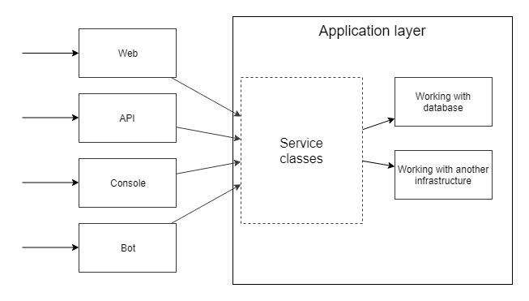
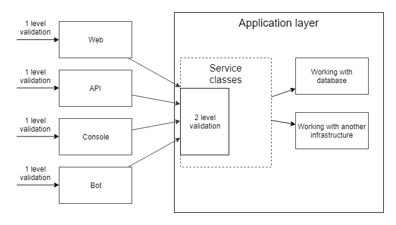

# Валидация

A> "...But, now you come to me, and you say: "Don Corleone, give me justice." But you don't ask with respect. You don't offer friendship..."

## Валидация связанная с базой данных

Как всегда, главу начнём с примера кода с практиками, накопленными в предыдущих главах.
Создание статьи:

```php
class PostController extends Controller
{
    public function create(Request $request, PostService $service)
    {
        $this->validate($request, [
            'category_id' => 'required|exists:categories',
            'title' => 'required',
            'body' => 'required',
        ]);
        
        $service->create(/* DTO */);
        
        //...
    }
}

class PostService
{
    public function create(CreatePostDto $dto)
    {
        $post = new Post();
        $post->category_id = $dto->categoryId;
        $post->title = $dto->title;
        $post->body = $dto->body;
        
        $post->saveOrFail();
    }
}
```

Я, краткости ради, вернул валидацию обратно в контроллер.
Одной из проверок является существование нужной категории в базе данных. 
Давайте представим, что в будущем в модель категорий будет добавлен трейт **SoftDeletes**.
Этот функционал будет помечать строки в базе данных как удаленные вместо того, чтобы физически их удалять, а также не включать строки, помеченные как удаленные в результаты запросов.
Всё приложение продолжит работать, не заметив этого изменения.
Кроме этой валидации.
Она позволит создать статью с удаленной категорией, нарушив тем самым консистентность данных.
Исправим это:

```php
$this->validate($request, [
    'category_id' => [
        'required|exists:categories,id,deleted_at,null',
    ],
    'title' => 'required',
    'body' => 'required',
]);
```
Была добавлена проверка на пометку на удаление.
Могу ещё добавить, что таких правок может понадобиться много, ведь статьи не только создаются.
Любое другое изменение может опять сломать нашу "умную" валидацию.
Например, пометка "archived" для категорий, которая позволит им оставаться на сайте, но не позволяет добавлять новые статьи в них.
Мы не делали никаких изменений в форме добавления статьи, и вообще во всей HTTP части приложения.
Изменения касались либо бизнес-логики (архивные категории), либо логики хранения данных (Soft delete), однако менять приходится классы HTTP-запросов с их валидацией.
Это ещё один пример высокой связанности (high coupling).
Не так давно мы решили вынести всю работу с базой данных в Слой Приложения, но по старой привычке всё ещё лезем в базу напрямую из валидации, игнорируя все абстракции, которые строятся с помощью Eloquent или Слоя Приложения.





Надо разделить валидацию. В валидации HTTP слоя нам просто необходимо убедиться, что пользователь не ошибся при вводе данных:

```php
$this->validate($request, [
    'category_id' => 'required',
    'title' => 'required',
    'body' => 'required',
]);

class PostService
{
    public function create(CreatePostDto $dto)
    {
        $category = Category::find($dto->categoryId);
        
        if($category === null) {
            // throw "Category not found" exception
        }
        
        if($category->archived) {
            // throw "Category archived" exception
        }
        
        $post = new Post();
        $post->category_id = $category->id;
        $post->title = $dto->title;
        $post->body = $dto->body;
        
        $post->saveOrFail();
    }
}
```
Валидацию же, затрагивающую бизнес-логику или базу данных, необходимо проводить в более правильных местах.
Теперь код работает более стабильно: валидация в контроллерах или **FormRequest** не меняется от случайных изменений в других слоях.
Метод **PostService::create** не доверяет такие важные проверки вызывающему коду и валидирует всё сам.
В качестве бонуса, приложение теперь имеет намного более понятные тексты ошибок.

## Два уровня валидации





В прошлом примере валидация была разделена на две части и я сказал, что метод **PostService::create** не доверяет сложную валидацию вызывающему коду, но он всё ещё доверяет ему в простом:

```php
$post->title = $dto->title;
```
Здесь мы исходим из того, что заголовок у нас будет непустой, однако на 100 процентов уверенности нет.
Да, сейчас оно проверяется правилом 'required' при валидации, но это далеко, где-то в контроллерах или ещё дальше. 
Метод **PostService::create** может быть вызван из другого кода, и там эта проверка может быть забыта.
Давайте рассмотрим пример с регистрацией пользователя (он удобнее):

```php
readonly final class RegisterUserDto
{
    public function __construct(
        public string $name,
        public string $email,
        public DateTime $birthDate,
    ) {}
}

class UserService
{
    public function register(RegisterUserDto $request)
    {
        $existingUser = User::whereEmail($request->email)
            ->first();
        
        if($existingUser !== null) {
            throw new UserWithThisEmailAlreadyExists(...);    
        }
        
        $user = new User();
        $user->name = $request->name;
        $user->email = $request->email;
        $user->birthDate = $request->birthDate;
        
        $user->saveOrFail();
    }
}
```
После начала использования DTO мы вынуждены забыть про то, что данные в web запросе были отвалидированы.
Любой может написать такой код:

```php
$userService->register(new RegisterUserDto('', '', new DateTime()));
```
Никто не может поручиться, что в **name** будет лежать непустая строка, а в **email** строка с верным email адресом.
Что делать?
Можно дублировать валидацию в сервисном классе:

```php
class UserService
{
    public function register(RegisterUserDto $request)
    {
        if(empty($request->name)) {
            throw //
        }
        
        if(!filter_var($request->email, 
                        FILTER_VALIDATE_EMAIL)) {
            throw //
        }
        
        //...
    }
}
```
Или сделать такую же валидацию в конструкторе DTO класса, но в приложении будет куча мест, где нужно будет получать email, имя или подобные данные. Много кода будет дублироваться. Я могу предложить два варианта.

## Валидация аннотациями

Проект **Symfony** содержит отличный компонент для валидации аннотациями - **symfony/validator**.
Перепишем наш **RegisterUserDto**:

```php
use Symfony\Component\Validator\Constraints as Assert;

readonly class RegisterUserDto
{
    public function __construct(
        #[Assert\NotBlank]
        private string $name;
        
        #[Assert\NotBlank]
        #[Assert\Email]
        private string $email;
        
        #[Assert\NotNull]
        private DateTime $birthDate;
    ) {}
}
```

Просим валидатор в сервисном классе и используем его для проверки DTO:

```php
class UserService
{
    public function __construct(
        private ValidatorInterface $validator
    ) {}
    
    public function register(RegisterUserDto $dto)
    {
        $violations = $this->validator->validate($dto);
                
        if (count($violations) > 0) {
            throw new ValidationException($violations);
        }
        
        $existingUser = User::whereEmail($dto->email)->first();
        
        if($existingUser !== null) {
            throw new UserWithThisEmailAlreadyExists(...);    
        }
        
        $user = new User();
        $user->name = $dto->name;
        $user->email = $dto->email;
        $user->birthDate = $dto->birthDate;
        
        $user->saveOrFail();
    }
}
```

Правила валидации описываются аннотациями. 
Метод **ValidatorInterface::validate** возвращает список нарушений правил валидации.
Если он пуст - всё хорошо. Если нет, выбрасываем исключение валидации - **ValidationException**.
Используя эту явную валидацию, в Слое Приложения можно быть уверенным в валидности данных.
Также, в качестве бонуса, можно удалить валидацию в слое Web, API и т.д, поскольку все данные уже проверяются глубже.
Отличная идея, но с этим есть некоторые проблемы.

### Проблема данных Http запроса
В первую очередь, данные, которые передаются от пользователей в HTTP-запросе, не всегда равны данным, передаваемым в Слой Приложения.
Когда пользователь меняет свой пароль, приложение запрашивает старый пароль, новый пароль и повторить новый пароль.
Валидация Web-слоя должна проверить поля нового пароля на совпадение, а Слою Приложения эти данные просто не нужны, он получит только значения старого и нового пароля.

Другой пример: одно из значений, передаваемых в Слой Приложения заполняется email-адресом текущего пользователя.
Если этот email окажется пустым, то пользователь может увидеть сообщение "Формат email неверный", при том, что он даже не вводил никакого email!
Поэтому, делать валидацию пользовательского ввода в Слое Приложения - не самая лучшая идея.

### Проблема сложных структур данных
Представьте некий DTO создания заказа такси - **CreateTaxiOrderDto**.
Это будет авиа-такси, поэтому заказы могут быть из одной страны в другую.
Там будут поля **fromHouse**, **fromStreet**, **fromCity**, **fromState**, **fromCountry**, **toHouse**, **toStreet**, **toCity**,...
Огромный DTO с кучей полей, дублирующих друг-друга, зависящих друг от друга.
Номер дома не имеет никакого смысла без имени улицы.
Имя улицы, без города и страны.
Валидация подобных данных будет сложной и регулярно дублируемой в разных DTO-объектах.

## Value objects
Решение этой проблемы лежит прямо в **RegisterUserDto**.
Мы не храним отдельно **$birthDay**, **$birthMonth** и **$birthYear**. Не валидируем их каждый раз.
Мы просто храним объект **DateTime**! Он всегда хранит корректную дату и время.
Сравнивая даты, мы никогда не сравниваем их года, месяцы и дни. Там есть метод **diff()** для сравнений дат.
Этот класс содержит все знания о датах внутри себя, избавляя нас от необходимости дублировать логику работы с ними везде.
Можно попробовать сделать что-то похожее и с другими данными:

```php
final class Email
{
    /** @var string */
    private $email;
    
    private function __construct(string $email)
    {
        if (!filter_var($email, FILTER_VALIDATE_EMAIL)) {
            throw new InvalidArgumentException(
                'Email ' . $email . ' is not valid');
        }
        
        $this->email = $email;
    }
    
    public static function createFromString(
        string $email)
    {
        return new static($email);
    }
    
    public function value(): string
    {
        return $this->email;
    }
}

final class UserName
{
    /** @var string */
    private $name;
    
    private function __construct(string $name)
    {
        if (/* Some validation of $name value*. 
            It depends on project requirements. */) {
            throw new InvalidArgumentException(
                'Invalid user name: ' . $name);
        }
        
        $this->name = $name;
    }
    
    public static function createFromString(
        string $name)
    {
        return new static($name);
    }
    
    public function value(): string
    {
        return $this->name;
    }
}

readonly final class RegisterUserDto
{
    public function __construct(
        public UserName $name,
        public Email $email,
        public DateTime $birthDate,
    ) {}
}
```
Да, создавать класс для каждого возможного типа вводимых данных - это не то, о чем мечтает каждый программист.
Но это естественный путь декомпозиции приложения.
Вместо того, чтобы использовать строки и всегда сомневаться, лежит ли в них нужное значение, эти классы позволяют всегда иметь корректные значения, как с DateTime.
Этот шаблон называется **Объект-значение**(**Value Object** или **VO**).
В поле **email** больше не лежит просто строка. Поле это теперь типа **Email**, который без сомнения можно использовать везде, где нужны email-адреса.
**UserService** может без страха использовать эти значения:

```php
final class UserService
{
    public function register(RegisterUserDto $dto)
    {
        //...
        $user = new User();
        $user->name = $dto->name;
        $user->email = $dto->email;
        $user->birthDate = $dto->bithDate;
        
        $user->saveOrFail();
    }
}
```
Для того чтобы полям Eloquent-сущности можно было присваивать такие VO как **Email**, необходимо реализовать их преобразование через механизм casting.
Это влечет за собой дополнительные затраты и необходимо еще раз задуматься "а стоит ли данный проект таких затрат?".
Для многих проектов страхи, описанные выше, не так значительны и вполне можно обойтись без такого значительного усложнения логики.
Однако, есть проекты, в которых цена ошибки будет слишком велика и такие усилия по защите целостности данных будут вполне оправданы.

## Объект-значение как композиция других значений
Объекты-значения **Email** и **UserName** - это просто оболочки для строк, но шаблон **Объект-значение** - более широкое понятие.
Географическая координата может быть описана двумя float значениями: долгота и широта.
Обычно, мало кому интересна долгота, без знания широты.
Создав объект **GeoPoint**, можно во всем приложении работать с ним.

```php
readonly final class GeoPoint
{
    public function __construct(
        public float $latitude, 
        public float $longitude,
    ) {}
    
    public function isEqual(GeoPoint $other): bool
    {
        // просто примера ради
        return $this->getDistance($other)->getMeters() < 10; 
    }

    public function getDistance(GeoPoint $other): Distance
    {
        // Вычисление расстояния между $this и $other
    }
}

final class City
{
    //...
    private GeoPoint $centerPoint;

    public function getDistance(City $other): Distance
    {
        return $this->centerPoint
                    ->getDistance($other->centerPoint);
    }
}
```
Примером того, как знание о координатах инкапсулировано в классе **GeoPoint**, является метод **getDistance** класса **City**.
Для вычисления дистанции между городами просто используется расстояние между двумя центральными точками городов.

Другие примеры объектов-значений:

* **Money**(int **amount**, Currency **currency**)
* **Address**(string **street**, string **city**, string **state**, string **country**, string **zipcode**)

Вы заметили, что в прошлом примере я пытаюсь не использовать примитивные типы, такие как строки и числа?
Метод **getDistance()** возвращает объект **Distance**, а не int или float.
Класс **Distance** может иметь методы **getMeters()**: float или **getMiles()**: float.
А также **Distance::isEqual**(**Distance** **$other**) для сравнения двух расстояний.
Это тоже объект-значение!
Для многих проектов такая детализация излишня, и метод **GeoPoint::getDistance()**: возвращающий число с плавающей запятой расстояния в метрах более, чем достаточен.
Я лишь хотел показать пример того, что я называю "мышлением объектами".
Мы ещё вернемся к объектам-значениям позднее в этой книге.
Вероятно, вы понимаете, что этот шаблон слишком мощный, чтобы использоваться только как поле в DTO.

## Объекты-значения и валидация

```php
final class UserController extends Controller
{
    public function register(
        Request $request, UserService $service)
    {
        $this->validate($request, [
            'name' => 'required',
            'email' => 'required|email',
            'birth_date' => 'required|date',
        ]);
        
        $service->register(new RegisterUserDto(
            UserName::create($request['name']),
            Email::create($request['email']),
            DateTime::createFromFormat('some format', $request)
        ));
        
        //return ok response
    }
}
```

В этом коде можно легко найти дубликаты.
Значение email-адреса сначала валидируется с помощью Laravel валидации, а потом в конструкторе класса **Email**:

```php
final class Email
{
    private function __construct(string $email)
    {
        if (!filter_var($email, FILTER_VALIDATE_EMAIL)) {
            throw new InvalidArgumentException(
                'Email ' . $email . ' is not valid');
        }
        
        $this->email = $email;
    }
    
    //...
}
```

Идея удаления кода Laravel-валидации выглядит интересной.
Можно удалить вызов **$this->validate()** и просто ловить исключение **InvalidArgumentException** в глобальном обработчике ошибок.
Но, как я уже писал, данные HTTP-запроса не всегда равны данным, передаваемым в Слой Приложения, да и исключение **InvalidArgumentException** может быть выброшено во многих других ситуациях.
Опять может повториться ситуация, когда пользователь видит ошибки про данные, которые он не вводил.

Если вы помните, PhpStorm по умолчанию имеет 3 класса непроверяемых исключений: **Error**, **RuntimeException** и **LogicException**:

* **Error** означает ошибку языка PHP, например **TypeError**, **ParseError**, и т.д.
* **RuntimeException** означает ошибку времени выполнения, не зависящую от нашего кода, например проблемы с соединением с базой данных.
* **InvalidArgumentException** наследует от **LogicException**.
Описание **LogicException** в документации PHP: "Исключение означает ошибку в логике приложения. Эти ошибки должны напрямую вести к исправлению кода.".
Поэтому, если код написан верно, он никогда не должен выбрасывать **LogicException**.

Это означает, что проверки в конструкторах объектов-значений нужны только для того, чтобы убедиться, что данные были проверены ранее, например с помощью вызова метода ->validate() и стандартного валидатора Laravel.
Они не должны быть использованы в качестве валидации данных, введенных пользователем. 
Это валидация кода нашего приложения.

## Пара слов в конце главы

Вынесение логики в Слой Приложения ведет к некоторым проблемам с валидацией данных.
Мы не можем напрямую использовать объекты **FormRequest** и приходится использовать некие объекты передачи данных (DTO), пусть даже это будут простые массивы.
Если Слой Приложения всегда получает ровно те данные, которые ввел пользователь, то вся валидация может быть перенесена туда и использовано решение с пакетом **symfony/validator** или другим.
Но это будет опасно и не очень удобно, если идет работа со сложными структурами данных, такими как адреса или точки координат, например.

Валидация может быть оставлена в Web, API и других частях кода, а Слой Приложения будет просто доверять переданным ему данным.
По моему опыту это работает только в маленьких проектах.
Большие проекты, над которыми работают команды разработчиков, постоянно будут сталкиваться с проблемами невалидных данных, которые будут вести к неправильным значениям в базе данных или к выбросу неверных исключений.
 
Шаблон объект-значение требует некоторого дополнительного кодинга и "мышления объектами" от программистов, но это наиболее безопасный и естественный способ представлять данные, имеющие какой-то дополнительный смысл, т.е. "не просто строка, а email".
Как всегда, это выбор между краткосрочной и долгосрочной производительностью.
