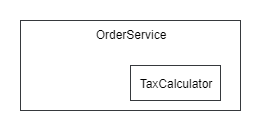
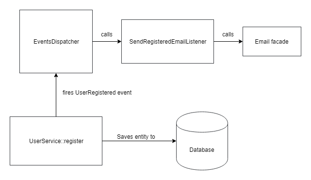
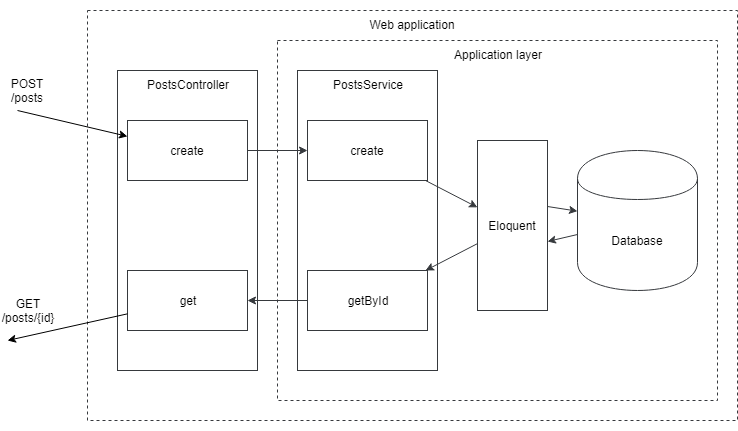
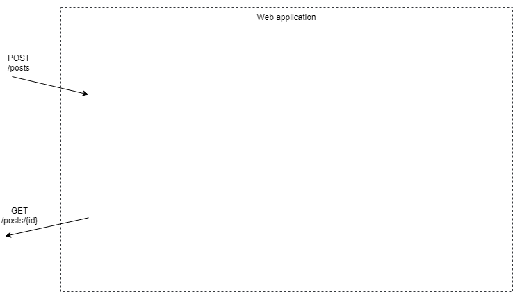

# Unit-тестирование

## Первые шаги

Вы, вероятно, уже слышали про unit-тестирование.
Оно довольно популярно сейчас.
Я довольно часто общаюсь с разработчиками, которые утверждают, что не начинают писать код, пока не напишут тест для него.
TDD-маньяки!
Начинать писать unit-тесты довольно сложно, особенно если вы пишете, используя фреймворки такие, как Laravel.
Unit-тесты одни из лучших индикаторов качества кода в проекте.
Фреймворки пытаются сделать процесс добавления новых фич как можно более быстрым, позволяя срезать углы в некоторых местах, но высоко-связанный код обычная тому цена.
Сущности железно связанные с базой данных, классы с большим количеством зависимостей, которые бывает трудно найти (Laravel фасады).
В этой главе я постараюсь протестировать код Laravel приложения и показать главные трудности, но начнем с самого начала.

**Чистая функция** - это функция, результат которой зависит **только** от введенных данных. 
Она не меняет никакие внешние значения и просто вычисляет результат. 
Примеры: 

```php
function strpos(string $needle, string $haystack)
function array_chunk(array $input, $size, $preserve_keys = null)
```

Чистые функции очень простые и предсказуемые.
Unit-тесты для них писать легко.
Попробуем написать простую функцию (это может быть и методом класса) методом TDD:

```php
function cutString(string $source, int $limit): string
{
    return ''; // начнем просто возвращая пустую строку
}

class CutStringTest extends \PHPUnit\Framework\TestCase
{
    public function testEmpty()
    {
        $this->assertEquals('', cutString('', 20));
    }

    public function testShortString()
    {
        $this->assertEquals('short', cutString('short', 20));
    }

    public function testCut()
    {
        $this->assertEquals('long string shoul...', 
            cutString('long string should be cut', 20));
    }
}
```

Я здесь использую PHPUnit для написания тестов.
Название функции не очень удачное, но просто взглянув на тесты, можно понять что она делает.
Тесты проверяют результат с помощью assertEquals.
Unit-тесты могут служить документацией к коду, если они такие же простые и легко-читаемые.
 
Если я запущу эти тесты, то получу такой вывод:

```
Failed asserting that two strings are equal.
Expected :'short'
Actual   :''

Failed asserting that two strings are equal.
Expected :'long string shoul...'
Actual   :''
```

Разумеется, ведь наша функция еще не написана.
Время ее написать:

```php
function cutString(string $source, int $limit): string
{
    $len = strlen($source);

    if($len < $limit) {
        return $source;
    }

    return substr($source, 0, $limit-3) . '...';
}
```

Вывод PHPUnit после этих правок:

```
OK (3 tests, 3 assertions)
```
Отлично!
Класс unit-теста содержит список требований к функции:

* Для пустой строки результат тоже должен быть пуст.
* Для строк, которые короче лимита, должна вернуться эта строка без изменений.
* Для строк длиннее лимита, результатом должна стать строка, укороченная до этого лимита с тремя точками в конце.

Успешные тесты говорят о том, что код удовлетворяет требованиям.
Но это не так!
В коде небольшая ошибка и функция не работает как задумано, если длина строки совпадает с лимитом.
Хорошая привычка: если найден баг, надо написать тест, который его воспроизведет и упадёт.
Нам в любом случае нужно будет проверить исправлен ли этот баг и unit-тест хорошее место для этого.
Новые тест-методы:

```php
class CutStringTest extends \PHPUnit\Framework\TestCase
{
    // старые тесты
    
    public function testLimit()
    {
        $this->assertEquals('limit', cutString('limit', 5));
    }

    public function testBeyondTheLimit()
    {
        $this->assertEquals('beyondl...', 
                            cutString('beyondlimit', 10));
    }
}
```

**testBeyondTheLimit** выполняется хорошо, а **testLimit** падает:

```
Failed asserting that two strings are equal.
Expected :'limit'
Actual   :'li...'
```

Исправление простое: поменять **<** на **<=**

```php
function cutString(string $source, int $limit): string
{
    $len = strlen($source);

    if($len <= $limit) {
        return $source;
    }

    return substr($source, 0, $limit-3) . '...';
}
```

Сразу же запускаем тесты:

```
OK (5 tests, 5 assertions)
```

Отлично. Проверка краевых значений (0, длина **$limit**, длина **$limit**+1, и т.д.) очень важная часть тестирования.
Многие ошибки находятся именно в этих местах.

Когда я писал функцию **cutString**, я думал, что длина исходной строки мне понадобится дальше и сохранил её в переменную. Но оказалось, что дальше нам нужна только переменная **$limit**.
Теперь я могу удалить эту переменную.

```php
function cutString(string $source, int $limit): string
{
    if(strlen($source) <= $limit) {
        return $source;
    }

    return substr($source, 0, $limit-3) . '...';
}
```

И опять: запускаем тесты!
Я изменил код и мог что-то сломать при этом.
Лучше это обнаружить как можно скорее и исправить.
Эта привычка сильно повышает итоговую производительность.
С хорошо написанными тестами, почти любая ошибка будет поймана сразу и разработчик может исправить её пока тот код, который он поменял, у него всё еще в голове.

Я всё внимание обратил на главный функционал и забыл про пред-условия.
Разумеется, параметр **$limit** в реальном проекте никогда не будет слишком маленький, но хороший дизайн функции предполагает проверку этого значения тоже:

```php
class CutStringTest extends \PHPUnit\Framework\TestCase
{
    //...
    
    public function testLimitCondition()
    {
        $this->expectException(InvalidArgumentException::class);
        
        cutString('limit', 4);
    }
}

function cutString(string $source, int $limit): string
{
    if($limit < 5) {
        throw new InvalidArgumentException(
            'The limit is too low');
    }
        
    if(strlen($source) <= $limit) {
        return $source;
    }

    return substr($source, 0, $limit-3) . '...';
}
```

Вызов **expectException** проверяет то, что исключение будет выброшено. Если этого не произойдет, то тест будет признан упавшим.

## Тестирование классов с состоянием

Чистые функции прекрасны, но в реальном мире слишком много вещей, которые нельзя описать исключительно ими.
Объекты могут иметь **состояние**.
Unit-тестирование классов с состоянием немного сложнее.
Для таких тестов есть рекомендация делить код теста на три части:
1. **инициализация** объекта в нужном состоянии
2. **выполнение** тестируемого действия
3. **проверка** результата

I> Есть также шаблон AAA: Arrange, Act, Assert, который описывает те же три шага.

Начну с простого примера теста воображаемой сущности **Статья**, которая не является Eloquent моделью.
Её можно создать только с непустым заголовком, а текст может быть пустым.
Но опубликовать эту статью можно только, если её текст не пустой.

```php
class Post
{
    public string $title; 
    public string $body;
    public bool $published = false;

    public function __construct(
        $title, $body
    ) {
        if (empty($title)) {
            throw new InvalidArgumentException(
                'Title should not be empty');
        }

        $this->title = $title;
        $this->body = $body;
    }

    public function publish()
    {        
        if (empty($this->body)) {
            throw new CantPublishException(
                'Cant publish post with empty body');
        }

        $this->published = true;
    }
}
```

Конструктор класса **Post** - чистая функция, поэтому тесты для нее подобны предыдущим:

```php
class CreatePostTest extends \PHPUnit\Framework\TestCase
{
    public function testSuccessfulCreate()
    {
        // инициализация и выполнение
        $post = new Post('title', '');

        // проверка
        $this->assertEquals('title', $post->title);
    }

    public function testEmptyTitle()
    {
        // проверка
        $this->expectException(InvalidArgumentException::class);

        // инициализация и выполнение
        new Post('', '');
    }
}
```

Однако, метод **publish** зависит от текущего состояния объекта и части тестов более ощутимы:

```php
class PublishPostTest extends \PHPUnit\Framework\TestCase
{
    public function testSuccessfulPublish()
    {
        // инициализация
        $post = new Post('title', 'body');

        // выполнение
        $post->publish();

        // проверка
        $this->assertTrue($post->published);
    }

    public function testPublishEmptyBody()
    {
        // инициализация
        $post = new Post('title', '');

        // проверка
        $this->expectException(CantPublishException::class);

        // выполнение
        $post->publish();
    }
}
```

При тестировании исключений **проверка**, которая обычно последняя, происходит до **выполнения**.
Тестирование классов с состоянием сложнее тестирования чистых функций, поскольку разработчик должен держать в голове состояние объекта и проверить все возможные варианты пар "состояние-изменение".

## Тестирование классов с зависимостями

Одной из важных особенностей unit-тестирования является тестирование в изоляции.
Unit (класс, функция или другой модуль) должен быть изолирован от всего остального мира.
Это будет гарантировать, что тест тестирует только этот модуль.
Тест может упасть только по двум причинам: неправильный тест или неправильный код тестируемого модуля.
Ни неправильно настроенная база данных, ни появившийся баг в какой-то из используемых библиотек не могут уронить unit-тесты. 
Тестирование в изоляции даёт нам эту простоту и быстродействие.
Настоящие unit-тесты выполняются очень быстро, поскольку во время их выполнения не происходит никаких тяжелых операций, вроде запросов в базу данных, чтения файлов или вызовов API.
Когда класс просит некоторые DI-зависимости, тест должен их ему предоставить.  

### Зависимости на реальные классы

В главе про внедрение зависимостей я писал про два типа возможных интерфейсов:

1. Есть интерфейс и несколько возможных реализаций.
2. Есть интерфейс и одна реализация.

Для второго случая я предлагал не создавать интерфейса, теперь же хочу проанализировать это.
Какая зависимость может быть реализована только одним возможным способом?
Все операции ввода/вывода, такие как вызовы API, операции с файлами или запросы в базу данных, всегда могут иметь другие возможные реализации. С другим драйвером, декоратором и т.д. 
Иногда класс содержит некоторые большие вычисления и разработчик решает вынести эту логику в отдельный класс.
Этот новый класс становится новой зависимостью.
В этом случае трудно себе представить другой возможный вариант реализации этой зависимости и это прекрасный момент, чтобы поговорить про инкапсуляцию и почему unit-тестирование называется unit-тестированием, т.е. тестированием модулей, а не тестирование классов или функций.

Это пример описанного случая. Класс **TaxCalculator** был вынесен в свой класс из класса **OrderService**.

```php
class OrderService
{
    public function __construct(
        private TaxCalculator $taxCalculator
    ) {}
    
    public function create(OrderCreateDto $orderCreateDto)
    {
        $order = new Order();
        //...
        $order->sum = ...;
        $order->taxSum = $this->taxCalculator
                            ->calculateTax($order);
        //...
    }
}
```

Но если мы взглянем на класс **OrderService**, то увидим, что **TaxCalculator** не выглядит его зависимостью.
Он не выглядит как что-то внешнее, нужное **OrderService** для работы.
Он выглядит как часть класса **OrderService**.





**OrderService** здесь является модулем, который содержит не только класс **OrderService**, но и класс **TaxCalculator**.
Класс **TaxCalculator** должен быть внутренней зависимостью, а не внешней.

```php
class OrderService
{
    private TaxCalculator $taxCalculator = new TaxCalculator();
    //...
}
```

Теперь всему остальному коду необязательно знать про **TaxCalculator**.
Unit-тесты могут тестировать класс **OrderService** не заботясь о предоставлении ему объекта **TaxCalculator**.
Если условия изменятся и **TaxCalculator** станет внешней зависимостью (разные алгоритмы подсчета налогов), то зависимость будет несложно сделать публичной, нужно будет просто поставить его как параметр в конструктор и поменять код тестов.

Модуль - весьма широкое понятие.
В начале этой статьи модулем была маленькая функция, а иногда в модуле может содержаться несколько классов.
Программные объекты внутри модуля должны быть сфокусированы на одной ответственности, другими словами, иметь сильную связность.
Когда методы класса полностью независимы друг от друга, класс не является модулем.
Каждый метод класса - это модуль в данном случае. 
Возможно, стоит вынести эти методы в отдельные классы, чтобы разработчики не просматривали кучу лишнего кода каждый раз?

### Стабы и фейки

Обычно, зависимость - это интерфейс, который имеет несколько реализаций.
Использование реальных реализаций этого интерфейса во время unit-тестирования - плохая идея, поскольку там могут проводиться те самые операции ввода-вывода, замедляющие тестирование и не дающие провести тестирование этого модуля в изоляции.
Прогон unit-тестов должен быть быстр как молния, поскольку запускаться они будут часто и важно, чтобы разработчик запустив их не потерял фокус над кодом.
Написал код - прогнал тесты, еще написал код - прогнал тесты.
Быстрые тесты позволят ему оставаться более продуктивным, не позволяя отвлекаться.
Решение в лоб задачи изоляции класса от зависимостей - создание отдельной реализации этого интерфейса, предназначенного просто для тестирования.
Вернемся к предыдущему примеру и вообразим, что **TaxCalculator** стал зависимостью и это теперь интерфейс с некоей реализацией.

```php
interface TaxCalculator
{
    public function calculateTax(Order $order): float;
}

class OrderService
{
    public function __construct(
        private TaxCalculator $taxCalculator
    ) {}
    
    public function create(OrderCreateDto $orderCreateDto)
    {
        $order = new Order();
        //...
        $order->sum = ...;
        $order->taxSum = $this->taxCalculator
                            ->calculateTax($order);
        //...
    }
}

class FakeTaxCalculator implements TaxCalculator
{
    public function calculateTax(Order $order): float
    {
        return 0;
    }
}

class OrderServiceTest extends \PHPUnit\Framework\TestCase
{
    public function testCreate()
    {
        $orderService = new OrderService(new FakeTaxCalculator());

        $orderService->create(new OrderCreateDto(...));

        // some assertions
    }
}
```

Работает!
Такие классы называются фейками.
Библиотеки для unit-тестирования могут создавать такие классы на лету.
Тот же самый тест, но с использованием метода **createMock** библиотеки PHPUnit:

```php
class OrderServiceTest extends \PHPUnit\Framework\TestCase
{
    public function testCreate()
    {
        $stub = $this->createMock(TaxCalculator::class);

        $stub->method('calculateTax')
            ->willReturn(0);

        $orderService = new OrderService($stub);

        $orderService->create(new OrderCreateDto(...));

        // some assertions
    }
}
```

Стабы удобны когда нужно быстро настроить простую реализацию, однако когда тестов с этой зависимостью становится много, вариант с фэйковым классом смотрится оптимальнее.
Библиотеки могут создавать стабы не только для интерфейсов, но и для реальных классов, что может быть весьма удобно при работе с легаси-проектами или для ленивых разработчиков.

### Моки

Иногда разработчик хочет протестировать вызваны ли методы стаба, сколько раз и какие параметры переданы были.

> Вообще, я не считаю идею тестирования вызовов методов зависимостей хорошей идеей.
> Unit-тест в этом случае начинает знать слишком многое о том, как этот класс работает.
> Как следствие, такие тесты очень легко ломаются. 
> Небольшой рефакторинг и тесты падают.
> Если это случается слишком часто, команда может просто забыть про unit-тестирование.
> Это называется тестированием методом белого ящика.
> Тестирование методом черного ящика пытается тестировать только входные и выходные данные, не залезая внутрь.
> Разумеется, тестирование черным ящиком намного стабильнее. 

Эти проверки могут быть реализованы в фейковом классе, но это будет весьма непросто и мало кто захочет делать это для каждой возможной зависимости.
Библиотеки для тестирования могут создавать специальные мок-классы, которые позволяют легко проверять вызовы их методов.

```php
class OrderServiceTest extends \PHPUnit\Framework\TestCase
{
    public function testCreate()
    {
        $stub = $this->createMock(TaxCalculator::class);

        // Конфигурация мок-класса
        $stub->expects($this->once())
            ->method('calculateTax')
            ->willReturn(0);

        $orderService = new OrderService($stub);

        $orderService->create(new OrderCreateDto(...));

        // некоторые проверки
    }
}
```

Теперь тест проверяет, что во время выполнения метода **OrderService::create** с переданными параметрами **TaxCalculator::calculateTax** был вызван ровно один раз.
С мок-классами можно делать различные проверки на значения параметров и количество вызовов, настраивать возвращаемые значения, выбрасывать исключения и т.д.
Я не хочу фокусироваться на этом в данной книге.
Фейки, стабы и моки имеют общее имя - test doubles, название для объектов, которые подставляются вместо реальных с целью тестирования.
Они могут использоваться не только в unit-тестах, но в и интеграционных тестах.

## Типы тестов ПО

Люди придумали множество способов тестировать приложения.
Security testing для проверки приложений на различные уязвимости.
Performance testing для проверки насколько хорошо приложение ведет себя при нагрузке.
В этой главе мы сфокусируемся на проверке корректности работы приложений.
Unit-тестирование уже было рассмотрено.
**Интеграционное тестирование** проверяет совместную работу нескольких модулей.
Пример: Попросить **UserService** зарегистрировать нового пользователя и проверить, что новая строка создана в базе данных, нужное событие (**UserRegistered**) было сгенерировано и соответствующий email был послан (ну или хотя бы фреймворк получил команду сделать это).





**Функциональное тестирование** (приёмочное или E2E - end to end) проверяет приложение на соответствие функциональным требованиям.
Пример: Требование о создании некоей сущности.
Тест открывает браузер, идёт на специфическую страницу, заполняет поля значениями, "нажимает" кнопку Создать и проверяет, что нужная сущность была создана, путем поиска её на определенной странице.

## Тестирование в Laravel

Laravel предоставляет много инструментов для различного тестирования.

### Инструменты Laravel для функционального тестирования

Инструменты для тестирования HTTP запросов, браузерного и консоли делают функциональное тестирование в Laravel весьма удобным, но мне не нравятся примеры из документации.
Один из них, совсем немного измененный:

```php
class ExampleTest extends TestCase
{
    public function testBasicExample()
    {
        $response = $this->postJson('/users', [
            'name' => 'Sally',
            'email' => 'sally@example.com'
        ]);

        $response
            ->assertOk()
            ->assertJson([
                'created' => true,
            ]);
    }
}
```

Этот тест просто проверяет, что запрос **POST /user** вернул успешный результат.
Это не выглядит законченным тестом.
Тест должен проверять, что пользователь реально создан.
Но как?
Первый ответ, приходящий в голову: просто сделать запрос в базу данных и проверить это.
Опять пример из документации:

```php
class ExampleTest extends TestCase
{
    public function testDatabase()
    {
        // Сделать запрос на создание пользователя
    
        $this->assertDatabaseHas('users', [
            'email' => 'sally@example.com'
        ]);
    }
}
```

Хорошо. Напишем другой тест подобным образом:

```php
class PostsTest extends TestCase
{
    public function testDelete()
    {
        $response = $this->deleteJson('/posts/1');

        $response->assertOk();
        
        $this->assertDatabaseMissing('posts', [
            'id' => 1
        ]);
    }
}
```

А вот тут уже небольшая ловушка.
Абсолютно такая же как и в главе про валидацию.
Просто добавив трейт **SoftDeletes** в класс **Post**, мы уроним этот тест.
Однако, приложение работает абсолютно также, выполняет те же самые требования и пользователи этой разницы не заметят.
Функциональные тесты не должны падать в таких условиях.
Тест, который делает запрос в приложение, а потом лезет в базу данных проверять результат, не является настоящим функциональным тестом.
Он знает слишком многое про то, как работает приложение, как оно хранит данные и какие таблицы для этого использует.
Это еще один пример тестирования методом белого ящика.

Как я уже говорил, функциональное тестирование проверяет, удовлетворяет ли приложение функциональным требованиям.
Функциональное тестирование не про базу данных, оно о приложении в целом.
Поэтому нормальные функциональные тесты не лезут внутрь приложения, они работают снаружи.

```php
class PostsTest extends TestCase
{
    public function testCreate()
    {
        $response = $this->postJson('/api/posts', [
            'title' => 'Post test title'
        ]);

        $response
            ->assertOk()
            ->assertJsonStructure([
                'id',
            ]);

        $checkResponse = $this->getJson(
            '/api/posts/' . $response->getData()->id);

        $checkResponse
            ->assertOk()
            ->assertJson([
                'title' => 'Post test title',
            ]);
    }
    
    public function testDelete()
    {
        // Здесь некоторая инициализация, чтобы создать
        // объект Post с id = $postId

        // Удостоверяемся, что этот объект есть 
        $this->getJson('/api/posts/' . $postId)
            ->assertOk();
        
        // Удаляем его
        $this->jsonDelete('/posts/' . $postId)
            ->assertOk();
        
        // Проверяем, что больше в приложении его нет
        $this->getJson('/api/posts/' . $postId)
            ->assertStatus(404);
    }
}
```

Этому тесту абсолютно все равно как удален объект, с помощью 'delete' SQL запроса или с помощью Soft delete шаблона.
Функциональный тест проверяет поведение приложения в целом.
Ожидаемое поведение, если объект удален - он не возвращается по своему id и тест проверяет именно это.

Схема процессинга запросов "POST /posts/" и "GET /post/{id}":





Что должен видеть функциональный тест: 





### Моки Laravel-фасадов

Laravel предоставляет удобную реализацию шаблона **Service Locator** - Laravel-фасады.
Laravel не только предлагает их использовать, но и предоставляет инструменты для тестирования кода, который использует фасады.
Давайте напишем один из предыдущих примеров с использованием Laravel-фасадов и протестируем этот код:

```php
final class Survey extends Model
{
    public function options()
    {
        return $this->hasMany(SurveyOption::class);
    }
}

final class SurveyOption extends Model
{
}

final class SurveyCreated
{
    public function __construct(
        public readonly int $surveyId
    ) {}
}

final class SurveyCreateDto
{
    public function __construct(
        public readonly string $title,
        /** @var string[] */ 
        public readonly array $options,
    ) {}
}

final class SurveyService
{
    public function create(SurveyCreateDto $dto)
    {
        if(count($dto->options) < 2) {
            throw new BusinessException(
                "Please provide at least 2 options");
        }

        $survey = new Survey();

        \DB::transaction(function() use ($dto, $survey) {
            $survey->title = $dto->title;
            $survey->save();

            foreach ($dto->options as $option) {
                $survey->options()->create([
                    'text' => $option,
                ]);
            }
        });

        \Event::dispatch(new SurveyCreated($survey->id));
    }
}

class SurveyServiceTest extends TestCase
{
    public function testCreate()
    {
        \Event::fake();

        $postService = new SurveyService();
        $postService->create(new SurveyCreateDto(
            'test title', 
            ['option1', 'option2']));

        \Event::assertDispatched(SurveyCreated::class);
    }
}
```

* Вызов **\Event::fake()** трансформирует Laravel-фасад **Event** в мок-объект.
* Метод **SurveyService::create** создаёт опрос с вариантами ответа, сохраняет его в базу данных и генерирует событие **SurveyCreated**.
* Вызов **\Event::assertDispatched** проверяет, что это событие было вызвано.

Я вижу несколько недостатков:

* Это не является unit-тестом.
Фасад **\Event** был заменен моком, но база данных - нет.
Реальные строчки будут добавлены в базу данных.
Для того чтобы сделать этот тест более чистым, в класс теста обычно добавляют трейт **RefreshDatabase**, который создаёт базу данных заново каждый раз.
Это очень медленно.
Один такой тест может быть выполнен за разумное время, но сотни таких займут уже несколько минут и никто не будет их выполнять после каждой мелкой правки.
* Тесты проверяют только генерацию событий.
Для того чтобы проверить создание записей в базе данных нужно использовать вызовы методов, таких как **assertDatabaseHas** или что-то вроде **SurveyService::getById**, которое делает этот тест неким функциональным тестом к Слою Приложения, поскольку он просит Слой Приложения что-то сделать и проверяет результат тоже вызвав его. 
* Зависимости класса **SurveyService** не описаны явно.
Фасад **Event** вызывается где-то внутри. 
Чтобы понять, что конкретно он требует для своей работы, нужно просмотреть весь его код.
Это делает написание тестов для него весьма неудобным.
Хуже всего, если в класс будет добавлена новая зависимость с помощью laravel-фасада.
Тесты будут продолжать работать как ни в чем не бывало, но не с моком, а с реальной реализацией этого фасада: реальные вызовы API и т.д.
Я слышал несколько реальных историй, когда разработчики запускали тесты и это приводило к тысячам реальных денежных переводов!
Ноги у такого растут именно из-за таких вот случаев, когда неожиданно в тесты попадет реальная реализация.

Я называю это "форсированным интеграционным тестированием".
Разработчик хочет написать unit-тест, но код обладает такой высокой связанностью, так крепко сцеплен с фреймворком, что этого просто не получается.
Попробуем это сделать! 

## Unit-тестирование Слоя Приложения

### Отсоединяем код от laravel-фасадов

Для того чтобы протестировать метод **SurveyService::create** в изоляции, нужно убрать использование Laravel-фасадов и базы данных (Eloquent).
Первая часть несложная, у нас есть Внедрение Зависимостей.

* Фасад **\Event** представляет интерфейс **Illuminate\Contracts\Events\Dispatcher**.
* Фасад **\DB** - **Illuminate\Database\ConnectionInterface**.

Вообще, последнее не совсем правда. Фасад **\DB** представляет **\Illuminate\Database\DatabaseManager**, который содержит вот такую вот магию:

```php
class DatabaseManager
{
    /**
     * Dynamically pass methods to the default connection.
     *
     * @param  string  $method
     * @param  array   $parameters
     * @return mixed
     */
    public function __call($method, $parameters)
    {
        return $this->connection()->$method(...$parameters);
    }
}    
```

Но нам будет достаточно только использования **ConnectionInterface** напрямую.

```php
class SurveyService
{
    public function __construct(
        private ConnectionInterface $connection, 
        private Dispatcher $dispatcher
    ) {}

    public function create(SurveyCreateDto $dto)
    {
        if(count($dto->options) < 2) {
            throw new BusinessException(
                "Please provide at least 2 options");
        }

        $survey = new Survey();

        $this->connection->transaction(function() use ($dto, $survey) {
            $survey->title = $dto->title;
            $survey->save();

            foreach ($dto->options as $option) {
                $survey->options()->create([
                    'text' => $option,
                ]);
            }
        });

        $this->dispatcher->dispatch(new SurveyCreated($survey->id));
    }
}
```

Хорошо. Для интерфейса **ConnectionInterface** я могу создать фейк класс **FakeConnection**.
Класс **EventFake**, который используется, когда происходит вызов **\Event::fake()**, может быть использован напрямую.

```php
use Illuminate\Support\Testing\Fakes\EventFake;
//...

class SurveyServiceTest extends TestCase
{
    public function testCreateSurvey()
    {
        $eventFake = new EventFake(
            $this->createMock(Dispatcher::class));

        $postService = new SurveyService(
            new FakeConnection(), $eventFake);
        
        $postService->create(new SurveyCreateDto(
            'test title',
            ['option1', 'option2']));

        $eventFake->assertDispatched(SurveyCreated::class);
    }
}
```

Этот тест выглядит очень похоже на прошлый, с фасадами, но теперь он намного строже с зависимостями класса **SurveyService**.
Но не совсем.
Любой разработчик всё еще может использовать любой фасад внутри класса **SurveyService** и тест будет продолжать работать.
Это происходит потому, что здесь используется специальный базовый класс для тестов, предоставляемый Laravel, который полностью настраивает рабочее окружение.

```php
use Illuminate\Foundation\Testing\TestCase as BaseTestCase;

abstract class TestCase extends BaseTestCase
{
    use CreatesApplication;
}
```

Для unit-тестов это недопустимо, нужно использовать обычный базовый класс PHPUnit:

```php

abstract class TestCase extends \PHPUnit\Framework\TestCase
{    
}
```

Теперь, если кто-то добавит вызов фасада, тест упадёт с ошибкой:

```
Error : Class 'SomeFacade' not found
```

Отлично, от laravel-фасадов мы код полностью избавили.

### Отсоединяем от базы данных

Отсоединять от базы данных намного сложнее.
Создадим класс репозитория (шаблон **Репозиторий**), чтобы собрать в нём всю работу с базой данных.

```php
interface SurveyRepository
{
    //... другие методы

    public function save(Survey $survey);

    public function saveOption(SurveyOption $option);
}

class EloquentSurveyRepository implements SurveyRepository
{
    //... другие методы

    public function save(Survey $survey)
    {
        $survey->save();
    }

    public function saveOption(SurveyOption $option)
    {
        $option->save();
    }
}

class SurveyService
{
    public function __construct(
        private ConnectionInterface $connection, 
        private SurveyRepository $repository, 
        private Dispatcher $dispatcher
    ) {}

    public function create(SurveyCreateDto $dto)
    {
        if(count($dto->options) < 2) {
            throw new BusinessException(
                "Please provide at least 2 options");
        }

        $survey = new Survey();

        $this->connection->transaction(function() use ($dto, $survey) {
            $survey->title = $dto->title;
            $this->repository->save($survey);

            foreach ($dto->options as $optionText) {
                $option = new SurveyOption();
                $option->survey_id = $survey->id;
                $option->text = $optionText;

                $this->repository->saveOption($option);
            }
        });

        $this->dispatcher->dispatch(new SurveyCreated($survey->id));
    }
}

class SurveyServiceTest extends \PHPUnit\Framework\TestCase
{
    public function testCreateSurvey()
    {
        $eventFake = new EventFake(
            $this->createMock(Dispatcher::class));

        $repositoryMock = $this->createMock(SurveyRepository::class);

        $repositoryMock->method('save')
            ->with($this->callback(function(Survey $survey) {
                return $survey->title == 'test title';
            }));

        $repositoryMock->expects($this->at(2))
            ->method('saveOption');

        $postService = new SurveyService(
            new FakeConnection(), $repositoryMock, $eventFake);
        
        $postService->create(new SurveyCreateDto(
            'test title',
            ['option1', 'option2']));

        $eventFake->assertDispatched(SurveyCreated::class);
    }
}
```

Это корректный unit-тест.
Класс **SurveyService** был протестирован в полной изоляции, не касаясь среды Laravel и базы данных.
Но почему это не радует меня?
Причины в следующем:

* Я был вынужден создать абстракцию с репозиторием исключительно для того, чтобы написать unit-тесты.
Код класса **SurveyService** без него выглядит в разы читабельнее, что весьма важно.
Это похоже на шаблон **Репозиторий**, но не является им.
Он просто пытается заменить операции Eloquent с базой данных.
Если объект опроса будет иметь больше отношений, то придётся реализовывать методы **save%ИмяОтношения%** для каждого из них.
* Запрещены почти все операции Eloquent.
Да, они будут работать корректно в реальном приложении, но не в unit-тестах.
Раз за разом разработчики будут спрашивать себя - "а для чего нам эти unit-тесты?"
* С другой стороны, такие unit-тесты очень сложные.
Их сложно писать и сложно читать.
Притом, что это пример один из простейших - просто создание одной сущности с отношениями.
* Каждая добавленная зависимость заставит переписывать все unit-тесты.
Это делает поддержку таких тестов весьма трудоемким занятием.

Это сложно измерить, но мне кажется, что польза от таких тестов намного меньше усилий затрачиваемых на них и урону читабельности кода.
В начале этой главы я сказал, что Unit-тесты - одни из лучших индикаторов качества кода в проекте.
Если код сложно тестировать, скорее всего он обладает высокой связанностью.
Класс **SurveyService** точно обладает.
Он содержит основную логику (проверку количества вариантов ответа и создание сущности), а также логику приложения (транзакции базы данных, генерация событий, запросы к API и т.д.).
Это можно исправить выделив из класса эту самую основную логику. 
Об этом мы поговорим в следующей главе. 

## Стратегия тестирования приложения

В этом разделе я не хочу говорить про большие компании, которые создают или уже имеют стратегии тестирования до того, как проект начался.
Разговор будет про мелкие проекты, которые начинают расти.
В самом начале проект тестируется членами команды, которые просто используют приложение.
Время от времени, менеджер или разработчики открывают приложение, выполняют в нём некоторые действия, проверяя корректность его работы и насколько красив его интерфейс.
Это неавтоматическое тестирование без какой-либо стратегии.

Дальше (обычно после каких-нибудь болезненных ошибок на продакшене) команда решает что-то изменить. 

Первое, очевидное, решение - нанять ручного тестировщика.
Он будет тестировать новый функционал, а также может описать главные сценарии работы с приложением и после каждого обновления проходить по этим сценариям, проверяя, что приложение работает как требуется. Ключевые слова - smoke тесты, регрессионное тестирование.

Если приложение продолжит расти, то количество сценариев тоже будет расти.
В то же время, команда наверняка начнет чаще выкатывать обновления и вручную проверять каждый сценарий при каждом обновлении станет невозможно.
Решение - писать автоматические тесты.
Сценарии использования, написанный ручным тестировщиком могут быть сконвертированы в автоматические тесты для Selenium или других инструментов функционального тестирования.

С точки зрения пользователя вашего приложения, функциональное тестирование является самым важным и весьма желательно уделить ему достаточное внимание.
Тем более, что если ваше приложение - это API, то писать функциональные тесты к нему - одно удовольствие. 

А что же unit-тесты?
Да, они могут помочь нам проверить много специфических случаев, которые сложно будет покрыть функциональными тестами, но главная их задача - помогать нам писать код.
Помните пример с **cutString** в начале главы?
Вопреки распространенному мнению, писать такой код с тестами чаще быстрее, чем без них.
Тесты сразу же проверят код на правильность, проверят поведение кода в краевых случаях и в дальнейшем не позволят изменениям в коде нарушить требования к этому коду.
Написание unit-тестов должно быть простым.
Они не должны быть тяжелым камнем на шее проекта, который постоянно хочется выбросить.
В коде наверняка есть много чистых функций, и писать их с помощью тестов - весьма хорошая практика.

Unit-тесты же для контроллеров или Слоя Приложения, как мы уже убедились ранее, писать весьма неприятно, а поддерживать - тем более.
"Форсированно интеграционные" тесты проще, но они могут быть не очень стабильны.
Если ваш проект имеет основную логику (не связанную с базой данных), которую вы очень хотите покрыть unit-тестами, чтобы, например, проверить поведение при краевых случаях, это весьма толстый намёк на то, что основная логика проекта выросла настолько, что нуждается в отделении от Слоя Приложения.
В свой собственный слой.
