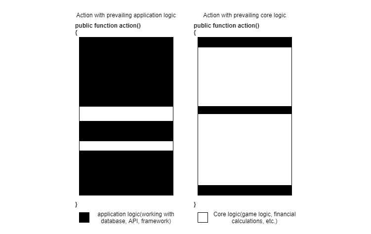

# Доменный слой

## Когда и зачем?

Бизнес-логика, на английском Domain logic или Логика предметной области, это та логика, которую представляют себе пользователи или заказчики, если полностью выкинуть из головы интерфейс пользователя. Например, для игры это будет полный свод её правил, а для финансового приложения - все сущности, которые там есть и все правила расчетов. Для блога всю бизнес-логику можно грубо описать так: есть статьи, у них есть заголовок и текст, администратор может их создать и опубликовать, а другие пользователи могут видеть все опубликованные статьи.

Сложные приложения могут быть разделены на два класса:

* Сложная логика приложения, но средняя или даже простая бизнес-логика. Пример: нагруженные социальные сети или иные контент-проекты. Логика приложения там огромная: SEO, интеграции с API, авторизации, поиск контента и т.д. Бизнес же логика, в сравнении с этим, довольно проста - посты и комментарии.
* По-настоящему сложная бизнес-логика и сложная или не очень сложная логика приложения. Пример: игры или энтерпрайз приложения.





Черным цветом здесь обозначена логика приложения, белым - бизнес-логика. Легко догадаться, что вынесение бизнес-логики в отдельный слой чуть ли не обязательно для приложений второго типа. Для приложений первого типа это тоже может оказаться полезным, но это будет не так просто доказать.

Вынесение бизнес-логики в отдельный слой - весьма серьезная задача, особенно для уже реализованного приложения, которое использует для работы с базой данных Eloquent или другие реализации шаблона Active Record. Связь объектов с базой данных в них жесткая и неразрывная. Их придётся полностью оторвать от базы данных, реализовав их как независимые объекты, реализующие доменную логику. Эта задача может потребовать колоссальных усилий и времени, поэтому решение создавать Доменный слой должно иметь серьезные причины. Я попробую перечислить некоторые из них и они должны быть положены гирьками на воображаемые весы в голове архитектора проекта. На другой стороне весов должна быть большая гиря из времени, пота и крови разработчиков, которым придется многое переосмыслить, если до этого вся бизнес-логика, реализовывалась объектами, представляющими собой строчки из таблиц базы данных.

### Unit-тестирование

В предыдущей главе мы выяснили, что писать unit-тесты для слоя приложения - очень трудно и не очень полезно. Поэтому для приложений с не очень сложной бизнес-логикой, такие тесты почти не пишут. Функциональные тесты для таких приложений намного важнее.

С другой стороны, сложную логику покрывать функциональными тестами - очень дорого по времени разработчиков, а соответственно и по деньгам. Время тратится как на написание таких тестов, так и на выполнение их. Для крупных приложений весь набор функциональных тестов может выполняться часами. Писать же сложную логику с помощью unit-тестов намного эффективнее и продуктивнее, а выполняются они за миллисекунды. Но сами тесты должны быть очень простыми. Давайте сравним unit-тест для объекта, описывающего сущность, а не строчку в базе данных, с unit-тестами для слоя приложения. Последние монструозные тесты из предыдущей главы я копировать не стану, а тесты для сущности Post - легко:

```php
class CreatePostTest extends \PHPUnit\Framework\TestCase
{
    public function testSuccessfulCreate()
    {
        $post = new Post('title', '');

        $this->assertEquals('title', $post->title);
    }

    public function testEmptyTitle()
    {
        $this->expectException(InvalidArgumentException::class);

        new Post('', '');
    }
}

class PublishPostTest extends \PHPUnit\Framework\TestCase
{
    public function testSuccessfulPublish()
    {
        $post = new Post('title', 'body');

        $post->publish();

        $this->assertTrue($post->published);
    }

    public function testPublishEmptyBody()
    {
        $post = new Post('title', '');

        $this->expectException(CantPublishException::class);

        $post->publish();
    }
}
```

Такие тесты требуют минимальных усилий. Их легко писать и поддерживать. А реализовывать сложную логику сущности при поддержке хорошо написанных тестов - в разы проще. Простота и легкость таких тестов результат того, что класс **Post** реализует единственную ответственность - логика сущности Статья. Он не отвлекается на такие вещи, как база данных. Из подобных классов и состоит Доменный слой.

### Простота поддержки кода

Реализация двух логик (бизнес- и приложения-) в одном месте нарушает Принцип Единственной Ответственности. Наказание за это последует довольно быстро. Причем, разумеется, это не будет одним ударом гильотины. Этот искусный палач будет мучать медленно. Каждое движение будет причинять боль. Количество дублированного кода будет расти. Любая попытка вынести какую-либо логику в свой метод или класс встретит большое сопротивление. Две логики, сплетенные в одно целое, всегда будет необходимо отделить друг от друга, перед тем как делать рефакторинг.
 
Вынесение доменной логики в отдельный слой позволит разработчикам всегда концентрироваться на одной логике, что делает процесс рефакторинга более простым и позволит держать приложение в тонусе, не тратя на это огромное количество времени.

### Active record и Data mapper

Eloquent является реализацией шаблона Active Record. Классы моделей Eloquent очень умные - они сами могут загрузить себя из базы и сохранить себя там же. Класс **User**, наследуясь от Eloquent **Model**, наследует огромный пласт кода, который работает с базой данных и сам становится навеки связанным с ней. Работая с ним, всегда приходится держать в голове такие факты как то, что `$this->posts` - это не просто коллекция объектов **Post**. Это псевдо-свойство, это проекция отношения `posts`. Нельзя просто взять и добавить туда новый объект. Придется вызвать что-то вроде `$this->posts()->create(...)`.

Этот код не может быть покрыт unit-тестами. Приходится постоянно держать в голове базу данных и когнитивная нагрузка на программиста растёт все больше с ростом сложности логики.

Библиотеки, реализующие шаблон Data mapper, пытаются снять эту нагрузку. Классы сущностей там - обычные классы. Как мы успели убедиться, unit-тесты для таких классов писать весьма приятно. Когда разработчик хочет сохранить состояние сущности в базе данных, он вызывает метод **persist** у Data Mapper библиотеки и она, используя некоторую мета-информацию про то, как именно нужно хранить эту сущность в базе данных, обеспечивает их преобразование в строчки таблиц и обратно. Самая популярная Data Mapper библиотека в PHP на даный момент - Doctrine. Я буду использовать её для будущих примеров. Следующие "причины" будут описывать преимущества использования чистых сущностей проецируемых в базу данных с помощью Data Mapper, вместо Active Record.

### Высокая связность бизнес логики

Вернёмся к примеру с сущностью опроса. Опрос - весьма простая сущность, которая содержит текст вопроса и возможные ответы. Очевидное условие: у каждого опроса должно быть как минимум два варианта ответа. В примере, который был раньше в книге, в действии **создатьОпрос** была такая проверка перед созданием объекта сущности. Это же условие делает сущность **SurveyOption** зависимой. Приложение не может просто взять эту сущность и удалить её. В действии **удалитьВариантОтвета** сначала должно быть проверено, что в объекте **Survey** после этого останется достаточно вариантов ответа. Таким образом, знание о том, что в опросе должно быть как минимум два варианта ответа, теперь содержится в обоих этих действиях: **создатьОпрос** и **удалитьВариантОтвета**. Связность данного кода слабая.

Это происходит из-за того, что сущности **Survey** и **SurveyOption** не являются независимыми. Они представляют собой один **модуль** - опрос с вариантами ответа. Знание о минимальном количестве вариантов ответа должно быть сосредоточено в одном месте - сущности **Survey**.

Я понимаю, что такой простой пример не может доказать важность работы таких сущностей как одно целое. Представим что-нибудь более сложное - реализацию игры Монополия! Всё в этой игре - это один большой модуль. Игроки, их имущество, их деньги, их положение на доске, положение других объектов на доске. Всё это представляет собой текущее состояние игры. Игрок делает ход и всё, что произойдёт дальше, зависит от текущего состояния. Если он наступает на чужую собственность - он должен заплатить. Если у него достаточно денег - он платит. Если нет - должен получить деньги как-либо, либо сдаться. Если собственность ничья, её можно купить. Если у него недостаточно денег - должен начаться аукцион среди других игроков.

Монополия - отличный пример сложного модуля. Реализация такой огромной логики в методах отдельных сервисных классов приведёт к невероятному дублированию кода и лучший способ это дублирование устранить - сконцентрировать логику в сущностях внутри единого модуля. Это также позволит писать логику вместе с unit-тестами, которые проверят всё огромное множество возможных ситуаций.

### Сдвиг фокуса с базы данных к предметной области

Приложение, особенно сложное, не является просто прослойкой между интерфейсом пользователя и базой данных. Однопользовательские игры, которые играются на локальном компьютере (какой-нибудь шутер или RPG), не сохраняют своё состояние в базе данных после каждого происходящего там действия. Игровые объекты просто живут в памяти, взаимодействуя друг с другом, не сохранясь в базу данных каждый раз. Только тогда, когда игрок попросит сохранить игру, она сохраняет всё своё состояние в какой-нибудь файл. Вот так приложение должно работать! То, что web-приложения вынуждены сохранять в базе данных своё состояние после каждого обновляющего запроса - это не удобства ради. Это необходимое зло. 

В идеальном мире с приложениями написанными раз и навсегда, работающими на 100% стабильно, на 100% стабильном железе с бесконечной памятью, лучшим решением было бы хранить всё в объектах в памяти приложения, без сохранения всего в базе данных. Идея выглядит сумасшедшей, особенно для PHP-программистов, которые привыкли, что всё созданное умирает после каждого запроса, но в этом есть определенный смысл. С этой точки зрения, намного выгоднее иметь обычные объекты с логикой, которые даже не думают о таких странных вещах, как таблицы базы данных. Это поможет разработчикам сфокусироваться на главной логике, а не логике инфраструктуры.

Иметь возможность писать логику, используя объекты, и лишь потом решая где и как они будут храниться - весьма полезно. Например, варианты ответов на опрос можно хранить в отдельной таблице, а можно в JSON-поле таблицы с опросами.

### Инварианты сущностей

Инвариант класса, это условие на его состояние, которое должно выполняться всегда. Каждый метод, изменяющий состояние сущности, должен сохранять этот инвариант.
Примеры: у клиента всегда должен быть email, опрос всегда должен содержать как минимум два варианта ответа. Условие сохранять инвариант в каждом методе, который изменяет состояние, заставляет проверять этот инвариант в этих методах.

Кстати, идея иммутабельных объектов, т.е. объектов, которые создаются раз и не меняют никаких своих значений, делает задачу поддержания инварианта простой. Пример такого объекта: объект-значение **Email**. Его инвариант - содержать всегда только правильное значение строки email-адреса. Проверка инварианта делается в конструкторе. А поскольку он дальше не меняет своего состояния, то в других местах эта проверка и не нужна. А вот если бы он имел метод **setEmail**, то проверку инварианта, т.е. корректности email, пришлось бы вызывать и в этом методе. 

В сущностях Eloquent крайне трудно обеспечивать инварианты. Объекты **SurveyOption** - формально независимы, хотя и должны быть под контролем объекта **Survey**. Любая часть приложения может вызвать **remove()** метод сущности **SurveyOption** и она будет просто удалена. В итоге все инварианты Eloquent сущностей держатся буквально на честном слове: на соглашениях внутри проекта или отлаженном процессе code review. Серьезным проектам необходимо что-то более весомое, чем честное слово. Системы, в которых сам код не позволяет делать больших глупостей, намного более стабильны, чем системы полагающие, что ими будут заниматься только очень умные и высоко-квалифицированные программисты.

## Реализация Доменного слоя

### Пример домена

Если вы, тщательно взвесив все За и Против, решили попробовать выделить доменную логику, то давайте начнем с небольшого примера. Фрилансерская биржа - неплохой вариант. Забудем про базы данных и web-интерфейсы. Разрабатываем чистую логику.

```php
final class Client
{
    private function __construct(private Email $email) {}
    
    public static function register(Email $email): Client
    {
        return new Client($email);
    }
}
```

Просто сущность клиента.

**Где имя и фамилия клиента?**

Я пока не нуждаюсь в этой информации. Кто знает, может это будет биржа с анонимными клиентами? Надо будет - добавим.

**Почему тогда есть email?**

Мне нужно как-то идентифицировать клиентов.

**Где методы setEmail и getEmail?**

Они будут добавлены как только я почувствую нужду в них.

```php
final class Freelancer
{
    private function __construct(
        private Email $email, 
        private Money $hourRate
    ) {}

    public static function register(
        Email $email, Money $hourRate): Freelancer
    {
        return new Freelancer($email, $hourRate);
    }
}
```

Сущность Фрилансер. По сравнению с клиентом было добавлено поле с часовой ставкой. Для денег используется класс **Money**. Какие поля там есть? Что используется для количества: float или integer? Разработчик, который работает над сущностью Фрилансер не должен беспокоиться об этом! **Money** просто представляет деньги в нашей системе. Этот класс умеет всё, что от него требуется для реализации доменной логики: сравнивать себя с другими деньгами и некоторые математические операции.

Изначально проект будет работать с одной валютой и будет хранить денежную информацию в одном поле integer, представляющим собой количество центов (или рублей, неважно). Через несколько лет биржа может стать международной и нужно будет добавить поддержку нескольких валют. В класс **Money** будет добавлено поле **currency** и изменена логика. В базу данных добавится поле с используемой валютой, в паре мест, где создаются объекты **Money** придётся добавить информацию о валюте, но главная логика, которая использует деньги, не будет даже затронута! Она как использовала объект **Money**, так и будет продолжать. 

Это пример принципа **Сокрытия информации**. Класс **Money** предоставляет стабильный интерфейс для концепта денег. Методы **getAmount()**:int и **getCurrency()**:string - плохие кандидаты на стабильный интерфейс. В этом случае клиенты класса будут знать слишком многое о внутренней структуре и каждое изменение в ней будет приводить к большому количеству изменений в проекте. Методы **equalTo**(**Money** **$other**), **compare**(**Money** **$other**), **plus**(**Money** **$other**) и **multiple**(**int** **$amount**) - прячут всю информацию о внутренней структуре внутри себя. Такие, прячущие информацию, методы являются намного более стабильным интерфейсом. Его не придётся часто менять. Меньше изменений в интерфейсах - меньше хлопот при поддержке.

Дальше, клиент может создать Проект. У проекта есть название, описание и примерный бюджет, но логика работы с ним не зависит от этих данных, важных только для людей. Логика подачи заявок от фрилансеров никак не зависит от заголовка проекта. А вот интерфейс в будущем может поменяться и в проект могут быть добавлены новые поля, которые не влияют на логику. Поэтому, исходя из принципа сокрытия информации, я хочу спрятать информацию о деталях проекта, важных только людям, в объект значение:

```php
final class JobDescription
{
    // value object. 
    // Job title, description, estimated budget, etc.
}

final class Job
{
    private function __construct(
        private Client $client, 
        private JobDescription $description
    ) {}

    public static function post(Client $client, 
        JobDescription $description): Job
    {
        return new Job($client, $description);
    }
}
```

Отлично. Базовая структура сущностей создана. Давайте, добавим немного логики. Фрилансер может заявиться делать этот проект. Заявка фрилансера содержит сопроводительное письмо (или просто сообщение заказчику) и его текущую ставку. Он может в будущем поменять свою ставку, но это не должно изменить её в заявках.

```php
final class Proposal
{
    public function __construct(
        private Job $job, 
        private Freelancer $freelancer, 
        private Money $hourRate, 
        private string $coverLetter
    ) {}
}

final class Job
{
    //...

    /**
     * @var Proposal[]
     */
    private $proposals;
    
    public function addProposal(Freelancer $freelancer, 
        Money $hourRate, string $coverLetter)
    {
        $this->proposals[] = new Proposal($this, 
            $freelancer, $hourRate, $coverLetter);
    }
}

final class Freelancer
{
    //...
    
    public function apply(Job $job, string $coverLetter)
    {
        $job->addProposal($this, $this->hourRate, $coverLetter);
    }
}
```

Это другой пример сокрытия информации. Только сущность Фрилансера знает, что у него есть часовая ставка. Каждый объект обладает минимальной информацией, необходимой для его работы. Не должно быть такого, что какой-то объект постоянно дергает поля другого объекта, таким образом зная о нём слишком многое. Система, построенная таким образом - очень стабильна. Новые требования в них часто реализуются изменениями в 1-2 файлах. Если эти изменения не затрагивают интерфейс класса (интерфейсом класса здесь названы все его публичные методы), то изменений в других классах не требуется. Такой код также более защищен от багов, которые могут быть случайно занесены изменениями.

Фрилансер не может добавить новую заявку. Он должен поменять старую для этого. Далее, в базе данных, вероятно, будет добавлен некий уникальный индекс на поля **job_id** и **freelancer_id** в таблице **proposals**, но это требование должно быть реализовано в доменной логике тоже:

```php
final class Proposal
{
    // ..
    
    public function getFreelancer(): Freelancer
    {
        return $this->freelancer;
    }
}

final class Freelancer
{
    public function equals(Freelancer $other): bool
    {
        return $this->email->equals($other->email);
    }
}

final class Job
{
    //...
    
    public function addProposal(Freelancer $freelancer, 
        Money $hourRate, string $coverLetter)
    {
        $newProposal = new Proposal($this, 
            $freelancer, $hourRate, $coverLetter);
            
        foreach($this->proposals as $proposal) {
            if($proposal->getFreelancer()
                   ->equals($newProposal->getFreelancer())) {
                throw new BusinessException(
                    'Этот фрилансер уже оставлял заявку');
            }
        }
        
        $this->proposals[] = $newProposal;
    }
}
```

Я добавил метод **equals()** в класс **Freelancer**. Как я уже говорил, email нужен для идентификации, поэтому если у двух объектов **Freelancer** одинаковые email - то это один и тот же фрилансер. Класс **Job** начинает знать слишком многое про класс **Proposal**. Весь этот `foreach` - это копание во внутренностях имплементации заявки. Мартин Фаулер назвал эту проблему "завистливый метод" (или Feature Envy в оригинале). Решение простое - перенести эту логику в класс **Proposal**:

```php
final class Proposal
{
    //...
    
    /**
     * @param Proposal $other
     * @throws BusinessException
     */
    public function checkCompatibility(Proposal $other)
    {
        if($this->freelancer->equals($other->freelancer)) {
            throw new BusinessException(
                'Этот фрилансер уже оставлял заявку');
        }
    }
}

final class Job
{
    /**
     * ...
     * @throws BusinessException
     */
    public function addProposal(Freelancer $freelancer, 
        Money $hourRate, string $coverLetter)
    {
        $newProposal = new Proposal($this, 
            $freelancer, $hourRate, $coverLetter);
        
        foreach($this->proposals as $proposal) {
            $proposal->checkCompatibility($newProposal);
        }

        $this->proposals[] = $newProposal;
    }
}
```

Заявка теперь сама проверяет совместима ли она с новой заявкой. А метод **Proposal::getFreelancer()** больше не используется и может быть удалён.

Инкапсуляцию, которая весьма близка к сокрытию информации, называют одним из трёх китов объектно-ориентированного программирования, но я постоянно вижу неверную её интерпретацию. В стиле "public **$name** - это не инкапсуляция, а private **$name** и методы **getName** и **setName**, банально имитирующие это публичное поле - инкапсуляция, потому, что в будущем можно будет переопределить поведение **setName** и **getName**". Не знаю как именно можно переопределить эти методы геттера и сеттера, но даже в этом случае всё приложение видит, что у этого класса есть свойство **name** и его можно как прочитать, так и записать, соответственно, будет использовать его везде и интерфейс этого класса не будет стабильным никогда.

Для некоторых классов, таких как DTO, выставлять напоказ своё внутреннее устройство - это нормально, поскольку хранение данных - это единственное предназначение DTO. Но объектно-ориентированное программирование предполагает, что объекты будут работать в основном со своими данными, а не с чужими. Это делает объекты более независимыми, соответственно, менее связанными с другими объектами, и, как следствие, более лёгкими в поддержке.

Я уже успел написать некоторую логику, но совершенно забыл о тестах!

```php
class ClientTest extends TestCase
{
    public function testRegister()
    {
        $client = Client::register(Email::create('some@email.com'));

        // Что здесь проверять?
    }
}
```

Сущность клиента не имеет никаких публичных полей и геттеров. Unit-тесты не могут проверить что-либо. PHPUnit не любит когда проверки отсутствуют, он вернёт ошибку: "This test did not perform any assertions". Я мог бы создать геттер-метод **getEmail()** и проверить, что сущность есть и у неё **email** тот же, который мы передали методу **register**. Но этот геттер-метод, который благодаря принципу сокрытия информации не потребовался в реализации бизнес-логики, будет использоваться только в тестах, что меня совсем не устраивает. Будучи добавленным, он может соблазнить слабого духом разработчика использовать его и в логике, что нарушит гармонию данного класса.

### Доменные события

Самое время вспомнить про доменные события. Они в любом случае будут использованы в приложении, просто чуть позже, когда нам, например, понадобится посылать письма после каких-то действий. Они идеальны для тестов, но с ними есть пара проблем.

Когда вся бизнес-логика лежала в слое приложения, сервисный класс спокойно кидал события напрямую в класс Dispatcher, когда ему требуется. Доменный объект так делать не может, поскольку про объект Dispatcher он ничего не знает. Этот Dispatcher объект можно предоставлять доменным объектам, но это может разрушить иллюзию того, что мы моделируем чистую логику. Как вы заметили, в доменных объектах, которые мы реализовали, речь идёт только о клиентах, фрилансерах и заказах, никаких баз данных, очередей и веб-контроллеров там нет. 

Поэтому, более популярным решением является простое агрегирование событий внутри доменных объектов. Простейший вариант:

```php
final class Client
{
    //...
    
    private $events = [];
 
    public function releaseEvents(): array
    {
        $events = $this->events;
        $this->events = [];

        return $events;
    }

    protected function record($event)
    {
        $this->events[] = $event;
    }
}
```

Сущность записывает события, которые с ней происходят, используя метод **record**. Метод **releaseEvents** возвращает их разом и очищает буфер, чтобы случайно одно событие не было обработано дважды.

Что должно содержать событие **ClientRegistered**? Я ранее говорил, что хочу использовать **email** для идентификации, но в реальной жизни **email** адрес не является хорошим средством идентификации сущностей. Клиенты могут менять их, а также они не очень эффективны в качестве ключей в базе данных.

Самым популярным решением для идентификации сущностей является целочисленное поле с авто-инкрементным значением, реализованным в движках баз данных. Оно простое, удобное, но выглядит логичным только если доменный слой не отделен полностью от базы данных. Одним из преимуществ чистых доменных объектов является консистентность (или постоянное соответствие инвариантам), т.е. например если у нас есть объект **Client**, то мы можем быть уверены, что у него непустой и корректный **email**, если требования к приложению это предполагают. Любое приложение будет предполагать, что у объекта всегда есть непустой и корректный идентификатор, однако в момент, когда сущность будет создана, но еще не будет сохранена в базе, у неё будет пустой идентификатор, а это не даст, например, сгенерировать правильные события, да и другие проблемы могут проявиться.

Я всё еще не сказал, что мне необходим этот идентификатор для написания unit-тестов, но не люблю этот аргумент про unit-тесты. Те, кто пишет их, и так все понимают. Кто не пишет - для них этот аргумент ничего не значит. Проблемы с unit-тестами - это лишь лакмусовая бумажка, лишь некий показатель проблем с дизайном системы в целом или какой-то её части. Если есть проблемы с тестами, надо искать проблемы в основном коде.

Код с предоставлением **id** для сущности:

```php
final class Client
{
    protected function __construct(
        private $id, 
        private Email $email,
    ) {}
    
    public static function register($id, Email $email): Client
    {
        $client = new Client($id, $email);
        $client->record(new ClientRegistered($client->id));

        return $client;
    }
}
```

Событие **ClientRegistered** записывается в именованном конструкторе, поскольку оно имеет бизнес-имя **registered** и означает, что клиент именно зарегистрировался. Возможно, в будущем будет реализована команда импорта пользователей из другого приложения и событие должно генерироваться другое:

```php
final class Client
{
    public static function importFromCsv($id, Email $email): Client
    {
        $client = new Client($id, $email);
        $client->record(new ClientImportedFromCsv($client->id));

        return $client;
    }
}
```

### Генерация идентификатора 

Наш код теперь требует, чтобы идентификатор был предоставлен сущностям извне, но как генерировать их? Авто-инкрементная колонка в базе данных делала свою работу идеально и будет трудно заменить её. Продолжать использовать авто-инкрементные значения, реализованные через Redis или Memcached - не самая лучшая идея, поскольку это добавляет новую и довольно большую возможную точку отказа в приложении.

Наиболее популярный не-авто-инкрементный алгоритм для идентификаторов это **Универсальный уникальный идентификатор** (**Universally unique identifier**, UUID). Это 128-битное значение, которое генерируется одним из стандартных алгоритмов, описанных в RFC 4122. Вероятность генерации двух одинаковых значений стремится к нулю. В php есть пакет для работы с UUID - **ramsey/uuid**. Там реализованы некоторые алгоритмы из стандарта RFC 4122. Теперь можно писать тесты:

```php
final class Client
{
    public static function register(
        UuidInterface $id, 
        Email $email): Client
    {
        $client = new Client($id, $email);
        $client->record(new ClientRegistered($client->id));

        return $client;
    }
}

class Factory
{
    public static function createUuid(): UuidInterface
    {
        return Uuid::uuid4();
    }

    public static function createEmail(): Email
    {
        static $i = 0;

        return Email::create("test" . $i++ . "@t.com");
    }
}

class ClientTest extends UnitTestCase
{
    public function testRegister()
    {
        $client = Client::register(
            Factory::createUuid(), 
            Factory::createEmail()
        );

        $this->assertEventsHas(ClientRegistered::class, 
            $client->releaseEvents());
    }
}
```

Помните тестирование методом черного и белого ящиков? Это пример тестирования методом черного ящика. Тест ничего не знает о внутренностях объекта. Не лезет читать его **email**. Он просто проверяет, что на данную команду в сущности сгенерировалось ожидаемое событие. Другой тест:

```php
class Factory
{
    public static function createClient(): Client
    {
        return Client::register(self::createEmail());
    }
    
    public static function createFreelancer(): Freelancer
    {
        return Freelancer::register(
                    self::createEmail(), ...);
    }
}

class JobApplyTest extends UnitTestCase
{
    public function testApply()
    {
        $job = $this->createJob();
        $freelancer = Factory::createFreelancer();

        $freelancer->apply($job, 'cover letter');

        $this->assertEventsHas(FreelancerAppliedForJob::class, 
            $freelancer->releaseEvents());
    }

    public function testApplySameFreelancer()
    {
        $job = $this->createJob();
        $freelancer = Factory::createFreelancer();

        $freelancer->apply($job, 'cover letter');

        $this->expectException(
            SameFreelancerProposalException::class);

        $freelancer->apply($job, 'another cover letter');
    }

    private function createJob(): Job
    {
        return Job::post(
            Factory::createUuid(),
            Factory::createClient(),
            JobDescription::create('Simple job', 'Do nothing'));
    }
}
```

Эти тесты просто описывают требования к бизнес-логике системы, проверяя стандартные сценарии: заявка фрилансера на проект, повторная заявка фрилансера на проект. Никаких баз данных, моков, стабов... Никаких попыток залезть внутрь, допустим массива заявок на проект и проверить что-то там. Можно попробовать попросить обычного человека, знающего английский язык, но не разработчика, почитать данные тесты и большинство вещей он поймёт без дополнительной помощи! Такие тесты легко писать и не составит больших усилий писать их вместе с кодом, как того требуют практики TDD.

Я понимаю, что данная логика слишком проста, чтобы показать преимущества отдельного, чисто доменного кода и удобного unit-тестирования, но попробуйте представить себе игру Монополия и её реализацию. Это может помочь ощутить разницу подходов. Сложную бизнес-логику намного проще писать и поддерживать, если рядом верные unit-тесты, а инфраструктурная составляющая приложения (база данных, HTTP, очереди т .д.) отделена от главной логики.

Создание хорошей модели предметной области весьма нетривиальная задача. Я могу порекомендовать две книги: красную и синюю. Выбирать не надо. Можно прочитать обе. **"Domain-Driven Design: Tackling Complexity in the Heart of Software"** от **Eric Evans** и **"Implementing Domain-Driven Design"** от **Vaughn Vernon**. На русском они тоже есть. Книги эти довольно трудны в освоении, но там приводится довольно много примеров из реальной практики, которые могут поменять ваше представление о том, как надо строить модели предметной области. Новые понятия, такие как **Aggregate root**, **Ubiquitous language** и **Bounded context** помогут вам по-другому взглянуть на свой код, хотя первые два из них я совсем немного рассмотрел и в этой книге.

### Маппинг модели в базу данных

После построения модели самое время подумать о базе данных, в которой нам надо хранить наши сущности и объекты-значения. Я буду использовать ORM-библиотеку **Doctrine** для этого. Для Laravel есть пакет **laravel-doctrine/orm**, который содержит всё необходимое для использования её в проектах.

**Doctrine** позволяет использовать разные пути конфигурации маппинга.
Пример с обычным массивом:

```php
return [
    'App\Article' => [
        'type'   => 'entity',
        'table'  => 'articles',
        'id'     => [
            'id' => [
                'type'     => 'integer',
                'generator' => [
                    'strategy' => 'auto'
                ]
            ],
        ],
        'fields' => [
            'title' => [
                'type' => 'string'
            ]
        ]
    ]
];
```

Некоторые разработчики предпочитают держать код сущностей как можно более чистым и такая внешняя конфигурация отлично подходит. Но большинство разработчиков используют атрибуты - специальные пометки в виде объектов перед классами, полями и другими частями кода. Пример с атрибутами:

```php
use Doctrine\ORM\Mapping AS ORM;

#[ORM\Embeddable]
final class Email
{
    #[ORM\Column(type="string")]
    private string $email;   
    //...
}

#[ORM\Embeddable]
final class Money
{
    #[ORM\Column(type="integer")]
    private int $amount;
    // ...
}

#[ORM\Entity]
final class Freelancer
{
    #[ORM\Embedded(Email::class)]
    private Email $email;

    #[ORM\Embedded(Money::class)]
    private Money $hourRate;
}

#[ORM\Entity]
final class Job
{
    #[ORM\ManyToOne(targetEntity="Client")]
    #[ORM\JoinColumn(nullable=false)]
    private Client $client;
    
    //...
}
```

Я использую атрибут **Embeddable** для объектов значений и атрибут **Embedded**, чтобы использовать их в других классах. Каждый атрибут это скрытый вызов new и конструктор класса может иметь параметры. Атрибут **Embedded** требует имя класса, и опциональный параметр **columnPrefix**, который полезен для генерации колонок (отлично подходит для случаев адресов **fromCountry**, **fromCity**, ... - значение **from**, и **to** для, соответственно, **toCountry**, **toCity**, ...).

Есть также атрибуты для различных отношений: один ко многим (one to many), многие ко многим (many to many), и т.д.

```php
#[ORM\Entity]
final class Freelancer
{
    #[ORM\Id]
    #[ORM\Column(type="uuid", unique=true)]
    #[ORM\GeneratedValue(strategy="NONE")]
    private UuidInterface $id;
}

#[ORM\Entity]
final class Proposal
{
    #[ORM\Id]
    #[ORM\Column(type="integer", unique=true)]
    #[ORM\GeneratedValue(strategy="AUTO")]
    private int $id;
}
```

Каждая сущность имеет поле с идентификатором. Тип `uuid` означает строку в 36 символов, в которой UUID будет храниться в своём стандартном строковом представлении, например `e4eaaaf2-d142-11e1-b3e4-080027620cdd`. Альтернативный вариант (немного более оптимальный по скорости): 16-байтное бинарное представление.

Сущность **Proposal** (заявка) является частью модуля **Job** (проект) и они никогда не будут создаваться как-либо отдельно. По большому счёту, им не нужен **id**, но **Doctrine** требует его для каждой сущности, поэтому можно добавить авто-инкрементное значение здесь.

Когда **Doctrine** достаёт сущность из базы данных, она создаёт объект требуемого класса без использования конструктора и просто заполняет его значениями из базы данных. Всё это работает через механизм рефлексии PHP. Как результат: объект "не чувствует" базу данных. Его жизненный цикл - естественный.

```php
$freelancer = new Freelancer($id, $email);

$freelancer->apply($job, 'some letter');

$freelancer->changeEmail($anotherEmail);

$freelancer->apply($anotherJob, 'another letter');
```

Между каждой этой строкой есть как минимум одно сохранение в базу и большое количество считываний из неё. Всё это может происходить на разных серверах, но объект ничего не чувствует, не вызываются конструкторы или сеттеры, он живёт также как в каком-нибудь unit-тесте. **Doctrine** выполняет огромную инфраструктурную работу для того, чтобы объекты жили без забот.

### Миграции

Пора создать нашу базу данных. Можно использовать миграции Laravel, но **Doctrine** предлагает еще немного магии: свои миграции. После установки пакета **laravel-doctrine/migrations** и запуска команды `php artisan doctrine:migrations:diff`, будет создана миграция:

```php
class Version20190111125641 extends AbstractMigration
{
public function up(Schema $schema)
{
$this->abortIf($this->connection->getDatabasePlatform()->getName() != 'sqlite', 
    'Migration can only be executed safely on \'sqlite\'.');

$this->addSql('CREATE TABLE clients (id CHAR(36) NOT NULL --(DC2Type:uuid)
, email VARCHAR(255) NOT NULL, PRIMARY KEY(id))');
$this->addSql('CREATE TABLE freelancers (id CHAR(36) NOT NULL --(DC2Type:uuid)
, email VARCHAR(255) NOT NULL, hourRate_amount INTEGER NOT NULL, 
PRIMARY KEY(id))');
$this->addSql('CREATE TABLE jobs (id CHAR(36) NOT NULL --(DC2Type:uuid)
, client_id CHAR(36) NOT NULL --(DC2Type:uuid)
, title VARCHAR(255) NOT NULL, description VARCHAR(255) NOT NULL, 
PRIMARY KEY(id))');
$this->addSql('CREATE INDEX IDX_A8936DC519EB6921 ON jobs (client_id)');
$this->addSql('CREATE TABLE proposals (id INTEGER PRIMARY KEY 
AUTOINCREMENT NOT NULL
, job_id CHAR(36) DEFAULT NULL --(DC2Type:uuid)
, freelancer_id CHAR(36) NOT NULL --(DC2Type:uuid)
, cover_letter VARCHAR(255) NOT NULL, hourRate_amount INTEGER NOT NULL)');
$this->addSql('CREATE INDEX IDX_A5BA3A8FBE04EA9 ON proposals (job_id)');
$this->addSql('CREATE INDEX IDX_A5BA3A8F8545BDF5 ON proposals (freelancer_id)');
}

public function down(Schema $schema)
{
$this->abortIf($this->connection->getDatabasePlatform()->getName() != 'sqlite', 
    'Migration can only be executed safely on \'sqlite\'.');

$this->addSql('DROP TABLE clients');
$this->addSql('DROP TABLE freelancers');
$this->addSql('DROP TABLE jobs');
$this->addSql('DROP TABLE proposals');
}
}
```

Я использовал sqlite для этого тестового проекта. Да, выглядит уродливо по сравнению с красивыми и стройными миграциями Laravel, но **Doctrine** может создавать их автоматически! Команда `doctrine:migrations:diff` анализирует текущую базу данных и мета-данные сущностей и генерирует миграцию, которая приведёт базу данных в состояние, когда она будет содержать все нужные таблицы и поля.

Я думаю, достаточно про **Doctrine**. Она действительно позволяет разработчикам строить чистую модель предметной области и эффективно маппить её на базу данных. Изъянов у нее тоже хватает, но для нашего примера они несущественны. Как я уже написал ранее, после вынесения доменной логики, слою приложения остаётся только оркестрация между инфраструктурой и доменом. Теперь его основная задача - связать эти два куска кода в одно целое.

```php
final class FreelancersService
{
    /** @var ObjectManager */
    private $objectManager;
    
    /** @var MultiDispatcher */
    private $dispatcher;

    public function __construct(
        ObjectManager $objectManager, 
        MultiDispatcher $dispatcher)
    {
        $this->objectManager = $objectManager;
        $this->dispatcher = $dispatcher;
    }

    public function register(
        Email $email, 
        Money $hourRate): UuidInterface
    {
        $freelancer = Freelancer::register(
            Uuid::uuid4(), $email, $hourRate);

        $this->objectManager->persist($freelancer);
        $this->objectManager->flush();

        $this->dispatcher->multiDispatch(
            $freelancer->releaseEvents());

        return $freelancer->getId();
    }
    //...
}
```

Здесь UUID генерируется в слое приложения. Это может произойти и немного ранее. Я слышал о проектах, которые просят клиентов их API сгенерировать идентификатор для новых сущностей.

```
POST /api/freelancers/register
{
    "uuid": "e4eaaaf2-d142-11e1-b3e4-080027620cdd",
    "email": "some@email.com"
}
```

Этот подход выглядит каноничным. Клиенты просто просят приложение сделать определённое действие и предоставляют все необходимые для этого действия данные. Просто "200 Ok" ответа достаточно. Значение идентификатора у них уже есть, они могут продолжить работу.

**ObjectManager::persist** кладёт сущность в очередь на сохранение в базу данных. **ObjectManager::flush** сохраняет все объекты в очереди. Посмотрим на несоздающее действие:

```php
final class JobApplyDto
{
    public function __construct(
        public readonly UuidInterface $jobId, 
        public readonly UuidInterface $freelancerId, 
        public readonly string $coverLetter,
    ) {}
}

final class JobApplyRequest extends FormRequest
{
    public function rules()
    {
        return [
            'jobId' => 'required|uuid',
            'freelancerId' => 'required|uuid',
            //'coverLetter' => optional
        ];
    }

    public function getDto(): JobApplyDto
    {
        return new JobApplyDto(
            Uuid::fromString($this['jobId']),
            Uuid::fromString($this['freelancerId']),
            $this->get('coverLetter', '')
        );
    }
}
```

**JobApplyDto** - простое DTO для заявки на проект. **JobApplyRequest** - это объект запроса, который производит необходимую валидацию и создаёт объект **JobApplyDto**.

```php
final class FreelancersController extends Controller
{
    public function __construct(
        private FreelancersService $service
    ) {}

    public function apply(JobApplyRequest $request)
    {
        $this->service->apply($request->getDto());

        return /*success*/;
    }
}
```

Контроллеры очень просты. Они лишь передают данные из объектов-запросов в сервисные классы.

```php
final class FreelancersService
{
    public function apply(JobApplyDto $dto)
    {
        $freelancer = $this->objectManager
            ->findOrFail(Freelancer::class, $dto->getFreelancerId());

        $job = $this->objectManager
            ->findOrFail(Job::class, $dto->getJobId());

        $freelancer->apply($job, $dto->getCoverLetter());

        $this->dispatcher->multiDispatch(
                    $freelancer->releaseEvents());

        $this->objectManager->flush();
    }
}
```

Слой приложения тоже довольно простой. Он просит объект **objectManager** достать необходимую сущность из базы данных и производит необходимое бизнес-действие. Главная разница с **Eloquent** - это метод **flush**. Слой приложения не должен просить сохранить каждый изменённый объект в базу. **Doctrine** запоминает все объекты, которые она достала из базы и способна распознать какие изменения произошли с момента загрузки. Метод **flush** анализирует эти изменения и сохраняет все измененные объекты в базу.

В этом конкретном случае **Doctrine** находит, что новый объект был добавлен в свойство **proposals** и создаст новую строку в нужной таблице с нужными данными. Эта магия позволяет нам писать без оглядки на базу данных. Можно просто изменять значения полей, добавлять или удалять объекты из отношений, даже глубоко внутри первично загруженного объекта - всё это будет сохранено в методе **flush**.

Разумеется, всё имеет свою цену. Код **Doctrine** намного более сложный, чем код **Eloquent**. Когда я работаю с последним, при любых проблемах я могу посмотреть его код и найти ответы там. Не могу сказать подобного про **Doctrine**. Её более сложная конфигурация и непростые запросы посложнее обычного "найти по идентификатору" прилично добавляют сложности при поддержке. Не забывайте, что это разные ORM, написанные с разными целями.

Вы можете ознакомиться с полным исходным кодом данного примера здесь: 

[https://github.com/adelf/freelance-example](https://github.com/adelf/freelance-example)
 
Там реализован шаблон CQRS, поэтому лучше сначала прочитать следующую главу.

## Обработка ошибок в доменном слое

В главе "Обработка ошибок" я предложил использовать непроверяемое исключение **BusinessException** для уменьшения количества тегов **@throws**, но для сложной модели предметной области это не самая лучшая идея. Исключения могут быть сгенерированы глубоко внутри модели и на каком-то уровне на них можно реагировать. Даже в нашем простом случае генерируется исключение внутри объекта **Proposal**, при повторной заявке от того же фрилансера, но объект заявки не знает контекста. В случае добавления новой заявки это исключение отправляется наверх обрабатываться в глобальном обработчике. В другом случае вызывающий код может захотеть узнать что конкретно пошло не так: 

```php
// BusinessException превращается в проверяемое
abstract class BusinessException 
    extends \Exception {...}

final class SameFreelancerProposalException 
    extends BusinessException
{
    public function __construct()
    {
        parent::__construct(
            'Этот фрилансер уже оставлял заявку');
    }
}

final class Proposal
{
    //...
    
    /**
     * @param Proposal $other
     * @throws SameFreelancerProposalException
     */
    public function checkCompatibility(Proposal $other)
    {
        if($this->freelancer->equals($other->freelancer)) {
            throw new SameFreelancerProposalException();
        }
    }
}

final class Job
{
    //...
    
    /**
     * @param Proposal $newProposal
     * @throws SameFreelancerProposalException
     */
    public function addProposal(Proposal $newProposal)
    {
        foreach($this->proposals as $proposal)
        {
            $proposal->checkCompatibility($newProposal);
        }

        $this->proposals[] = $newProposal;
    }
}
```

Другое условие может добавиться с новыми требованиями: делать некий аукцион и не позволять фрилансерам добавлять заявку с часовой ставкой выше, чем текущая (не самое умное требование, но бывает и хуже). Новое исключение будет добавлено в теги **@throws**. Это приведет к каскаду изменений в вызывающем коде.

Другая проблема: иногда вызывающему коду нужно узнать все возможные проблемы: случаи "тот же самый фрилансер" и "слишком высокая часовая ставка" могут произойти одновременно, но исключение возможно только одно. Создавать какой-то композитный тип исключения, чтобы собирать там все проблемы, сделает код более грязным и какой тогда смысл в исключениях?

Поэтому я часто слышу от разработчиков, что они предпочитают нечто похожее на объект **FunctionResult** из главы про обработку ошибок для своей модели предметной области. С его помощью можно вернуть результат в самом удобном для всех виде.

## Пара слов в конце главы

Вынесение доменной логики - это большой шаг в эволюции проекта. Намного более практично делать его в самом начале, но архитектор должен оценить сложность этой логики. Если приложение - простой CRUD с очень небольшой дополнительной логикой, от доменного слоя будет мало толку.

С другой стороны, для сложной предметной области - это определённо хороший выбор. Написание чистых доменных объектов вместе с простыми и красивыми unit-тестами - большое преимущество. Довольно сложно осуществить переход с анемичной модели (когда сущности только хранят данные, а работают с ними другие классы) на модель богатую (когда модель сама работает со своими данными), как в коде, так и в голове разработчика, который ни разу не пробовал так думать. По себе знаю. Это как переход с процедурного программирования на объектно-ориентированное. Это требует времени и много практики, но для некоторых проектов оно того стоит.

Как вы, вероятно, заметили методы геттеры (**getEmail**, **getHourRate**) оказались совсем не нужны для описания модели, поскольку принцип сокрытия информации не предполагает их. Если геттер класса **А** используется в классе **B**, то класс **B** начинает знать слишком многое о классе **A** и изменения там часто приводят к каскадным изменениям в классе **B**, а также многих других. Не стоит этим увлекаться.

К сожалению, кроме кода, приложения также имеют и интерфейс пользователя, и все эти данные, которые мы так хотим спрятать, надо показывать пользователям. Люди хотят видеть имена и часовые ставки. Создавать методы-геттеры только ради этого не очень хочется, но придется. Или нет? Поговорим об этом в следующей главе.
